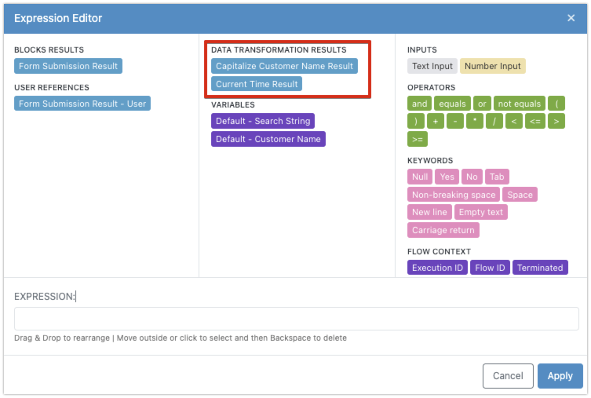
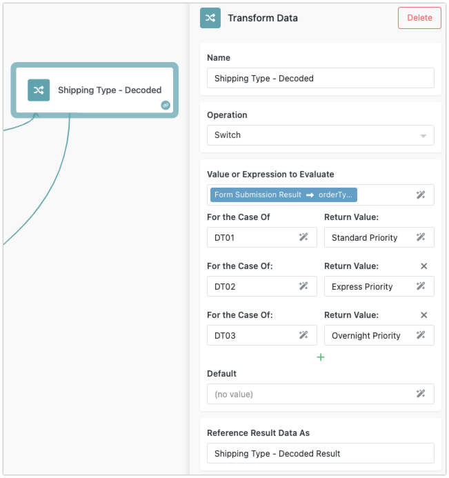

Data transformations in FlowRunner™ are handled by the versatile **Transform Data** block. This block offers various data transformation operations that can manipulate key/value structures, arrays/lists, strings, dates, and perform logical operations. When setting up a transformation, you select the desired operation and configure its input parameters, if any. When the Transform Data block executes, it performs the selected operation. For a complete list of supported operations, see the [Transform Data block](../reference/transformer.md) in the Block Reference guide. 

For example, the `Contains` operation checks if a given `Search String` is present within a `Text` input. The operation has two parameters: `Text` and `Search String`. Input parameter values for Transformer operations are set using the [Expression Editor](expressioneditor.md).

## Using Transformer Results

The outcome of a Transformer block operation is available as a `result` element for all subsequent blocks. You can access it in the Expression Editor under the `DATA TRANSFORMATION RESULTS` section. For instance, consider a flow that includes two transformers:

In the Expression Editor popup, you can see the results produced by these transformers:

These transformer results can be incorporated into expressions used by any other block in your flow, adding a layer of flexibility and dynamism to your automation.

For a complete list of all supported operations, refer to the [Transformer block reference](../reference/transformer.md). Below are a few examples demonstrating the usage of some data transformation operations:

## Data Mapper Example

Using the `Switch` operation, the transformer evaluates a value (or an expression) and returns a specific value for each configured case:

## Find Max Value Example

The `Max` operation in the transformer identifies the maximum number among the provided values:

## Extracting a Substring Example

With the `Substring` operation, the transformer extracts a portion of a string from the provided text. The substring is determined by the `Start` and `End` indexes:

By understanding and utilizing these data transformation operations, you can enhance the functionality and efficiency of your automation flows, ensuring that your data is precisely manipulated to meet your business needs.