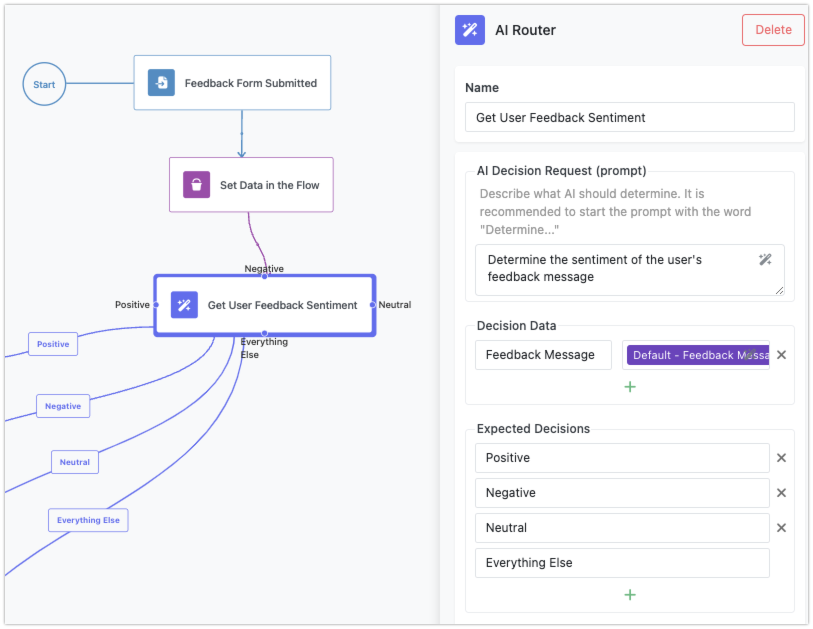

FlowRunner offers powerful AI capabilities that can enhance your applications and workflows. By integrating AI into your flows, you can add intelligent decision-making, automation, and enhanced functionality. This chapter provides an overview of the key AI-powered features in FlowRunner, each offering unique ways to bring artificial intelligence into your logic.

## AI Router

The **AI Router** allows you to route flows dynamically based on the results of AI-powered analysis. It acts as a decision-making tool that uses AI to evaluate input data and decide which path a flow should follow. For example, the AI Router can be used for natural language processing (NLP) to understand and classify user input, route requests to appropriate services, or perform sentiment analysis to tailor responses in customer interactions.

With AI Router, your flows can make smarter decisions based on patterns, trends, or natural language inputs, ensuring that your application can adapt in real-time to different situations or data inputs. For more information about the functionality, to learn how to configure and use AI Routers, visit the [AI Router](../reference/ai-router-action.md) section of this guide.

## AI Assistants

**AI Assistants** bring automation and intelligent behavior to your applications. They work as virtual agents, capable of handling tasks such as processing text, making recommendations, or even performing interactive conversations with users. AI Assistants can be embedded directly into flows, helping you automate complex processes that require understanding, learning, and decision-making.

These assistants can be trained to handle specific tasks like customer support, data extraction, or even more advanced AI-driven workflows. By integrating AI Assistants into FlowRunner, you can make your applications more interactive, responsive, and automated.

## AI Image Analysis in Conditions

The **AI Image Check in Conditions** feature allows you to use AI to analyze images and make decisions based on the results. This capability can be embedded into flow conditions, enabling your application to trigger actions based on image recognition or analysis.

For instance, you could use this feature to verify if an uploaded image meets certain criteria, detect objects within an image, or check for specific visual content. This AI-driven image analysis opens up possibilities for intelligent image processing, security checks, or even quality control workflows within your applications.

The integration of AI in FlowRunner allows you to create smarter, more dynamic workflows. With the **AI Router**, **AI Assistants**, and **AI Image Check in Conditions**, you can bring intelligent automation, decision-making, and image recognition to your applications. Each of these capabilities is covered in more detail in the corresponding sections of this guide, where you’ll learn how to use them to enhance your workflows and unlock new potential for your applications.