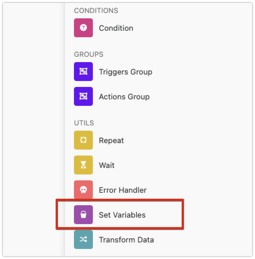
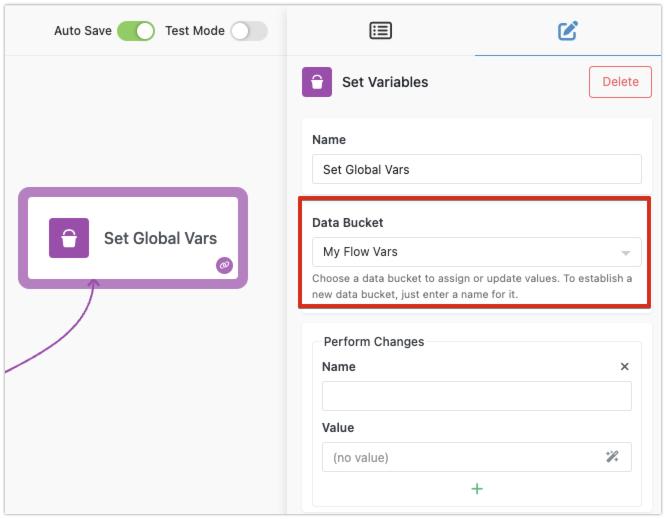
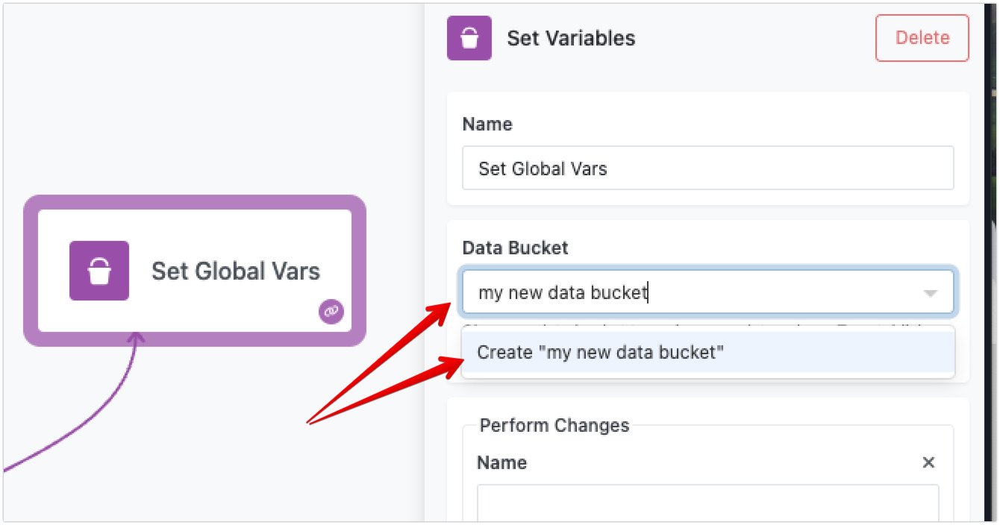
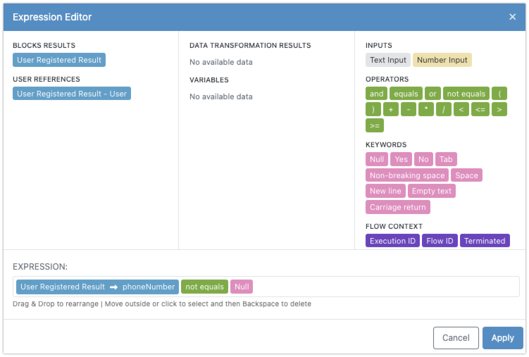

Variables in FlowRunner™ are a method for storing and accessing data in your flow’s actions, transformers, and conditions. Think of each variable as a drawer with a label. You can store any type of data in these drawers, such as string literals, numbers, dates, boolean values, data collections, or key/value structures. By naming these drawers, you can easily recall and use the data whenever needed.

To further organize your variables, FlowRunner™ supports a concept called **Data Buckets**. A data bucket is like a collection of drawers, grouped under a single name. This helps in logically organizing and managing your variables. For instance, if you have variables containing configuration parameters that apply to the entire flow, you might place them in a data bucket named `Global Config Params`.

## Set Variables Block

To set or change a variable, you use the `Set Variables` block.

Before you assign any variable values, make sure to specify a data bucket where the changes will occur. In the screenshot below the selected data bucket is called `My Flow Vars`:

It is easy to create new data buckets - simply type in a name for your data bucket and select the option below to create it:

## Setting and Changing Variables

The process involves identifying a variable name and assigning a value to it, both done using the [Expression Editor](expressioneditor.md). This method allows the variable name and value to be dynamically calculated, providing great flexibility. 

Consider the following example - it creates a variable called `has phone number`. The value assigned to the variable is dynamic. Using the Expression Editor, you can create an expression that sets the value of `has phone number` based on data available within the current flow.

When you build an expression to calculate a value for your variable, you can reference other variables. This means that the new variable’s value can be composite, drawing from any data available in the current `Set Variables` block. Below is a screenshot of the Expression Editor showing how the expression for the `has phone number` variable is composed:

## Accessing Variables

To access your variables, you use the Expression Editor. This tool includes a dedicated section that lists all variables available for the current block. For example, in the screenshot below, you can see there is one variable in the `My Flow Vars` data bucket, named `has phone number`.

By understanding how to effectively set, change, and access variables, you can build more dynamic and responsive automation flows. Variables help you manage data efficiently, ensuring that your workflows are both flexible and powerful.