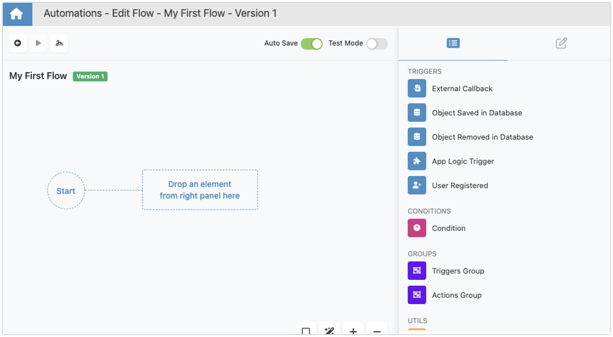

# Working with Blocks

In Backendless Automations, blocks serve as the building blocks of your workflows, each offering unique functionality to automate a range of tasks and processes. While the specific capabilities of each block vary, the general rules for connecting and editing them within your flows are consistent and straightforward. This chapter will guide you through these rules, ensuring you have a solid foundation for working with blocks in the Flow Editor.

## The Basics of Blocks

- **Starting Your Flow**: Every flow is marked with a `START` indicator. This marker is not just a point of reference; it signifies the beginning of your flow, providing a clear starting point for your automation journey.

    ??? info "Changing the Starting Block"
        If you need to change the starting block, please follow the steps described below:
        
<iframe src="https://demo.arcade.software/TpCpdxhwI1Qs42Dv5uK7?embed&show_copy_link=true" title="Automations - Edit Flow - My First Flow - Version 1 - Automations - Backendless" frameborder="0" loading="lazy" webkitallowfullscreen mozallowfullscreen allowfullscreen allow="clipboard-write" style="position: absolute; top: 0; left: 0; width: 100%; height: 100%;color-scheme: light;"></iframe>

- **Adding Blocks**: To introduce a new block into your flow, simply drag it from the [Blocks Toolbox](floweditor.md#blocks-toolbox) into the [Editor Canvas](floweditor.md#editor-canvas). This action is the first step in expanding your workflow’s capabilities.

- **Initiating Flows**: A flow can commence with any block, including actions, triggers, groups of actions or groups of triggers. These initial blocks set your flow in motion. Triggers will be lying in wait for the specified trigger event(s) to activate the subsequent actions.

## Connecting Blocks

- **Flow Transitions**: Blocks within your flow are connected by lines, which symbolize the transition of execution from one block to the next. These lines are the pathways through which your workflow's logic unfolds.

- **Multiple Successors**: It's possible for a single block to lead to multiple successors, meaning the flow can diverge, sending control to several blocks simultaneously. This feature enables the execution of parallel actions or triggers, expanding the flexibility and complexity of your workflows. For example, the `Callback from CRM` trigger in the image below has two successors. Both of them will be executed when the trigger is dispatched.

- **Multiple Predecessors**: Likewise, a block can have multiple predecessors, indicating various paths through which a block can be reached within a flow. This multiplicity allows for diverse triggers or conditions to converge on a single action or decision point. For example, the `Send SMS` block in the screenshot below has two predecessors. The block is executed immediately after each predecessor:

    !!! info "Handling Concurrency with Multiple Predecessors" 
        For managing execution concurrency more effectively, utilizing Action/Trigger groups is recommended. 

## Editing and Viewing Properties

Clicking on a block selects it. Upon selection, a block’s properties are displayed in the Property Editor. Here, you can fine-tune the block’s settings, tailoring it to your precise requirements. 

The contents of the Property Editor vary between different blocks, please refer to the documentation section where the blocks are described for additional details.

Understanding how to effectively work with blocks is fundamental to crafting efficient and dynamic workflows in Backendless Automations. By familiarizing yourself with the general rules for adding, connecting, and editing blocks, you're well on your way to designing automations that are not only powerful but also elegantly structured. Remember, the key to successful workflow automation lies in the thoughtful arrangement and configuration of these versatile components.