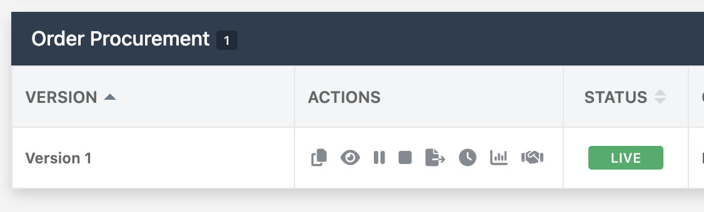
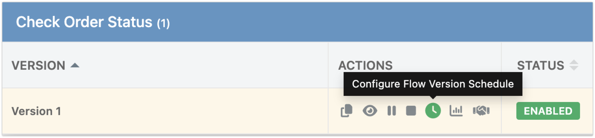
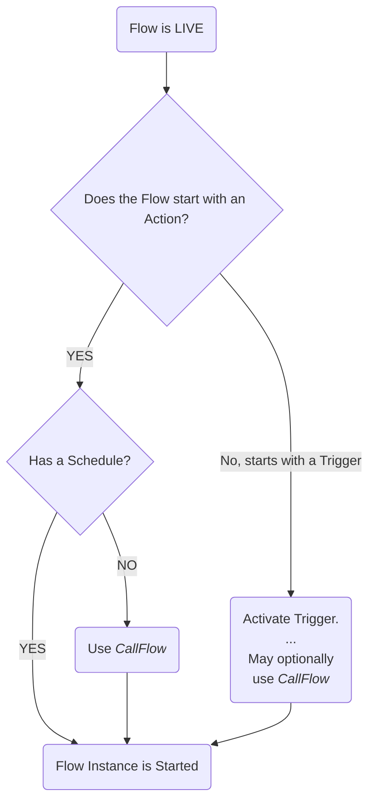

Running a flow means executing its sequence of actions, triggers, conditions, and transformations. How a flow runs depends on its structure and configuration. This section explains the different ways you can launch flows in FlowRunner™.

## Basic Rules for Launching Flows

To ensure your flows start smoothly, follow these basic rules:

1. **Enable the Flow**: A flow must be in the `LIVE` state to run:
   
2. **Starting Without a Schedule**: If a flow doesn’t have a schedule, it must be started with a special command called [`CallFlow`](#callflow-commandapi).

    !!! note
        There is an exception to this rule for flows that start with a trigger. In this case, the [`CallFlow`](#callflow-commandapi) command is optional. The flow can begin with the activation of the first trigger. However, initiating the flow with the [`CallFlow`](#callflow-commandapi) command can be beneficial. See the [section on the `CallFlow` API](#callflow-commandapi) for more details.

3. **Scheduled Flows**: When a flow has a schedule, it will automatically run according to that schedule. The [`CallFlow`](#callflow-commandapi) command is not needed as the scheduler handles the execution.
   
4. **Multiple Executions**: A single flow can have multiple executions, some running in parallel.
5. **Unique Identifiers**: Every execution of a flow has a unique identifier called `executionId`.

Below is a diagram illustrating the "launch rules":



The sections below provide more detail on each scenario.

## Flow without a Schedule

For a flow without a schedule, once you enable it (putting it in the `LIVE` state), it won’t run automatically. If the flow starts with a trigger, the trigger needs to be activated for the flow to run. If the flow starts with an action, it must be started using the [`CallFlow`](#callflow-commandapi) command/API.

## Flow with a Schedule

For a scheduled flow that is in the `LIVE` state, the scheduler starts new executions automatically. The [`CallFlow`](#callflow-commandapi) command/API is not needed in this case. If the flow starts with an action, the action block will execute with each new iteration of the schedule. If the flow starts with a trigger, each new execution will wait for the trigger to be activated.

## CallFlow Command/API

The `CallFlow` command creates a new execution of a flow. This command identifies the flow to execute and can optionally accept a key/value structure (object) to pass into the executed flow. The `CallFlow` command is available in several formats:

1. **FlowRunner™ Action**: Execute a flow from another flow.
    
2. **Codeless block**: Execute a flow from your UI application created with UI Builder or from Backendless Cloud Code. You can find the `Call Flow` Codeless block in the Codeless `Logic Editor`. Every flow you create will have a dedicated menu item in the `FLOWRUNNER` section:
    
The `Call Flow` Codeless block returns an object which contains the `executionId` property. The value of the property can be used later on to activate a trigger in the same flow execution. Below is an example of how to obtain the `executionId` value from the `Call Flow` response:
    
3. **REST API endpoint**: Execute a flow from any third-party system.

    **Endpoint**: 
    ```
    POST https://xxxx.backendless.app/api/automation/flow/activate-by-name
    ```

    **HTTP Headers**:
    ```
    Content-Type: application/json
    user-token: value 
    ```
    The `user-token` header is optional. When it is used, the activated flow receives the identity of the user represented by the token.

    **Request Body**:
    ```json
    {
      "name": "Flow name. Required Value",
      "initialData": {
        "A valid JSON object containing initial flow data. Optional"
      }
    }
    ```
    The `initialData` property in the request body is optional. When provided, the value is passed into the flow execution. It will be available through the [Expression Editor](../flow-editing/expressioneditor.md) interface.

    **Response Body**
    ```json
    {
      "executionId": "String"
    }
    ```

The return value from the `CallFlow` operation is an `executionId` assigned to the created flow execution. This ID is important if you need to "target" triggers from that specific execution. When calling a trigger, you can pass the `executionId` parameter to activate the trigger in a specific execution.