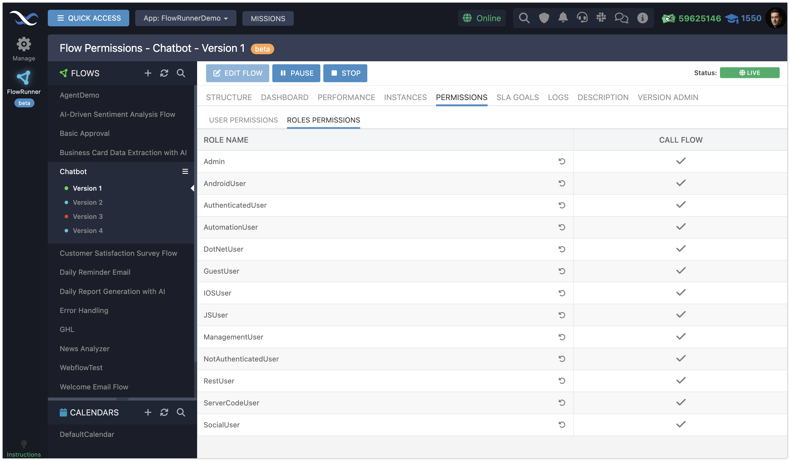

Controlling who can activate your automation flows is essential for maintaining security and ensuring smooth operations in FlowRunner™. Execution permissions let you define the identities or security roles that can activate your flows. This applies to human users as well as service accounts.

This feature allows you to grant access to specific individuals or groups via roles and enable integration with external systems, ensuring they can invoke flows securely.

By setting clear permissions, you safeguard your automation while giving authorized entities the access they need.

!!! note
    This section uses the term *activate* when it refers to the concept of starting a flow. To activate a flow, it must have the `LIVE` status. To activate the flow, use the `Call Flow` API or the **Call Flow** action block. (both are documented [here](../flow-execution/overview.html#callflow-commandapi)).

You can access flow permissions by selecting a flow version and clicking the **PERMISSIONS** tab:

## Execution Permissions  

Execution permissions allow you to control launch access to your flows, determining which users, roles, or systems can activate them. These permissions apply to **all versions of a flow**, ensuring consistent access management across your automation. 

Flows can be triggered in two primary ways:  

- **`Call Flow` API**: External systems or services can trigger flows via API, enabling integration with tools and platforms outside your FlowRunner™ automation.
- **The [`Call Flow`](../flow-execution/overview.md#callflow-commandapi) Action Block**: Use this to chain flows together, creating complex and efficient automation systems.  

## Granting or Denying Permissions  

Each flow in FlowRunner™ can have a custom set of permissions. You can assign these permissions to:  

- **Individual Users**: Grant or deny access directly to specific user accounts, controlling who can activate the flow.  
- **Security Roles**: Assign permissions to roles to efficiently manage access for groups of users.  

## System-Level Roles  

System-level roles, such as `NonAuthenticatedUser` and `AuthenticatedUser`, allow you to manage access based on user authentication. For instance, denying permission to the `NonAuthenticatedUser` role ensures only logged-in users can activate the flow.  

## Default Permissions  

By default, all users and roles have permission granted to activate flows. This setup simplifies testing and integration during development. Once your flows are ready for production, you can restrict permissions in the UI to meet your app’s security needs.  

## Changing Permissions in the UI  

Configuring execution permissions is straightforward. Here’s how to manage access for your flows:  

1. Navigate to the **Flow Manager** and locate the flow you want to configure.  
2. Click the **PERMISSIONS** tab.  
3. The interface consists of two tabs:  
    - **USER PERMISSIONS**: Manage access for individual users.  
    - **ROLES PERMISSIONS**: Set permissions for user roles.  
4. Adjust permissions by toggling the icons next to each user or role:  
     - **Gray Checkmark**: Permission is inherited from app-wide settings.  
    - **Green Checkmark**: Permission is explicitly granted for this flow.  
    - **Red X**: Permission is explicitly denied for this flow.  

Execution permissions are critical to securing your FlowRunner™ automations. By tailoring access for users, roles, and external systems, you can maintain both efficiency and control. Backendless makes this process intuitive, so you can focus on building great applications while ensuring your automations remain secure.  
