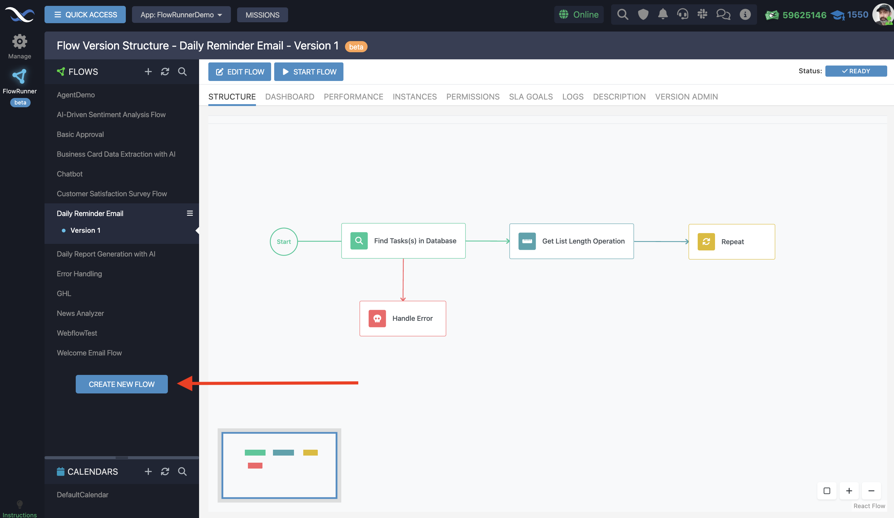

# Creating New Flows

Creating new flows is the first step in building automation with FlowRunner™. This chapter covers how to set up a flow by providing a name and description.

## Creating a Flow

Follow these steps to create a new flow in FlowRunner™:

1. **Navigate to Flow Manager:** Open the Flow Manager, the control center for all your automation activities.

2. **Create New Flow:** Click the **CREATE A NEW FLOW** button to initiate a new automation.

    

3. **Enter Flow Name:** Upon initiating a new flow, you’ll be prompted to give it a name. This name is how you'll identify your flow within the FlowRunner™ platform, so choose something descriptive and meaningful.

4. **Add a Description (Optional):** While optional, adding a description is highly recommended. This is where you outline the flow's purpose and any other important notes that will guide you or your collaborators in understanding its function.

5. **Confirm Creation:** With a name and an optional description in place, confirm the creation of your new flow by clicking the **CREATE** button. This action generates the flow and its first editable version within the system.

<!--ARCADE EMBED START-->
<iframe src="https://demo.arcade.software/1QEoCU9vKIOriK7BudfQ?embed&embed_mobile=tab&embed_desktop=inline&show_copy_link=true" title="Setting Up Your New Flow" frameborder="0" loading="lazy" webkitallowfullscreen mozallowfullscreen allowfullscreen allow="clipboard-write" style="position: absolute; top: 0; left: 0; width: 100%; height: 100%; color-scheme: light;" ></iframe>
<!--ARCADE EMBED END-->

## Flow Name

The name you choose for your flow serves as its primary identifier and should succinctly convey its purpose. Here are some tips for naming your flow:

- **Be Descriptive and Specific:** Use names that clearly indicate what the flow does, such as “Customer Onboarding Process” or “Weekly Sales Report Generator.”

- **Consistency is Key:** If your organization has existing naming conventions, stick to them. Consistency helps with organization and ease of finding specific flows later.

## Flow Description

Though optional, a well-crafted description is invaluable. It provides context and clarifies the flow’s intent and mechanics, especially for collaborative projects. When adding a description, consider the following:

- **Outline the Flow’s Purpose:** Explain what the flow is designed to achieve. This overview helps anyone working with or reviewing the flow to understand its objectives quickly.

- **Include Key Details:** Mention any important triggers, actions, or conditions that are central to the flow’s operation. This information can be crucial for maintenance or future modifications.

- **Keep it Clear and Concise:** While being thorough, aim for clarity and brevity. The goal is to communicate effectively, not to overwhelm with details.

Once created, your new flow and its first version are ready for further development. You can now structure your automation by planning and implementing the flow's components and logic.