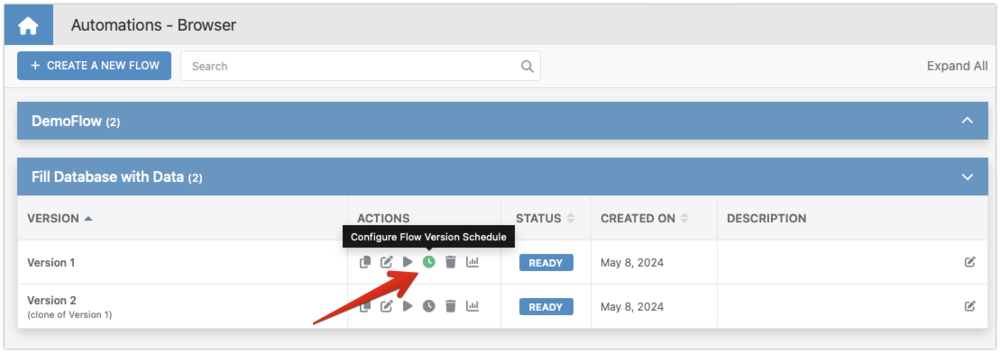
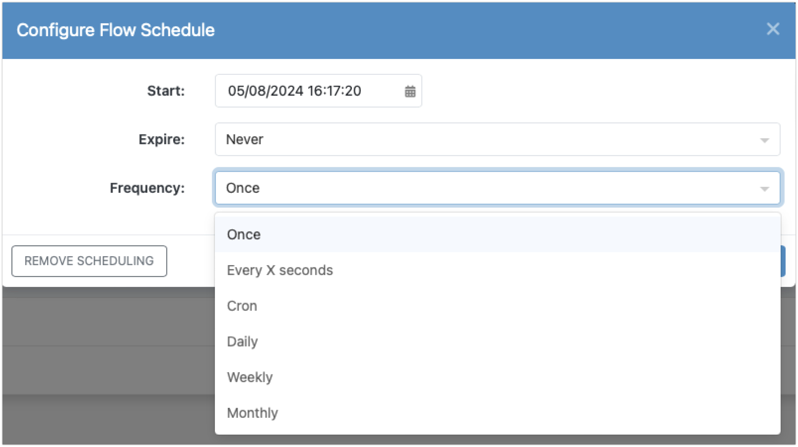

# Scheduled Flows

Scheduled Flows in Backendless Automations enhance your ability to automate business processes by allowing you to determine when and how often a flow should execute. For instance, imagine you need to generate a report every Friday detailing weekly sales; with Scheduled Flows, you can set up a flow that automatically gathers this data and generates the report at the specified time each week. This chapter will guide you through setting up these schedules, choosing frequency options, and managing the active schedules for your flows.

## Creating a Schedule

To create a flow that runs on a schedule, navigate to the Flow Manager interface and click the `Configure Flow Version Schedule` icon:

You will see the `Configure Flow Schedule` popup, where you must define the schedule's parameters, including the start time, frequency, and optionally select an expiration date/time. The schedule you set up is automatically activated when you run the flow version, either through the management console or programmatically via the API. This ensures that the flow executes according to the defined timing without manual intervention each time. Keep in mind that the flow schedule applies to a specific version of the flow. Different flow versions can have different schedules.

## Start Times and Expiration

The start time of a schedule is crucial as it determines when the flow will first trigger, setting the pattern for any recurring executions. Additionally, setting an expiration date for the schedule helps control how long the flow remains active, preventing indefinite execution and allowing you to manage resources effectively. 

## Frequency Options

You have various frequency options for scheduling your flows, each suited to different operational needs:

- **Once**: This option triggers the flow only once at a specified time.
- **Every X seconds**: Set the flow to execute repeatedly at intervals no less than 60 seconds, ideal for tasks that require frequent updates.
- **Daily**: Configure the flow to run every few days, useful for regular maintenance tasks or updates.
- **Weekly**: Opt to have the flow execute on selected days each week, perfect for weekly reporting or data aggregation tasks.
- **Monthly**: This setting is suitable for monthly operations, such as billing or performance reviews, allowing you to specify exact days or recurring weekdays each month.
- **Cron**: Use a [cron expression](https://crontab.cronhub.io/) to configure the execution frequency for your flow. 

## Removing a Schedule

If you need to stop scheduled executions, the process is simple. Click the `Remove Scheduling` button in the `Configure Flow Schedule` popup to deactivate the schedule. This action prevents future executions according to the former schedule but does not affect any active (running) instances of your flow.