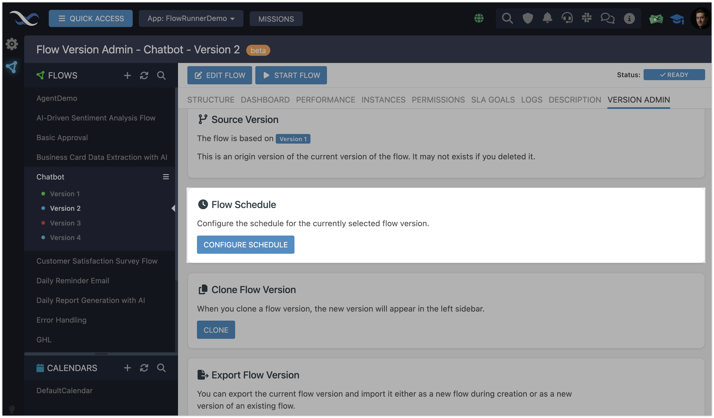
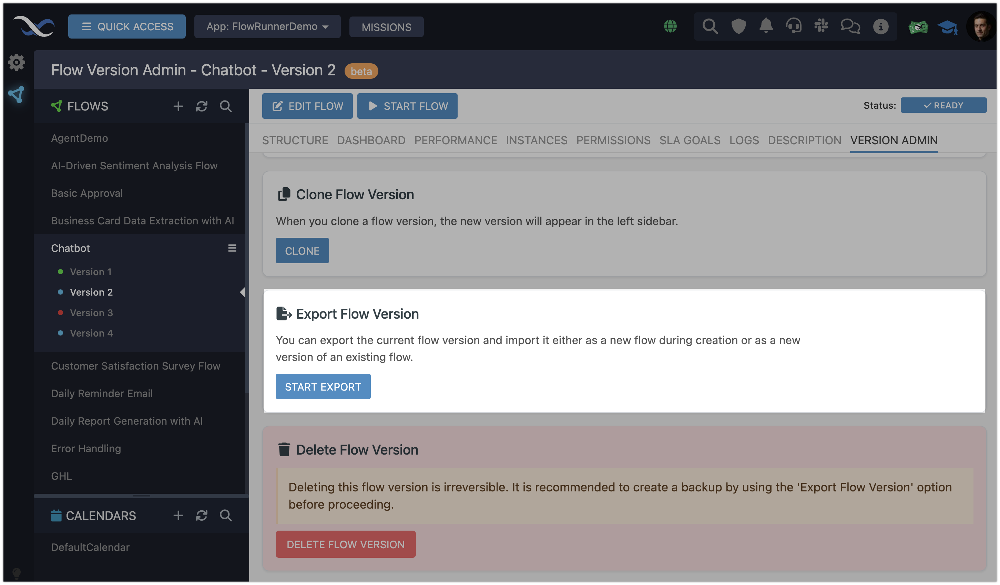

# Version Management  

Version management in FlowRunner™ is central to keeping your workflows adaptable, organized, and reliable. A **Flow Version** represents a specific iteration of a workflow, capturing its configuration, functionality, and operational settings at a given point in time. Versions allow you to refine and enhance workflows while keeping the current version running smoothly.  

### The Purpose of Flow Versions  

Flow versions serve multiple purposes beyond simply enabling updates:  

- **Single Active Version:** Only one version of a flow can be active at any time, known as the `LIVE` state. This ensures changes can be tested and refined in separate versions without impacting the live version.  
- **Dedicated Analytics:** Each version maintains its own analytics data, giving you insights into its performance once it goes live and runs automation tasks. This separation makes it easy to track the success of changes or compare different iterations.  
- **SLA Goals:** Service Level Agreement (SLA) goals can be defined per version, ensuring each iteration aligns with your operational requirements.  
- **Version-Specific Schedules:** Each version can operate on its own schedule, providing flexibility in automation timing and execution.  

## Version Statuses  

Every flow version has a status that reflects its readiness and role within your automation processes. These statuses help you understand where a version stands in its lifecycle:  

- **READY**: This status means the version has successfully passed all Backendless validations. It's error-free and ready to go live at your command.
- **NOT READY**: A version with this status contains one or more errors. Hovering over the status tag reveals a tooltip with details about the validation errors, helping you identify and resolve the issues.
- **LIVE**: This status indicates the version is actively running and automating the tasks it was designed for. Only one version of a flow can have this status at any time.  

<!--ARCADE EMBED START-->
<iframe src="https://demo.arcade.software/4PmeDtS99SOwYTBwJjsT?embed&embed_mobile=tab&embed_desktop=inline&show_copy_link=true" title="Explore Flow Version Structure" frameborder="0" loading="lazy" webkitallowfullscreen mozallowfullscreen allowfullscreen allow="clipboard-write" style="position: absolute; top: 0; left: 0; width: 100%; height: 100%; color-scheme: light;" ></iframe>
<!--ARCADE EMBED END-->

## Version Editing
You can edit any flow version that is not in the `LIVE` status. Click the **EDIT FLOW** button to open the [Flow Editor interface](../flow-editing/floweditor.md), where you can modify the version's automation logic. The Flow Editor provides all the tools you need to adjust workflows, implement updates, and refine functionality.

## Starting a Version
The **START FLOW** button activates a flow version, making it the current `LIVE` version. Only one version of a flow can be `LIVE` at any time, ensuring your automation processes remain focused and orderly.  

When a version is `LIVE`, additional controls become available:  

- **:fontawesome-solid-pause: PAUSE** Temporarily halts new executions while allowing ongoing processes to finish.  
- **:fontawesome-solid-stop: STOP:** Fully halts all executions, taking the version offline.  

## Version Administration Functions

All version management functions are available on the `VERSION ADMIN` tab:

### :fontawesome-solid-copy: - Clone version
Cloning a version is an essential tool for experimentation and iteration. It allows you to explore new ideas or make changes without disrupting the current `LIVE` version. When you clone a version, an identical copy of the selected version is created, providing a safe space to test updates or refine functionality.  

The cloned version includes everything from the original, ensuring consistency and a complete starting point for modifications. This includes:  

- The **schedule**, if one is defined.  
- Any **SLA goals** associated with the original version.  
- The full **configuration of all flow blocks**, preserving the workflow’s logic and design.  

Cloning is particularly useful for maintaining operational continuity while developing improvements, letting you seamlessly transition updates when ready.  

---
### :fontawesome-regular-clock: - Configure version schedule 
The **Configure Schedule** button opens a popup where you can set a schedule for the flow version. 

The scheduling functionality is highly flexible, supporting a wide range of options:  

- A one-time execution.  
- Recurring schedules such as hourly, daily, or weekly.  
- Advanced configurations using cron expressions for complete customization.  

With these options, you can tailor the flow’s execution timing to fit your specific automation needs. For more information, visit the [Schedule Flows](./scheduledflows.md) section of this guide.

---
### :fontawesome-solid-file-export: - Export version
Clicking the **Start Export** button generates a single export file containing all the key details of the flow. The file includes:  

- The flow’s automation steps.  
- The flow schedule, if one is defined.  
- SLA goals, if any are set.  

This export file allows you to back up your flow or transfer it to another environment while preserving all its critical configurations.  For more information, visit the [Import/Export](./import-export.md) section of this guide.

---
### :fontawesome-solid-trash: - Delete version
If a flow version is no longer needed, you can delete it. To prevent accidental removal, this action requires confirmation before the version is permanently deleted. For more information, see the [Deleting Flows](./deleteflow.md) section of this guide.

