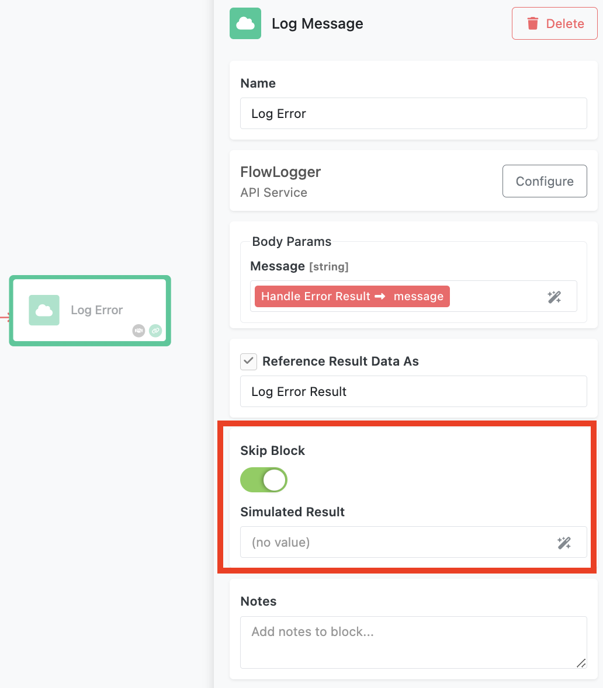

The **Skip Block** functionality in FlowRunner™ allows flow developers to bypass the execution of an action block without disrupting the flow. This feature is particularly useful during development, debugging, or testing, enabling developers to simulate results for skipped blocks and continue building and refining workflows seamlessly.  

Every action block in FlowRunner™ includes a **Skip Block** toggle. When enabled:  

1. The block does not execute its intended action.  
2. Developers can specify a **Simulated Result**, which will be treated as if the block had executed successfully.  
3. The simulated result is passed to the block’s successors, ensuring that the flow continues without errors or interruptions.  

When an action block is skipped, it is visually rendered in grayscale in the Flow Editor, providing a clear indicator that the block is not active during execution.

## Use Cases for Block Skipping  

The Skip Block toggle is ideal for situations where executing an action block is temporary, unnecessary, or undesired. Examples include:  

- **Debugging**: Temporarily skip certain actions (e.g. sending emails, making API calls) while debugging other parts of the flow.  
- **Testing**: Simulate block outputs to test downstream logic without relying on live systems or data.  
- **Logging**: Exclude logging actions while preserving the structure of the flow for production.  
- **Flow Development**: Placeholder actions can be skipped during the initial development phase while designing the broader workflow logic.  
- **Performance Optimization**: Disable non-critical actions to test the performance of a flow with fewer processes running.  

## Best Practices  

1. **Use Realistic Simulated Results**: Ensure the simulated result closely mimics the actual output of the block to avoid unexpected issues in successors.  
2. **Document Skipped Blocks**: Add comments or notes in the flow to explain why the Skip Block toggle is enabled and what the simulated result represents.  
3. **Re-enable Actions When Needed**: Disable the Skip Block toggle once debugging or testing is complete to restore the block’s intended functionality.  
4. **Test Successor Logic**: After skipping a block, validate that its successors behave correctly with the simulated result.  

The **Skip Block** functionality is a powerful tool for flow developers, enabling greater flexibility and control during the design, testing, and debugging of workflows. By leveraging this feature, you can streamline the development process while maintaining a robust automation environment.  
