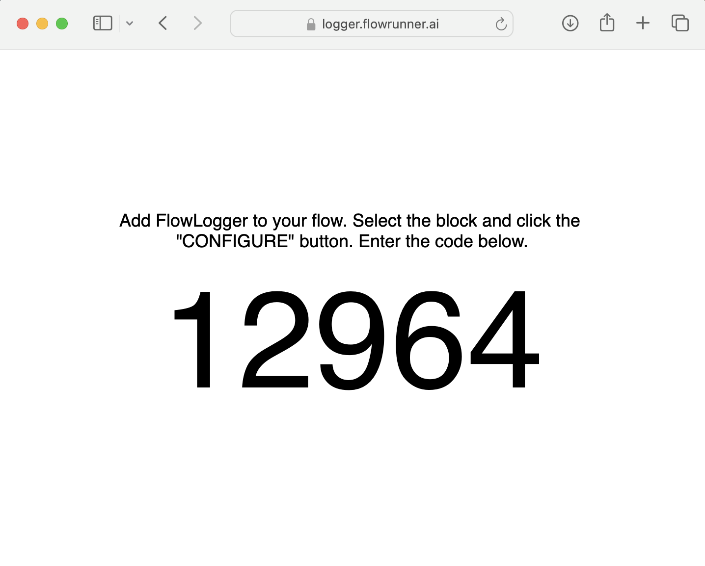
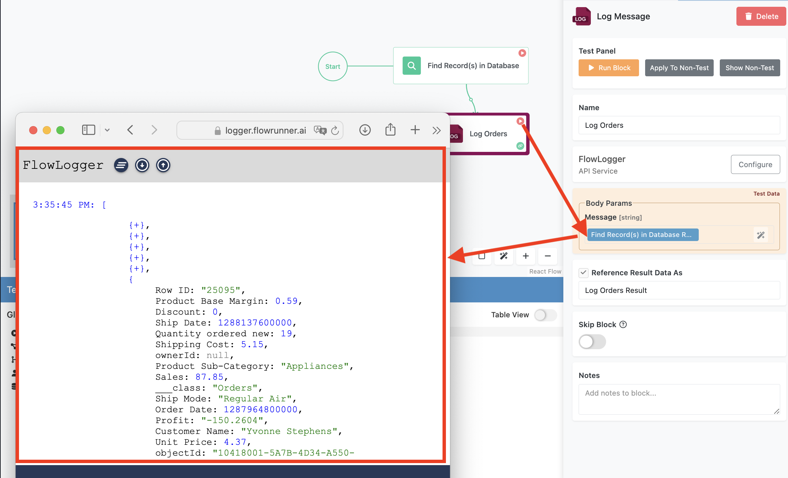

Debugging is a crucial part of the development and testing process in FlowRunner™. It allows you to identify, analyze, and resolve issues in your workflows to ensure they perform as expected. While testing validates the overall functionality of your flows (see the [Test Mode](./testing.md) chapter for details), debugging focuses on pinpointing and addressing specific problems within the flow.

To support effective debugging, FlowRunner™ provides integration with the FlowLogger(tm), a powerful web-based tool designed for real-time log monitoring and message analysis. Whether you’re tracking specific data points or troubleshooting errors, the FlowLogger(tm) gives you immediate feedback, simplifying the debugging process and helping you refine your flows more effectively. 

## FlowLogger(tm) Web App  

The FlowLogger(tm) is a web application available at [https://logger.flowrunner.ai](https://logger.flowrunner.ai). When you open the logger, it generates a five-digit **debugging session code**. This code links your flow to the logger and enables it to receive log messages during execution. 

## FlowRunner™ Logger Action  

Before you can use the FlowLogger(tm), you need to install its extension. Begin by opening the **Marketplace** in FlowRunner™(tm):

Search for the **FlowRunner™ Logger** extension. Click the `GET` button to install it in your application. 

!!! note
    Extentions installed from the marketplace will be available for all flows in your app.

Once installed, the extension will appear in the **CUSTOM ACTIONS** category to your [Blocks Toolbox](../flow-editing/floweditor.md#blocks-toolbox). This is where the **Log Message** block resides. 

To start using the **Log Message** block, drag it into your flow and select it to open its properties. In the Property Editor, click the **Configure** button. 

A popup window will appear, prompting you to enter the five-digit **Session Code** from the **FlowLogger(tm)** web application. After entering the Session Code, save your changes. This step will connect the block to the logger upon sending the very first log message.

## Using the Log Message Block  

The Log Message block allows you to transmit data from your flow to the FlowLogger(tm). It accepts a single input parameter, **Message**, which can contain any type of data, including strings, numbers, lists, or key/value structures.  

When the block executes, the message you specify is sent to the logge web app, where it appears in real-time. This makes the Log Message block an invaluable tool for understanding what’s happening inside your flow. You can use it to verify data, track execution paths, or identify errors. For example, you might log the results of a calculation, the contents of a variable, or the outcome of a database query.  

## Monitoring Logs in Real-Time  

Once your flow is linked to the FlowLogger(tm) web app, you can monitor its behavior as it runs. Messages sent by the Log Message block are displayed instantly, providing an up-to-the-moment view of your flow’s activity.  

To fully utilize the FlowLogger(tm), try running the Log Message block in [Test Mode](./testing.md). This lets you experiment with your flow in a safe environment, where you can observe how data is logged and troubleshoot issues without affecting live workflows.  

FlowLogger(tm) includes several features to enhance your debugging experience. If the log output becomes cluttered, you can clear all messages with the **Clear all logs** icon-button. For readability, you can adjust the text size of log entries using the :arrow_up: and :arrow_down: icon-buttons. 

When the logged data includes lists or key/value structures, the logger allows you to expand or collapse sections, making it easy to explore nested information.  

If you need to start a new session, click the **START NEW SESSION** button in the bottom bar of the FlowLogger(tm) window.

## Best Practices for Debugging  

1. Place Log Message blocks strategically at key points in your flow to track important data or monitor execution paths.  
2. Use meaningful and descriptive messages to provide clear context for each log entry.  
3. Clear the logger between tests to avoid confusion and ensure you’re viewing only the latest messages.  
4. Combine FlowLogger(tm) with Test Mode for a controlled debugging environment where you can isolate and resolve issues efficiently.  
5. Take advantage of the logger’s collapsible structures to navigate complex data more easily.  
