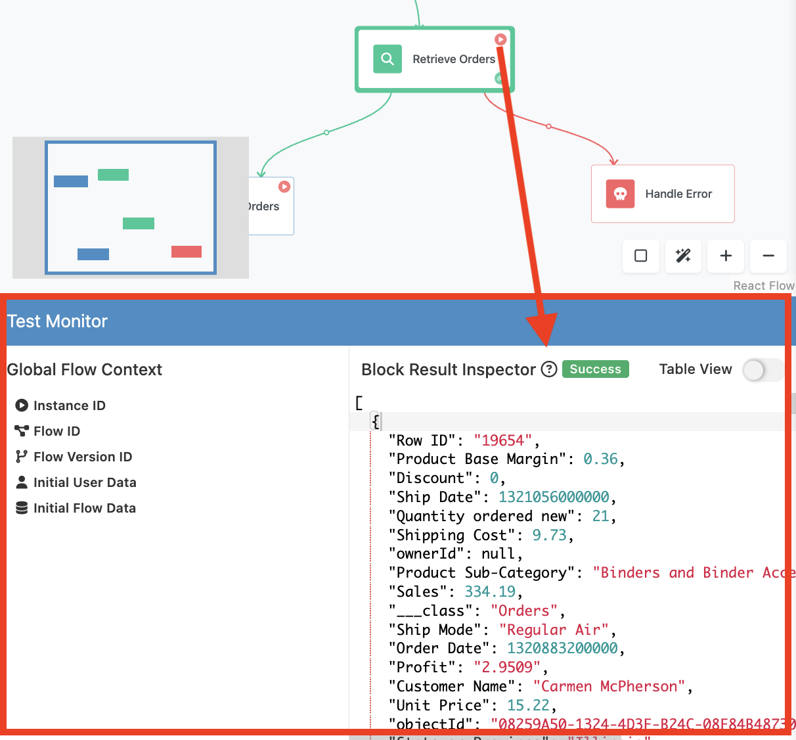
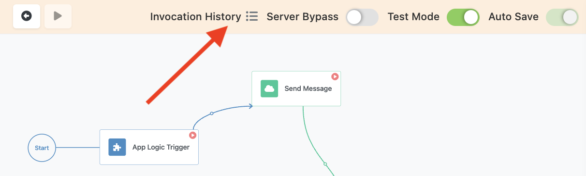

Test Mode helps you efficiently test and debug your flows. This mode allows you to simulate the flow execution, monitor its behavior, and ensure everything works as expected before launching the flow. Testing is crucial because many parts of the flows run "silently" and execute business rules and logic behind the scenes. By testing, you gain visibility into how this execution works, identify potential issues, and verify that your automation behaves as intended. This process helps you catch and resolve errors early, leading to more reliable and robust workflows.

You can activate Test Mode directly within the Flow Editor by toggling the "Test Mode" toggle. 

Once enabled, the interface adapts to support testing and debugging activities. You will observe the following changes in the interface:

1. The **Test Monitor** panel, the crucial element of the test mode appears at the bottom of the Flow Editor interface.
    

2. Blocks in your flow get the "play" icon that let's you perform a test run of the block.
   

3. When you select a block, the configuration properties that impact block's execution (usually these are the properties that define the input parameter(s)) are displayed with the special "debug" annotation. Additionally, notice the **Test** button, it performs the same action as the red "play" icon on the selected block:
   

## Test Monitor Panel

Test Monitor helps you inspect the results of test invocations and check the Global Flow Context values. When you execute a test run for a block, the Test Monitor panel will display the block's result:

When you select a block in the flow, the panel will show the result from the most recent test run. The result value can be edited (or created if you need to set up a mocked data).

## Invocation History
Every time a block is executed in Test Mode, an entry is added to the Invocation History panel. The panel is accessible by clicking the **Invocation History** icon located in the same toolbar as the "Test Mode" toggle:

For every test invocation, the panel displays the time of the call, the block's name, and the call status (Success or Error). 

## Test Parameters

In Test Mode, every block in your flow gets a special "play" icon. Clicking this icon will execute the block with the test input parameters. These parameters are initially copied from the "production" mode (the normal design mode of your flow), but you can modify them as needed for testing purposes. The test input parameters always have a red border and a red "bug" icon in the upper right corner. Clicking the "bug" icon will show the non-test (production) data. Use the double arrows icon button to transfer test data to the production properties and vice versa: 

???+ warning
      While in Test Mode, if you modify a test input parameter, its value does not immediately propagate to the non-test values. To update the non-test values, make sure to click the "double arrow" icon.

## Editing Test Data
The **Block Result Inspector** section of the **Test Monitor** panel lets you override or enter new data for any item in your flow. If a block's result is used as an input parameter, you can specify the value using the editor in Block Result Inspector. Consider the following example - the **Retrieve Orders** block is a **Find Record(s) in Database** action. It uses the `condition` property from **App Logic Trigger Data** for the **Where Clause** parameter:

Since the **App Logic Trigger** block is a trigger, when you run it in the Test Mode, it does not produce any results. In order to prepare the Retrieve Orders block for a test run, you need to make sure its input parameter has data. This means, you need to set up a value for the `condition` property in the data provided by the App Logic Trigger. To do that select **App Logic Trigger** block and click the "+" (**Add Row**) button in the **Block Result Inspector**:

Type in `condition` in the **Property Names** column and a valid where clause for your time, for example `Profit > 100`:

Run a test execution of the "Retrieve Orders" block, it will use the specifed value of the `condition` property. You can see the result in the **Block Result Inspector** panel:

## Step-by-Step Testing

Test Mode allows you to execute blocks step-by-step, giving you a granular view of how data flows through your automation. By examining the **Invocation History** and block results sections, you can understand how each block processes data and identify any issues or errors. This detailed inspection helps ensure that your flow operates correctly and efficiently in production.

FlowRunner’s Test Mode is a powerful tool for testing and debugging your flows. By enabling Test Mode, utilizing the Test Monitor, and executing blocks step-by-step, you can thoroughly validate your flows, ensuring they are ready for production. This proactive approach to testing helps you catch and resolve issues early, leading to more reliable and robust automations.