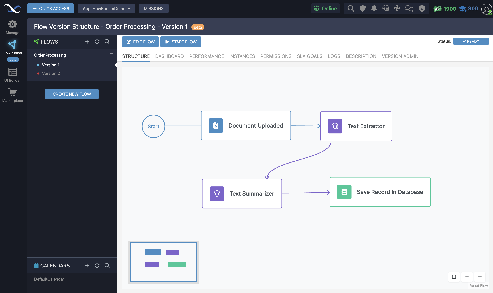

# Flow Manager

Welcome to the "Flow Manager" chapter of the FlowRunner™ User Guide. As the nucleus of your automation journey, Flow Manager equips you with the tools and functionalities necessary to orchestrate your workflows with precision and ease. This chapter will walk you through the various operations you can perform within Flow Manager, ensuring you have a solid foundation for creating, managing, and refining your automated workflows.

## Flow Managenent

Flow Manager is the central hub for all your workflow operations. Here's a rundown of the core functions you'll be utilizing:

- **[Create New Flows](./flow-management/createflow.md "Learn about creating new flows"):** Jumpstart your automation projects by crafting new workflows tailored to your specific needs.
- **[Rename Flows](./flow-management/renameflow.md "Learn how to rename your flows"):** Keep your workflows organized and easily identifiable by renaming them as your projects evolve.
- **[Delete Flows](./flow-management/deleteflow.md "Learn how to delete flows from your account"):** Remove unnecessary workflows from your system to maintain clarity and focus on your current automation tasks.
- **[Customize Flow's Appearance](./flow-management/flowappearance.md "How to customize flow's appearance"):** Personalize the look and feel of your workflows for a more intuitive and visually appealing design experience.
- **[Assign Flow Execution Permissions](./flow-management/callflowpermission.md "Securing external execution of flows"):** Secure your workflows by managing who can execute them, ensuring only authorized users have access.
- **[Manage Flow Versions](./flow-management/versionmanagement.md "Learn about version management functions"):** Handle different iterations of your workflows efficiently, enabling continuous improvement without losing track of previous versions.

## Flow Version Management

Diving deeper into version control, Flow Manager offers a comprehensive set of functionalities designed to manage the lifecycle of each Flow version:

- **[Edit Flow Version](./flow-management/versionmanagement.md#editing-a-version):** Fine-tune your workflows with precision, making adjustments to optimize performance or add new functionalities.
- **[Clone a Version](./flow-management/versionmanagement.md#creating-a-clone):** Easily create new iterations of your workflows by cloning existing versions, allowing for rapid experimentation and development.
- **[Start/Stop Flow Version](./flow-management/versionmanagement.md#starting-a-version)** Take control of your workflow executions by starting or stopping versions, enabling you to manage which processes are active at any given time.
- **[Delete a Version](./flow-management/versionmanagement.md#deleting-a-flow-version):** Keep your workflow environment tidy by removing outdated or redundant versions, focusing only on the iterations that matter.
- **[Navigate to the Version's Analytics](./flow-management/versionmanagement.md#access-flow-analytics):** Gain insights into your workflow's performance by accessing detailed analytics, helping you make data-driven decisions to enhance efficiency.
- **Add a Description for the Flow Version:** Document the purpose and functionality of each version, ensuring clarity and understanding for all users involved.

Flow Manager is designed to be both powerful and user-friendly, ensuring that regardless of your technical expertise, you have the tools necessary to implement and manage automated workflows effectively. By familiarizing yourself with the functionalities described in this chapter, you'll be well-equipped to navigate the FlowRunner™ platform, streamline your operations, and bring your business processes to new heights of efficiency and reliability.