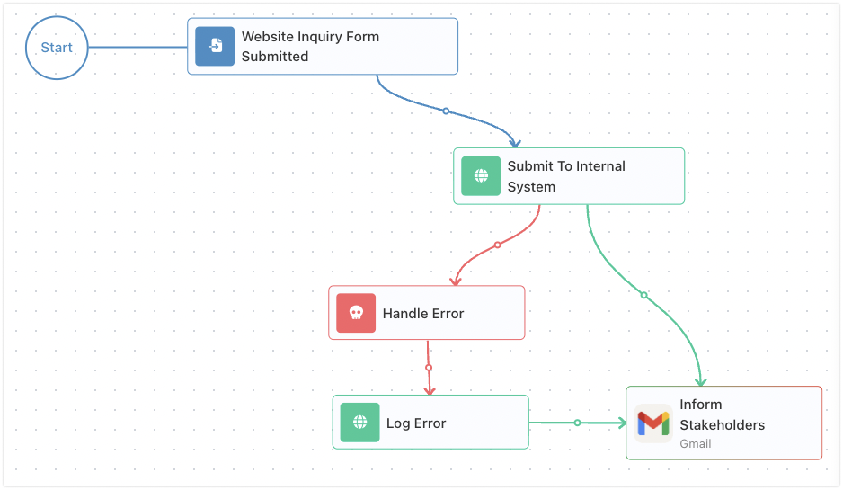

# Blocks

A block is the unit you build a flow out of. Each one has one clear job - call an API, ask a yes-or-no question, loop over a list, transform a value. You assemble a flow by placing blocks and wiring them together, and the wiring is rarely a straight line: a flow usually follows a real business process - an approval, an onboarding, an order moving through its steps - and those branch on a decision, loop over a batch, and rejoin. This page is about the pieces themselves - what a block is, what every block has in common, and how one block's result becomes the next block's input.

## One block, one job

The discipline that keeps flows readable is that a block does one thing. An [HTTP Request](../../reference/http-request.md){.fr-block} makes one web request. A [Condition](../../reference/condition.md){.fr-block} asks one yes-or-no question and forks the flow two ways. A [Transform Data](../../reference/transform-data.md){.fr-block} reshapes one value into another. As a rule you do not pack fetch, transform, and route into a single block; you place three and connect them, so the flow reads as the sequence of things it does. Two blocks bend this rule by design: a [Custom Cloud Code](../../reference/custom-cloud-code.md){.fr-block} block runs whatever code you write, and an [AI Agent](../../reference/ai-agent.md){.fr-block} runs a model with its own tools - each does many things inside one block, but all toward the single goal you give it. Reach for them when a routine is genuinely one unit, not to collapse a flow that should read as separate steps.

Most blocks are **actions** - a step that does work, like calling a service. Some are **triggers** - how a flow reacts to an outside event; most start a run, but a trigger can also sit in the middle of a flow and wait for something to happen - a person approving a step, a reply arriving - before the flow goes on (covered in [Triggers](triggers.md)). Some are **block containers** that hold other blocks and run them, like a [List Iterator](../../reference/list-iterator.md){.fr-block} looping a set of steps over every item in a list, or an [Actions Group](../../reference/actions-group.md){.fr-block} running several actions at once. And some are utilities that shape the flow itself rather than touch your data - a [Condition](../../reference/condition.md){.fr-block} branching the path, a [Handle Error](../../reference/handle-error.md){.fr-block} catching a failure. Whatever the kind, the rule holds: each block has its one job, and the flow is the arrangement of those jobs.

## The block palette and its categories

You add a block from the palette in the **Flow Editor** and drop it onto the canvas. The palette groups blocks by the kind of work they do, so you find the one you want by what it is for. The blocks built into FlowRunner™ fall into a handful of groups:

- **AI** - blocks that bring a model into the flow: the [AI Agent](../../reference/ai-agent.md){.fr-block}, and the [AI Router](../../reference/ai-router.md){.fr-block} that picks a path from natural language.
- **Triggers** - what a flow reacts to in the outside world, covered in [Triggers](triggers.md).
- **Actions** - the steps that do work: [HTTP Request](../../reference/http-request.md){.fr-block}, [Call Flow](../../reference/call-flow.md){.fr-block}, [Custom Cloud Code](../../reference/custom-cloud-code.md){.fr-block}, and the [Knowledge Base](../../reference/knowledge-bases-concept.md) and [Shared Memory](shared-memory.md) actions.
- **Utils** - the blocks that shape the flow's logic rather than its data: [Condition](../../reference/condition.md){.fr-block}, [List Iterator](../../reference/list-iterator.md){.fr-block}, [Handle Error](../../reference/handle-error.md){.fr-block}, [Transform Data](../../reference/transform-data.md){.fr-block}, [Set Variables](../../reference/set-variables.md){.fr-block}, and more.
- **Groups** - the containers that run several inner blocks together: [Actions Group](../../reference/actions-group.md){.fr-block} and [Triggers Group](../../reference/triggers-group.md){.fr-block}.
- **Subflows** - the [SubFlow](../../reference/subflow.md){.fr-block} block, which runs a separate flow you built as a reusable piece.

Those are only the start. A large library of **Extensions** - blocks for outside services like Backendless, Airtable, Stripe, Slack, and many more - is there out of the box, with nothing to install. A connected **MCP** server adds its tools as blocks the same way, under **MCP Extensions**. And two groups fill in from your own workspace: your flows each appear under **Flows as Actions**, ready to call as a step from another flow, and extensions your developers deploy appear under **Custom Extensions** - see [Extend](../../extend/index.md). So the palette is wide from the start and grows further with everything you build and connect.

<!-- RELEASE v.1.1.2 (FR-3218), DRIVEN 2026-09-25 on PROD: the AI Assistant block and its AI Assistants palette group are gone (a flow that still holds one shows it as an unknown block - developer's note, not driven). blocks-palette.png recaptured from the flow editor's first right-panel tab, every group collapsed except Triggers. The Custom Extensions group is live (FR-3474). -->

Every built-in block has a page in the [Block Reference](../../reference/condition.md), with its full configuration and a worked example. The categories are only a way to find a block; once it is on the canvas, you configure it the same way whichever group it came from.

## What every block has in common

Whatever a block does, you select the block and configure it in its panel. Most of that panel is specific to the block - a [Condition](../../reference/condition.md){.fr-block} asks for a value and a comparison, an [HTTP Request](../../reference/http-request.md){.fr-block} asks for a URL and a method. But a couple of things recur almost everywhere. You give the block a **Name**: naming it for what it does ("Look up customer", not the default "HTTP Request") makes the flow readable at a glance. You can leave **Notes** on it for whoever reads the flow later, which never affect how it runs. And most blocks publish their result under an alias for later blocks to read - the idea the next section is about.

Other shared controls appear where they apply - skipping a block at run time and using a stand-in result in its place, storing its result in a [variable](variables.md), tuning what it writes to the log - and each block's reference page lists exactly which ones it carries.

## A block produces a result that later blocks read

This is the idea that makes a flow more than a list of disconnected steps. When a block runs, it produces a **result** - the data it generated. An [HTTP Request](../../reference/http-request.md){.fr-block} produces the response the service sent back, a [Transform Data](../../reference/transform-data.md){.fr-block} produces the reshaped value, a [Condition](../../reference/condition.md){.fr-block} produces true or false. That result does not vanish when the block finishes. It joins the run's **Flow Context** - the pool of values any later step can read: every block result so far, the Initial Data the run began with, and the [Shared Memory](shared-memory.md) the flow carries across runs. You reach into all of it the same way, through the [Expression Editor](expressions.md).

When a later block needs what an earlier one produced, it reads that result by its **alias** - a short name for the result. By default the alias is the block's name with "Result" on the end - `HTTP Request Result`, `Condition Result` - and you can rename it to something clearer. In the [Expression Editor](expressions.md) you pick the alias, choose the field you want, and it drops in as a reference like {{HTTP Request Result->title}}. The full syntax - reaching deeper into objects, indexing lists, combining values - is the subject of [Expressions](expressions.md).

So a flow is wired for order, not for data: the wires say what runs after what, while a result stays readable - by its alias - for any later block that needs it, not only the one wired right after. If you would rather hold a value under a name of your own, or keep it past the block that made it, you store it in a [variable](variables.md) with [Set Variables](../../reference/set-variables.md){.fr-block} and read it from there. Either way a later block gets what it needs by name - which is why naming matters: a result read as {{Look Up Customer Result->email}} tells you what it is; a default alias does not.

## When a block fails

A block can fail - a service is down, a write is rejected, input does not make sense. By default, the first failure ends the run: no later block gets to react. When you want a flow to recover instead of stop, you reach for a [Handle Error](../../reference/handle-error.md){.fr-block} block. You connect the block that might fail to a Handle Error, and from then on that block has two exits - its normal path when it succeeds, and the Handle Error when it fails. On a failure the flow diverts into the recovery steps you built after the handler rather than stopping.

The Handle Error catches the error and produces it as its result, the same way any block produces a result, so a recovery step reads what went wrong through the handler's alias - {{Handle Error Result->message}} for the reason, {{Handle Error Result->source}} for the block that failed. The block itself is covered on its [reference page](../../reference/handle-error.md); the patterns you build around it - retry, fall back, notify - are the subject of the [Error Handling](../../reference/error-handling-concept.md) guide.

## Where to go next

- [Expressions](expressions.md) - how a block reads another block's result, and the full reference syntax
- [Variables and Data Buckets](variables.md) - storing a result by name with Assign to a Variable, so it outlives the block
- [Triggers](triggers.md) - how a flow reacts to outside events, to start or resume a run
- [Flows and Instances](flows-and-instances.md) - how the blocks you wire become a running instance
- [Block Reference](../../reference/condition.md) - every block, one page each, with full configuration and a worked example
