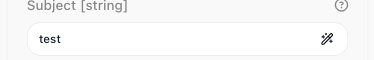
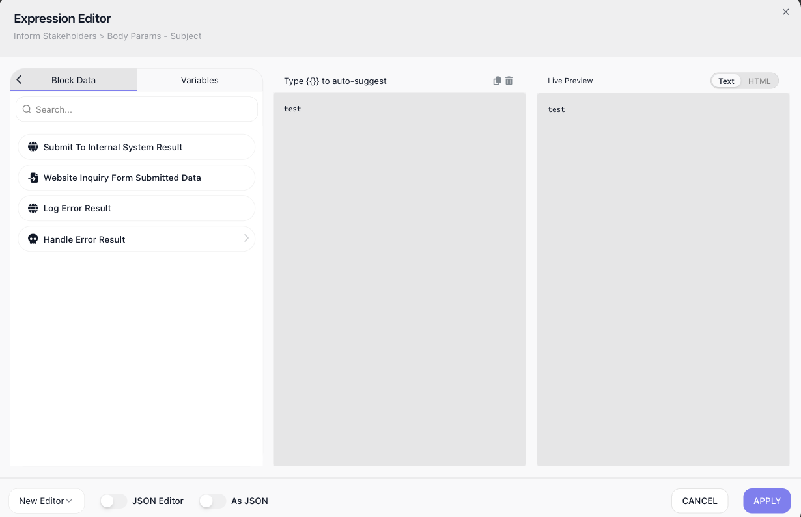
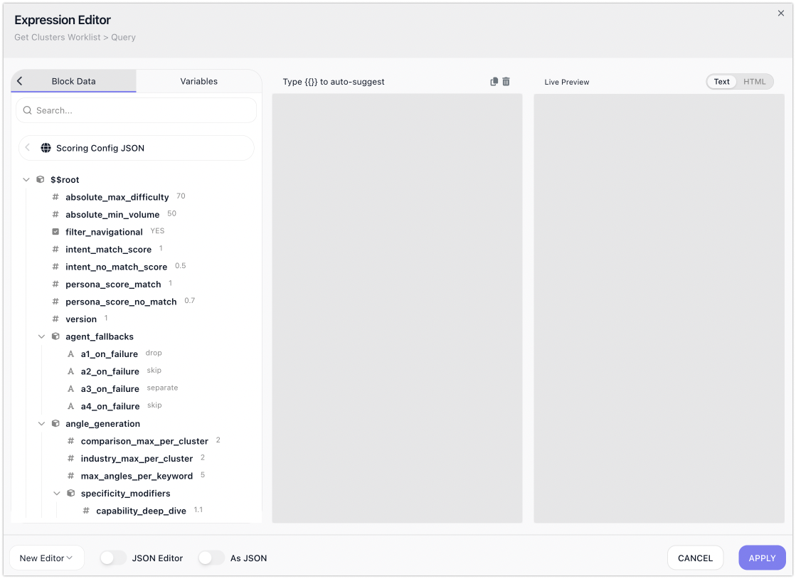
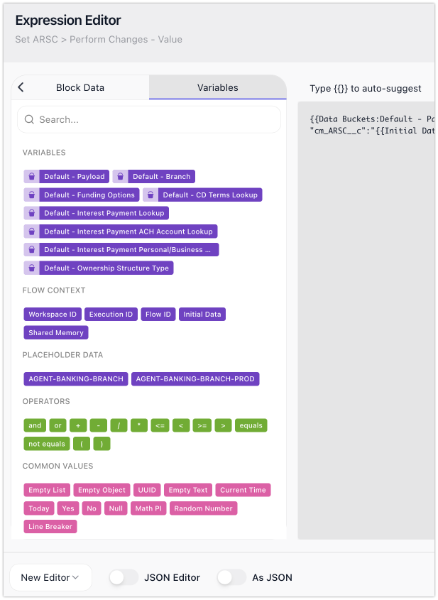
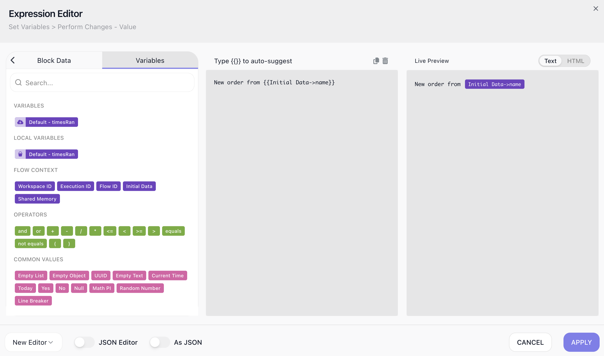
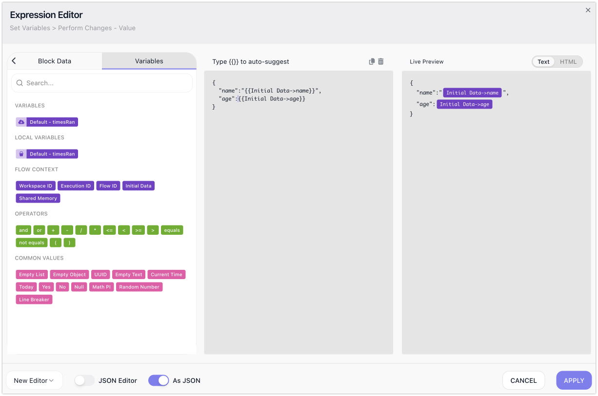

# Expression Editor

Data moves through a flow from one block to the next. A block does its work and produces a result, and blocks further down the flow can use that result. FlowRunner™'s Expression Editor is the dialog where you make that connection - setting a block's input to a value taken from an earlier block, or built from a few pieces. A block that sends an email, say, needs a recipient address, and that address is a result an earlier block already produced.

## Opening the Expression Editor

Wherever a block's input field can take an expression, it shows an icon at its right edge. Click it to open the Expression Editor on that field.

## Using another block's result

This is what the Editor is mostly for. Its ((Block Data)) tab lists the results of the blocks that ran before this one. To use one, double-click it into the expression, or start typing its name and pick it from the auto-suggest list.

You can take a result whole or reach a single value inside it. Open a result and it shows **`$$root`** - the result as one object - with its individual fields listed beneath. Double-click `$$root` to pass the whole object along, or double-click a field to pass just that value. A list works the same way: take `$$root` for the whole list, a single item from it, or - when the items are objects - a property from within an item.

Many blocks declare the shape of their result up front - most Extensions do - so their fields are ready to pick straight away. A few cannot: an [HTTP Request](../../reference/http-request.md){.fr-block} or an [AI Agent](../../reference/ai-agent.md){.fr-block} only learns its result's shape once it has actually run. When a result's fields are missing for that reason, run the block once in [Test Mode](../../run/testing.md); the Editor remembers what came back, and the fields appear here to choose from.

## Combining pieces into one value

A field's value does not have to be a single reference. You assemble the expression in the middle of the Editor - double-clicking pieces in or typing them - and it can hold several at once, with fixed text or an operator between them. The ((Variables)) tab supplies the pieces you build with, in groups:

- your **Data Bucket variables**, if the flow has any;
- the run's **Flow Context** - its **Initial Data**, the **Execution ID** and **Flow ID** of this run, the **Workspace ID**, and its [Shared Memory](shared-memory.md);
- **Operators** - `and`, `or`, the arithmetic `+ - * /`, the comparisons `< <= > >= equals not equals`, and parentheses to group them;
- **Common Values** - ready-made constants to drop in: an empty list, object, or text; today's date or the current time; a fresh UUID; a random number; `Yes`, `No`, `Null`, `Math PI`, and a line break;
- and, depending on what the flow sets up, its **Placeholder Data**.

So a subject line can read `New order from ` followed by a name the run started with, and a total can be a price plus its tax.

## Writing the value as JSON

Some fields expect a JSON object or array rather than plain text. Turn on ((As JSON)) and the editor treats what you build as JSON, so the field receives a structure instead of a string.

For a structure you would rather write out by hand, turn on ((JSON Editor)): the visual builder is replaced by a code editor where you type the JSON directly, and it checks and formats it as you go.

## Checking the result before you apply

The **Live Preview** keeps pace as you build, showing what the whole expression comes to right now. When it reads the way you want, **Apply** sets it on the field. If a piece cannot be worked out - a value that is not there - the preview shows that too, so you settle it here rather than when the flow runs.
