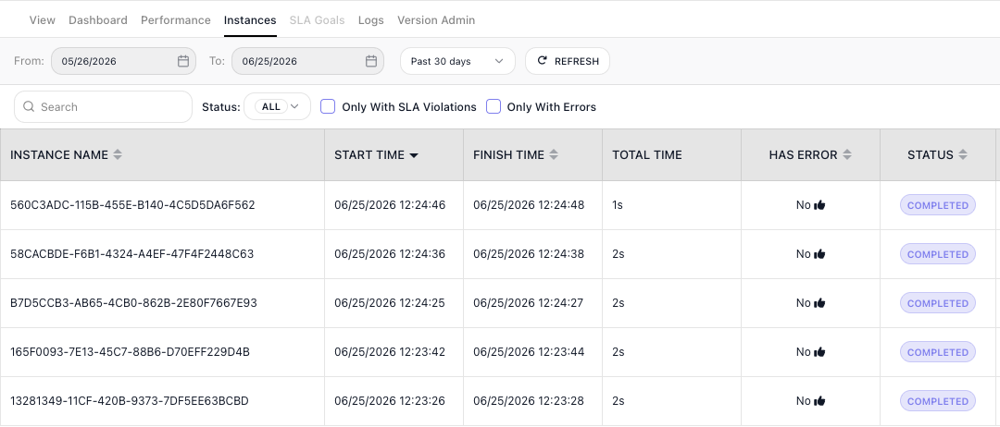

# Flows and Instances

A flow is the automation you design once. An instance is a single run of it. You build the flow in the **Flow Editor**: the steps, the logic, how they connect. From then on, each time something sets it off, FlowRunner™ creates a fresh instance of it. Keeping the two apart is the foundation for everything else in FlowRunner: where your logic lives, where your data lives, and what you are looking at when you watch a flow work.

## A flow is the design, an instance is a run

Think of a flow as a recipe and an instance as one meal cooked from it. The recipe is written down once. Every time you cook it you follow the same steps, but each meal uses its own ingredients and comes out as its own plate. Editing the recipe changes every future meal; cooking one meal never touches the recipe.

A flow works the same way. You lay out the steps once in the **Flow Editor**. Each time the flow is set off - a form is submitted, a schedule comes due, another flow or an outside system calls it over the API - FlowRunner starts a new instance: one run of that flow, working through the same steps on its own data. The flow is the blueprint that holds still; the instance is the live execution that moves.

## Every instance is independent

Because each instance is its own run, instances do not share state by default. Each one:

- carries its own Initial Data - the values it started with, like the form submission or the record that set it off - and builds its own variables as it goes;
- has its own Instance ID, so you can tell one run from another;
- runs on its own, even at the same moment as others. If fifty orders arrive at once, fifty instances of your order flow run in parallel, each handling its own order, none waiting on the rest.

When two or more runs genuinely need to share something - a running total, a flag, a value that outlives a single run - that is what [Shared Memory](shared-memory.md) is for.

## When a flow produces instances

A flow does not produce instances just by existing. A flow has **versions**, and it is a version that runs: each version has its own state, and only one version is **LIVE** at a time. A flow produces instances only from its LIVE version - while a version is not LIVE, brand-new or still being edited, it creates nothing, so half-finished logic never touches real data. Set a version LIVE and it starts creating instances whenever its trigger fires, its schedule comes due, or something calls it.

Versions are a subject of their own - their states, cloning, export and import, scheduling, and deletion. [Flows](../../manage/flows.md) covers them in full.

## The editor and the Instances tab

You work with the flow itself in the **Flow Editor**, the canvas where you build and change the steps. You watch the runs in the **Instances** tab, which lists each instance with its own ID and status. Open one and you see exactly what that single run did - the path it took and the data it carried - without the other runs getting in the way.

## An example: three tickets at once

Say you build a flow that handles a new support ticket: it reads the ticket, decides how urgent it is, and routes it to the right queue. Monday morning three tickets arrive within a minute of each other. FlowRunner starts three instances of the flow, one per ticket, each with its own ticket as its Initial Data. They run side by side - the urgent one finishes and routes while the other two are still being read - and each leaves its own record in the **Instances** tab.

## Related

- [Triggers](triggers.md) - what sets a flow off and starts a new instance
- [Variables and Data Buckets](variables.md) - the Initial Data an instance starts with, and the variables it builds as it runs
- [Shared Memory](shared-memory.md) - sharing state across instances when they need it
- [Call Flow](../../reference/call-flow.md) and [Flow Scheduling](../../reference/flow-scheduling-concept.md) - starting instances on demand or on a timetable
