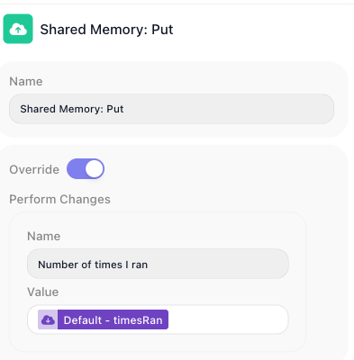
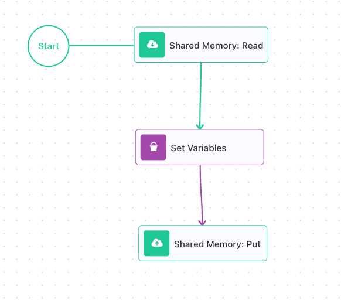
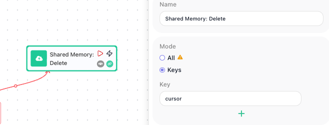
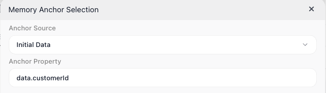
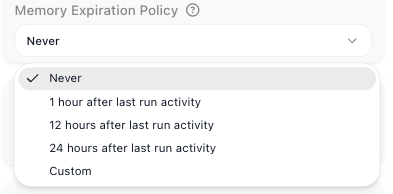

# Shared Memory

A flow forgets almost everything the moment a run ends, and most of the time that is exactly what you want. But every so often a flow learns something worth keeping: how many orders it has processed so far, where in a long list last night's run stopped, a login token it fetched an hour ago and can still reuse. FlowRunner™'s Shared Memory is where a flow holds on to that. It is a key/value store that belongs to the flow itself, so what one run writes is still there, waiting, for the next run to pick up.

## Memory that carries across runs

A [Data Bucket](variables.md) variable lives and dies inside a single instance: set while the run works, wiped clean the moment it ends, so every run starts from a blank slate. Shared Memory is the opposite kind of thing. It belongs to the flow, not to any one run, and every instance reaches into the same store, so a value one run writes is waiting for the next run tomorrow, or for an instance running right beside it this second. Nothing sweeps it away when a run ends; a value stays until you overwrite it, delete it, or let it expire, a setting that stays off until you turn it on (covered at the end).

## Writing a Shared Memory value

You write to the store with [Shared Memory: Put](../../reference/shared-memory-put.md){.fr-block}, in the **Actions** group of the palette. Hand it one or more name-and-value pairs and it files each value under its name. That name is the key, the handle a later Read or Delete uses to find the value again. The value can be something you type or an expression worked out at run time, so a Put can stash the result an earlier block just produced.

Write to a name that already holds a value and it overwrites; write to a new name and it creates. Put replaces, it does not merge. So to grow a value rather than replace it, whether you are bumping a counter or adding to a list, you read what is there, work out the new value, and write that back.

That overwrite behaviour is the ((Override)) toggle's doing: with it on, a write to a name that already exists drops the old value and keeps the new one.

## Reading a Shared Memory value

A saved value is only worth saving if a later run can get it back, and that is the whole job of [Shared Memory: Read](../../reference/shared-memory-read.md){.fr-block}, also in the **Actions** group. Give it a key and it hands back whatever is stored there.

You reach a Read's value the way you reach any block's result: through its result alias, the name in ((Reference Result Data As)). Leave that at its default and later blocks refer to the value as `Shared Memory: Read Result`. Turn on ((Assign to a Variable)) instead and the Read drops its result straight into a [Data Bucket](variables.md) variable you name, which earns its keep when the Read sits inside a [List Iterator](../../reference/list-iterator.md){.fr-block} or [Repeat](../../reference/repeat.md){.fr-block} loop: the plain alias would be stuck inside the loop, but the variable carries the value back out.

There is a first-run problem to head off. The very first time a flow runs, nothing has been written under the key yet, so a Read comes back empty-handed. That is what ((Default Value)) is for: set it, and when the key is missing the block returns that default instead of nothing. Key a counter's Read to a ((Default Value)) of `0` and the very first instance reads a clean zero rather than stumbling over an empty value.

## The counter pattern

Read and Put are built to work as a pair: read the saved value, work out the new one, write it back. That read-change-write loop is how a flow carries a number, a position, any running total forward from one instance to the next.

A run counter is the tidiest example: number each instance 1, 2, 3, even though every instance starts life knowing nothing. Three blocks do it.

- [Shared Memory: Read](../../reference/shared-memory-read.md){.fr-block} reads the count, its ((Default Value)) set to `0` so the first instance starts clean, and hands it to a variable (here `timesRan`) through ((Assign to a Variable)).
- [Set Variables](../../reference/set-variables.md){.fr-block} adds one to `timesRan`.
- [Shared Memory: Put](../../reference/shared-memory-put.md){.fr-block} writes `timesRan` back under the same key.

On the first instance the Read finds nothing and falls back to its ((Default Value)), `0`; Set Variables nudges it to `1`; Put writes `1` back. The next instance reads `1` and writes `2`; the one after, `2` and `3`. The number climbs, run after run, because Shared Memory is quietly holding it in between, which is the whole point.

The same read-change-write shape drives a cursor. A flow that chews through a long list a batch at a time saves where it stopped under a key like `cursor`, then reads that key next time to pick up exactly where it left off instead of starting the list over.

## Clearing a Shared Memory value

Because Shared Memory holds on by design, now and then you need to let go: restart a cursor, reset a counter, drop a one-time token you are finished with. [Shared Memory: Delete](../../reference/shared-memory-delete.md){.fr-block} does that (also in the **Actions** group), and its ((Mode)) radio decides how much it takes:

- ((Mode)) set to ((Keys)): you name the exact keys to drop, and only those go; everything else stays. The careful choice.
- ((Mode)) set to ((All)): the block wipes the entire store, every key the flow has ever written, in one stroke. The blunt reset for when the flow should forget everything.

Delete leaves nothing behind to read, so to check a key is really gone, just read it: a Read of a missing key returns its ((Default Value)), exactly as if the key had never existed. In the cursor flow above, deleting `cursor` after the last batch makes the next instance's Read fall back to its default and start the list over from the top.

!!! warning "Mode: 'All' clears an agent's memory too"
    An [AI Agent](../../reference/ai-agent.md){.fr-block} keeps its conversation memory, its **Messages History**, in this very same store, so a Delete with ((Mode)) set to ((All)) sweeps that away along with everything else. When you only mean to clear your own keys, name them with ((Mode)) set to ((Keys)); the agent's memory stays untouched.

## Sharing memory per caller

By default every instance shares one store, which is perfect for a flow-wide counter and wrong the moment each caller needs a memory of their own. Picture a support chatbot built as a single flow, fielding hundreds of customers at once. Every message is an instance, and with one shared store the notes it keeps for Dana and the notes it keeps for Sam land in the same place, so Dana's next message comes back laced with Sam's history. One store cannot serve them both; each customer needs their own.

The ((Memory Anchor)) gives you exactly that. Think of it as the label the store is filed under: point the anchor at something that identifies the caller, a customer id or a chat session id, and FlowRunner keeps a separate store for every distinct value. Two messages from the same customer share one store and build on each other; two different customers never touch. You set the anchor from the flow's **Flow Memory** settings; here it is pointed at the customer id carried in each message's data.

With that one anchor in place, a single count key holds a separate count for every customer at once: the foundation of per-user, per-session memory, where a "user" can just as easily be another system calling in. The same scoping wraps an [AI Agent](../../reference/ai-agent.md){.fr-block}'s **Messages History**, so one agent can hold a separate, private conversation with every customer.

Which value to anchor on, the exact path to it, and what should happen when a caller turns up with no anchor value at all (a setting called **Missing Anchor Policy**, right beside the anchor) are a short setup worth doing with care. The [Per-User Memory](../../reference/per-user-memory-concept.md) guide walks through all three, end to end.

## How long a shared value lasts

A store per caller is a fine thing until you have a million stale ones, a lingering store for every customer who ever sent a single message. The ((Memory Expiration Policy)) is the cleanup crew: tell it how long a store may sit untouched, and FlowRunner clears any store that goes that long with no run reading or writing it. It lives in the same **Flow Memory** settings as the anchor, with a handful of choices:

- ((Never)) - the default; nothing ages out, and a value stays until you change or remove it.
- ((1 hour after last run activity)), ((12 hours after last run activity)), or ((24 hours after last run activity)) - a store is cleared once that much idle time has passed with nothing touching it.
- ((Custom)) - the same idea, with an exact span you set in days, hours, minutes, and seconds.

That is why expiration and anchoring go hand in hand: when each anchor value is a short-lived session, letting idle stores age out keeps a flow's memory from growing without bound. For a value you mean to keep for the life of the flow, a lifetime counter, say, leave it at ((Never)).

<!-- verified 2026-07-04, driven in the MyProjects "Flow Memory" demo flow + block palette (labels/locations captured live this session, shown in the screenshots above):
  - Palette (edit mode): Shared Memory: Put / Read / Delete all sit under the "Actions" group (ACTIONS > Shared Memory).
  - Put config: an "Override" toggle and a "Perform Changes" name/value list; with Override on, a write to an existing key replaces in place (the block's write behavior).
  - Read config: field labeled "Reference Result Data As" whose default value renders verbatim as "Shared Memory: Read Result"; an "Assign to a Variable" option exposing a Data Bucket selector + "Variable Name"; a "Default Value" field. Absent-key-returns-Default and the counter climb 0 -> 1 -> 2 -> 3 across instances = V-run evidence. Result-alias scope-elevation out of a container (List Iterator/Repeat) = confirmed by the product owner.
  - Delete config: a "Mode" radio with options "Keys" and "All", and a single "Key" field.
  - Flow Memory settings: flow editor's right-hand panel "Settings" (gear) tab > "Flow Memory" section:
      * "Memory Anchor" (default value "Flow Memory"); its wand opens a "Memory Anchor Selection" dialog with Anchor Source (Initial Data / Initial Trigger / Flow Memory) + an Anchor Property path. Shot sm-anchor-inuse.png shows Anchor Source = Initial Data, Anchor Property = data.customerId, captured live 2026-07-05 (closed without saving).
      * "Missing Anchor Policy" - FULL verbatim option list: "Terminate on Memory Access", "Use Local Memory", "Do not Start Execution".
      * "Memory Expiration Policy" (default "Never"; options verbatim: Never / "1 hour after last run activity" / "12 hours after last run activity" / "24 hours after last run activity" / Custom; Custom exposes days/hours/min/sec fields). Help-icon tooltips captured verbatim.
  - Per-anchor store separation ("same anchor value shares one store; different values never cross") = the product's own Memory Anchor tooltip, verbatim: "Flow instances with the same anchor value share a memory space, allowing them to access and update common data."
  - AI Agent conversation memory is "Messages History" (product-owner confirmed), kept in the same Shared Memory store; a Delete with Mode=All clears the whole store (and therefore that history too). -->

## Related

- [Variables and Data Buckets](variables.md) - per-instance state, wiped when the instance ends, the counterpart to Shared Memory
- [Flows and Instances](flows-and-instances.md) - why instances do not share state by default, and why Shared Memory does
- [Shared Memory: Put](../../reference/shared-memory-put.md){.fr-block}, [Shared Memory: Read](../../reference/shared-memory-read.md){.fr-block}, and [Shared Memory: Delete](../../reference/shared-memory-delete.md){.fr-block} - the three blocks that write, read, and clear the store
- [AI Agent](../../reference/ai-agent.md){.fr-block} - its **Messages History** (conversation memory) is kept in Shared Memory, scoped and expired by the same anchor
