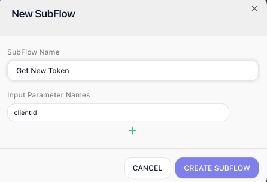
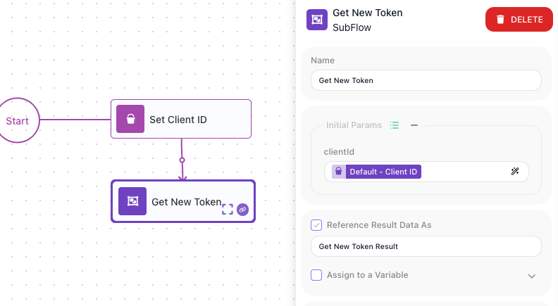
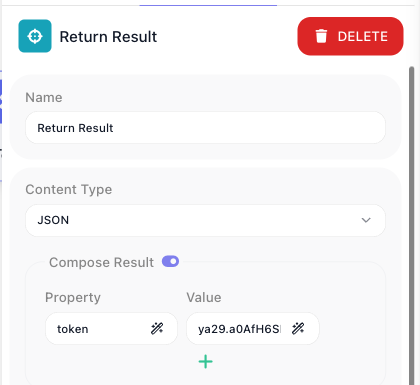
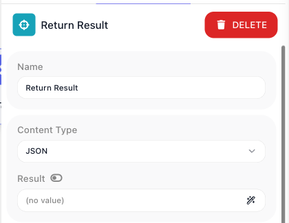

# Subflows

A subflow is a piece of a flow you build once and reuse. You take a handful of steps that you would otherwise rebuild or copy from spot to spot - refreshing a token, formatting a record, writing a row and reading back its id - and keep them as one named unit. From then on you drop that unit into your flow as a single step, hand it the values it should work on, and read back what it produces. The work lives in one place, so a fix made there lands everywhere the subflow runs.

## What a subflow is

<!-- doclint: no-shot: conceptual - defines the idea; the build / pass-in / return-value shots follow in the sections below -->
Think of a subflow as a named, self-contained mini-flow. It has its own steps inside it, the same kinds of steps any flow has. What makes it a subflow is that you do not run it on its own - you place it inside another flow as a single [SubFlow](../../reference/subflow.md){.fr-block} step, and when the flow reaches that step the mini-flow runs as one unit, then hands its result back to the step that ran it.

That gives you two things at once. The flow that uses the subflow stays short, because a whole routine collapses into a single step. And the routine itself lives in exactly one definition, so when the work needs to change you change it once rather than hunting down every copy.

One boundary to know from the start: a subflow belongs to the flow it was built in. You can reuse it as many times as you like within that flow, but it is not shared with other flows. When the same logic needs to run from a different flow, use the [Call Flow](../../reference/call-flow.md){.fr-block} block, or pick the flow from the **Flows as Actions** palette - either one runs a whole separate flow as a step.

## Building a subflow

You create a subflow from the **Subflows** list in FlowRunner™'s block palette: its ((add)) button opens the ((New SubFlow)) dialog. Give the subflow a name, and under **Input Parameter Names** declare each input it takes - the ((plus)) adds a row per input. These names matter: they are exactly what the steps inside will read when the subflow runs.

A brand-new subflow is empty - declaring its inputs does not give it any logic yet. To build what it actually does, place it on the canvas (it appears in the **Subflows** list, ready to drag in), then step into it: select the SubFlow block and click ((Expand)). The subflow opens on its own canvas, where you build its steps exactly the way you build any flow - it begins at `Start` (a subflow is entered by its parent, not by a trigger of its own), then the blocks that do the work and the wiring between them. ((Return)), at the top-left, brings you back out to the parent flow. The steps you build inside are the subflow's logic, shared by every placement of it.

To change a subflow's inputs after it exists, click the ((edit)) icon on it in the **Subflows** list - that reopens its parameter list so you can add or rename inputs.

## Passing values in

A subflow needs the values the parent flow already holds. You supply them on the placed SubFlow block, in its **Initial Params** section: every input you declared shows up there, and you map each one to something the parent can give it - a variable, an earlier block's result, a literal, or an expression. Below, the `clientId` input is mapped to the parent's `Default - Client ID` variable.

Whatever you map on the outside is exactly what the subflow reads on the inside, as its Initial Data. The `clientId` mapped here is read by the steps within as {{Initial Data->clientId}} - the header value in the subflow shot earlier. You name each input once, map it when you place the block, and the steps inside read it by name.

## Getting a value back

The Get New Token subflow does its work - fetching a fresh token - but the flow that ran it wants one thing back: the token. That answer is whatever the subflow's [Return Result](../../reference/return-result.md){.fr-block} block hands over.

Return Result picks the shape of that answer. Its ((Content Type)) sets the format the caller receives - ((JSON)), ((XML)), or ((Plain Text)) - and the ((Compose Result)) toggle decides how you build it.

With ((Compose Result)) on, you compose an object from a list of **Property** and **Value** rows, each row a name paired with an expression. Get New Token composes a small object with a `token` property holding the token the HTTP step fetched.

With ((Compose Result)) off, the block hands back a single value from one expression instead of a named object - for when the answer is just one thing.

Return Result is also terminal: when a path reaches it the result is composed and that path ends there, so it sits at the tail of whatever leads to it.

Whatever Return Result hands back becomes the result of the SubFlow block, read downstream through the block's result alias - the **Reference Result Data As** name set when you placed it (here, `Get New Token Result`). Because Get New Token composed an object with a `token` property, a later step reads the token as {{Get New Token Result->token}} - the alias names the whole result, and `->token` drills into that property. (With ((Compose Result)) off there is no property to drill into: the alias names the single value directly.)

A subflow with no Return Result still runs to completion, but it hands the caller nothing structured to read, so add one whenever the caller needs an answer back.

A subflow can also reach more than one Return Result - one on each branch of a condition, say. When it does, the caller gets back a more involved shape rather than a single plain object, so when you want the caller to read a simple object directly, keep to one Return Result on the path it will take. The [Return Result](../../reference/return-result.md){.fr-block} reference covers the multi-result shape in full.

## When to factor logic into a subflow

The signal is reuse. When the same handful of steps shows up in more than one spot and you find yourself about to rebuild or copy them, that is the moment to factor them out. Refreshing an access token before two different calls, or formatting a record the same way across several branches, are the everyday cases. Keeping that work as one reusable unit means a change lands everywhere it runs, instead of being fixed in one place and forgotten in another.

Reuse aside, a subflow earns its keep just by shortening a flow. A routine that would sprawl across a dozen blocks collapses into one named step, and the flow reads as the high-level shape of what it does rather than every low-level detail of how.

<!-- exercised in-product 2026-07-06 (ZZ Block Catalog Scratch, Return Result block; Get New Token subflow located in FBB GetCustomerMatches, subFlowId E65D307E):
  Return Result full surface, every state driven:
  - Content Type dropdown: exactly three options - "JSON", "XML", "Plain Text".
  - Compose Result toggle ON -> a repeatable "Property" / "Value" row list (compose an object from named properties).
  - Compose Result toggle OFF -> a single "Result" expression field (return one value directly, not a named object). Tooltip on the toggle: "Toggle single expression input".
  - Also present: a "Release Caller" toggle (External Callback / release-the-waiting-caller pattern - out of scope for this concept page) and standard Logging.
  - Both toggle states captured from the same Return Result block (header visible for identity): subflow-return-on.png (Compose Result on -> Property "token" = fetched token) after the "on" bullet; subflow-return-off.png (Compose Result off -> single "Result" field) after the "off" bullet. Captured live, not saved.
  - SubFlow vs Call Flow: SUBFLOW element references a subflow by subFlowId (intra-flow reuse); Call Flow = ACTION with operation CALL_FLOW referencing another top-level flow by flowId (cross-flow). Confirmed via flow-definition API. -->

## Related

- [SubFlow](../../reference/subflow.md){.fr-block} - the block itself, with the full walkthrough of creating one, declaring inputs, and editing its steps
- [Return Result](../../reference/return-result.md){.fr-block} - composing the object a caller reads back
- [Call Flow](../../reference/call-flow.md){.fr-block} - a separate block for running a whole published flow as a step, when the same logic must be reachable from other flows too
- [Flows and Instances](flows-and-instances.md) - the flow-and-run model a subflow's steps run within
