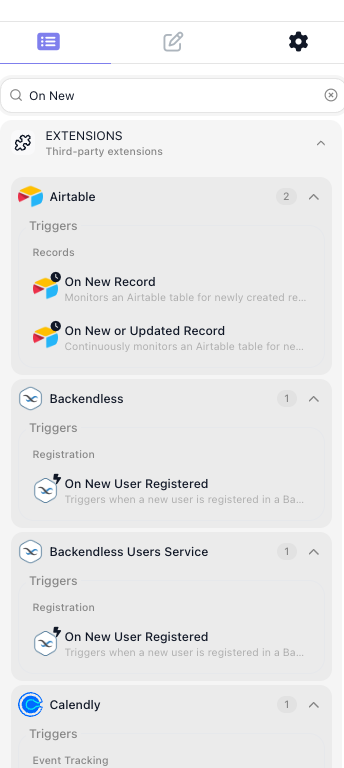

# Triggers

A trigger is how a flow reacts to something happening in the outside world. Instead of you running the flow, the event runs it: a customer sends an email, a payment clears, a row is added to a spreadsheet, a message lands in Slack - and the flow runs, with the details of that event already in hand. A trigger is what connects your automation to the world it works in, so it acts the moment something happens rather than waiting for you to set it off.

If you have automated anything before, you know the shape of it: *when this happens, do that.* A trigger is the "when this happens" half - the way a flow in FlowRunner™ watches for a real event and responds to it on its own.

## The events a flow can react to

The reach of a trigger is the point of it: the range of real events it can start or resume a flow from. Add an extension for a service and that service's events become triggers, so a flow can begin when:

- a **new email** arrives, or a **message** lands in Slack
- a **row** is added or updated in a spreadsheet, or a **record** changes in your database
- a **payment** is received, or a **new order** is placed
- a **new user** signs up, a **file** is uploaded, or a **call** comes in

What all of these share is that the world acts and the flow responds. For a service without a ready-made extension, FlowRunner ships a built-in trigger, the [External Callback](../../reference/external-callback.md), that gives the flow a web address anything can call - so even a custom system can set a flow off by sending it a request. It is one trigger among many, not a special case.

## Start a flow, or resume one

Most often a trigger starts a fresh run: the event happens, and a new instance of the flow begins to handle it. But a trigger can also sit *inside* a running flow and pick it back up. A flow can reach a point, pause, and wait - for an approval, a customer's reply - and the trigger resumes it the moment that event arrives. Starting and resuming are the same idea: a place where the flow waits for the world and reacts.

## The event brings its data

A trigger does not only signal *that* something happened; it carries *what* happened. A new-email trigger hands the flow the sender, the subject, and the body; a payment trigger hands it the amount and the customer. That detail becomes the material the rest of the flow works on - the values its blocks read, branch on, and pass along - so the flow is not merely set off by the event but shaped by it.

## Related

- [Flows and Instances](flows-and-instances.md) - the run a trigger starts, and the **LIVE** state a flow needs before its triggers listen
- [External Callback](../../reference/external-callback.md) - the built-in webhook trigger, and how it captures an incoming request
- [Triggers Group](../../reference/triggers-group.md) - waiting on several triggers at once and reacting to whichever fires
- [Flow Scheduling](../../reference/flow-scheduling-concept.md) - starting a flow on a timetable instead of an event
