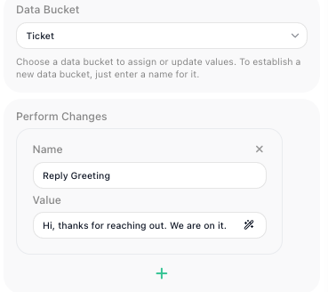
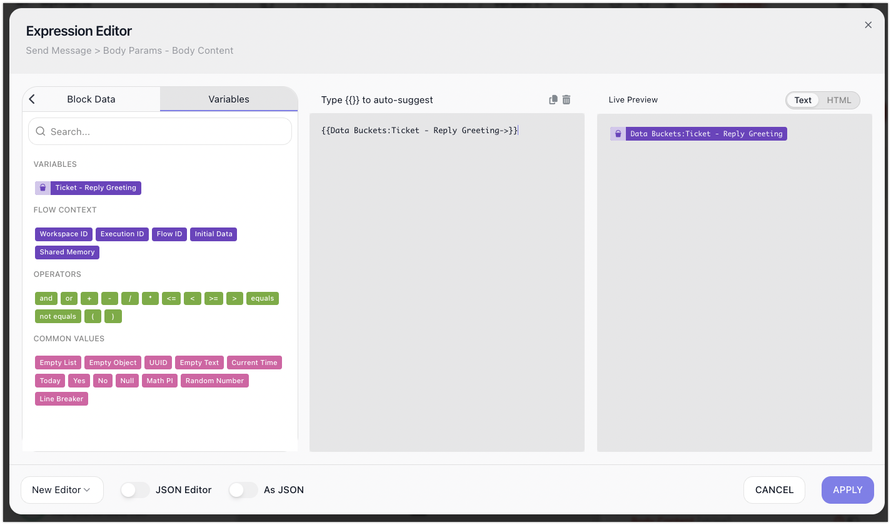
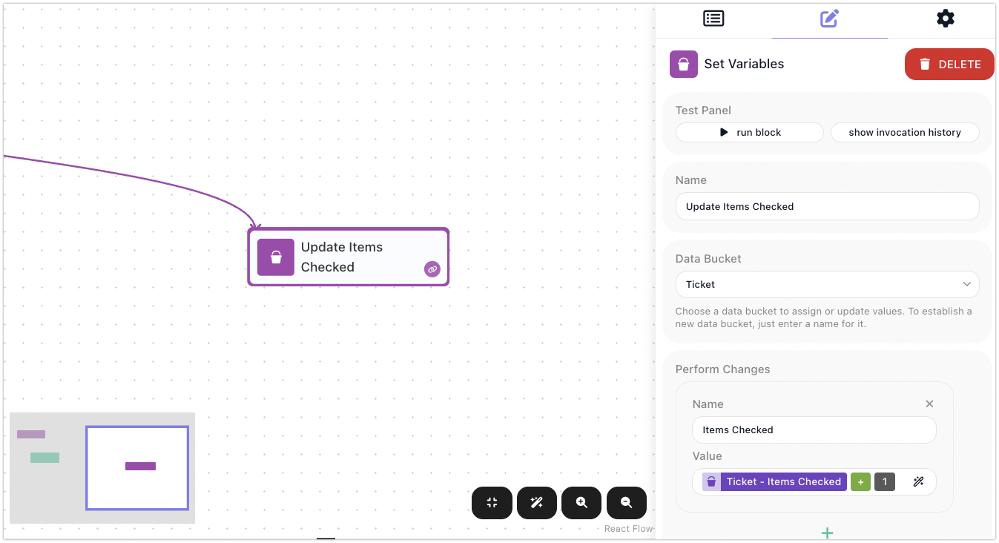

# Variables & Data Buckets

As a flow runs, its logic needs to hold values and work with them. It might set a value aside for a later step, build on one it already has - stitching a name into an email greeting, or adding one to a running count - read a value back when a step needs it, or clear one away once it has done its job. Each value a flow keeps this way is a **variable**: a named value it holds while the run is in progress, set and read with the [Set Variables](../../reference/set-variables.md){.fr-block} block and available anywhere a flow accepts an expression. A flow's variables are grouped together in a **Data Bucket**, but the variable is the thing you work with - so this page leads with it: what a variable is, how you write one, read it back, change it, and how long it lasts.

## What a variable is

A variable is a named value a flow holds while it runs. You choose the name, and it is meant to be readable - plain words with spaces, `Reply Greeting` or `Items Checked`, chosen to convey what the value is, not a programmer's `replyGreeting`. The value can be anything the flow works with: a line of text, a number, a flag, a list. The same variable can hold different things on different runs, because each run fills it from its own data.

Variables live in a **Data Bucket** - a named container that keeps related ones together. You might keep everything about the ticket you are handling in a bucket named `Ticket`. A variable is addressed by the two together, the bucket and the name, so `Reply Greeting` in the `Ticket` bucket is `Ticket - Reply Greeting`. You do not create a bucket on a separate screen; you name it the moment you write your first variable into it. If you never name one, FlowRunner™ uses a bucket called `Default`, so there is always somewhere for a variable to go.

## Writing a variable

Writing a variable is how a flow sets a value aside for later - the standard reply it will send, the running total it will build on. You create and set variables with the [Set Variables](../../reference/set-variables.md){.fr-block} block: pick the bucket to write into, then list the variables to set, each as a name and a value. The value can be a fixed value you type or an [expression](expressions.md) worked out at run time - so one variable can be the plain text of a standard reply, and the next can be a line built from a name the run received.

When the flow reaches the block, each variable is written into its bucket, ready for any later step to read.

## Reading a variable back

Once a variable is written, a later step reads it by referring to it in the [Expression Editor](expressions.md) - the panel where you build a value from references, operators, and literals. You pick the variable from its bucket and it drops in as a `Bucket - name` pill: the `Reply Greeting` variable from the `Ticket` bucket reads as the `Ticket - Reply Greeting` pill. A message block built on that pill sends "Hi, thanks for reaching out. We are on it."

Because a variable is addressed by its bucket and name together, two buckets can each hold a variable named `Status` without clashing - one is `Ticket - Status`, the other `Order - Status`. The bucket is the namespace that keeps them apart.

## Changing a variable as the flow runs

A variable is not fixed once written - you change it by setting it again, this time to a value worked out from its current one. A counter is the clearest case. To count items as a flow checks them, keep the count in a variable like `Items Checked` and, each time round, set it to its own current value plus one: read the `Ticket - Items Checked` pill, add `1`, and write the result back to the same variable. Run the loop and the number climbs - 1, 2, 3 - because each pass reads what the last one wrote and writes the next. The same read-it, change-it, write-it-back shape covers any running value: a total you keep adding to, a list you keep appending to.

## Clearing a variable

To clear a variable a flow is done with, you set it once more to an empty value, so it holds nothing. There is no separate delete - setting it empty is all that "removing" a variable amounts to.

## A variable lasts only for the run

A Data Bucket belongs to a single run - a single [instance](flows-and-instances.md) of the flow. Its variables exist from the moment a step writes them until that run ends, and then they are wiped. The next run starts with an empty bucket.

That is why `Items Checked` begins from nothing on every run, and why one run's `Reply Greeting` is gone by the time the next ticket arrives. Each run gets its own fresh variables and leaves nothing behind. This is by design: runs are independent, so one run's variables never leak into another's, and fifty tickets arriving at once become fifty runs that never tread on each other's data. But it also means a Data Bucket is the wrong place for a value that has to outlive the run that set it.

!!! note "Variables are scoped to one instance"
    A variable's value belongs to the single [instance](flows-and-instances.md) that set it. Other instances of the same flow cannot see it - not even ones running in parallel, at the very same moment - because each instance gets its own Data Bucket. When you need to share a value across instances of a flow, that is what [Shared Memory](shared-memory.md) is for.

## When a value must survive the run

For state that has to carry from one run to the next - a running total across runs, a cursor marking how far you got last time, a token to reuse - a Data Bucket will not hold it, because it resets every run. That is what [Shared Memory](shared-memory.md) is for: the flow's own store that keeps its values between runs. The dividing line is simple: a Data Bucket for anything you only need within the current run; Shared Memory for anything that has to be remembered after it ends.

## Related

- [Set Variables](../../reference/set-variables.md){.fr-block} - the block that writes and updates variables
- [Expressions](expressions.md) - building the values you store, and reading variables back as `Bucket - name` pills
- [Shared Memory](shared-memory.md) - keeping a value past the end of the run that set it
- [Flows and Instances](flows-and-instances.md) - why a bucket is wiped when a run ends
