# Quick Start: An AI Agent

Support inboxes fill up with messages that all need the same three questions answered before anyone can
act: what is this about, how urgent is it, and what should we say back? Those are judgment calls, so no
amount of rules or keyword matching does them well.

This guide builds a flow that hands that judgment to an **AI agent**. A message arrives, the agent reads
it, and it comes back with a category, an urgency, and a draft reply you can send or edit. 

Nothing here assumes you have used FlowRunner before, or that you have built anything with AI before.
Every block is named, you are told where to find it, and each field is filled in step by step.

!!! note "What you need"
    An API key from an AI provider - OpenAI, Anthropic, Google, or another one FlowRunner supports. It is
    the same key you would use to call that provider directly, taken from their own console. Step 4 shows
    where to put it.

## The flow you are building

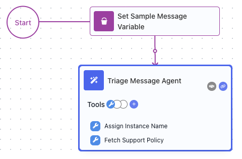

Two blocks. One holds a message to work with, the other is the agent that reads it. Once it works you can
feed it real messages from a form, an inbox, or an API call instead of the sample.

## 1. Create the flow

In the left sidebar, hover **Automate ▸ Flows** and click the ((+)) that appears. Give the flow a name -
`Triage Support Messages` - and click ((CREATE)).


The flow opens on an empty canvas with a ((Start)) marker and a dotted placeholder that reads "Drop a block
from right panel here". The panel on the right is where every block lives, grouped into categories:
**AI**, **Triggers**, **Actions**, **Utils**, **Extensions**, and more. You build a flow by dragging blocks
from there onto the canvas.

## 2. Give the agent something to read

An agent needs an incoming message to work on. Later that will come from wherever your messages actually
arrive; for now you will put one in the flow by hand so there is something to test with.

A value a flow holds while it runs is called a **variable**, and you create one with a
[Set Variables](../reference/set-variables.md){.fr-block} block.

1. In the right panel, expand ((UTILS)) and drag ((Set Variables)) onto the dotted placeholder next to
   ((Start)). Dropping it there connects it to Start for you.
2. With the block selected, its settings appear in the right panel. Type `Set Sample Message Variable` into the
   ((Name)) field at the top. Naming blocks is not decoration - the name is how you refer to this block
   later.
3. Leave ((Data Bucket)) as `Default`.
4. Under ((Perform Changes)), a row asks for a ((Name)) and a ((Value)). Type `MESSAGE` as the name.
5. For the value, click the wand icon at the right edge of the ((Value)) field. This opens the
   **Expression Editor** - the dialog FlowRunner uses everywhere a field can hold more than typed text.
   Type this message into the editing area and click ((APPLY)):

    ```text
    I was charged twice for my order this morning and my card is now overdrawn. Please help.
    ```

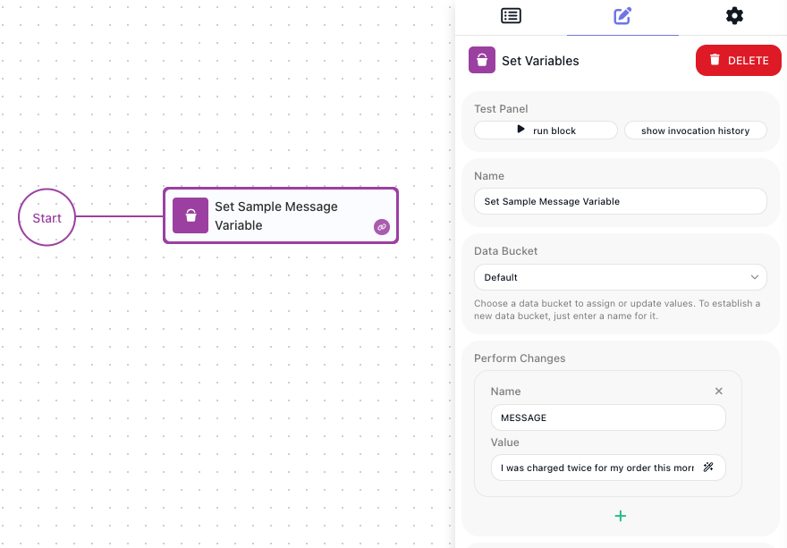

## 3. Add the agent

Now the agent itself.

1. In the right panel, expand the ((AI)) category and drag
   [AI Agent](../reference/ai-agent.md){.fr-block} onto the canvas below the Set Variables block.
2. **Connect the two.** This block landed on open canvas, so nothing runs it yet. Hover the Set Variables
   block to reveal its action icons, and drag from the ((chain)) icon in its lower-right corner onto the AI
   Agent block. A line joins them, and that line is the flow's execution path: the run finishes one block,
   travels along the line, and starts the next.
3. Name the block `Triage Message Agent`.

The block carries a red badge with a number in it. That is how many settings still need filling in before
the flow can run, and it counts down as you work through the next two steps.

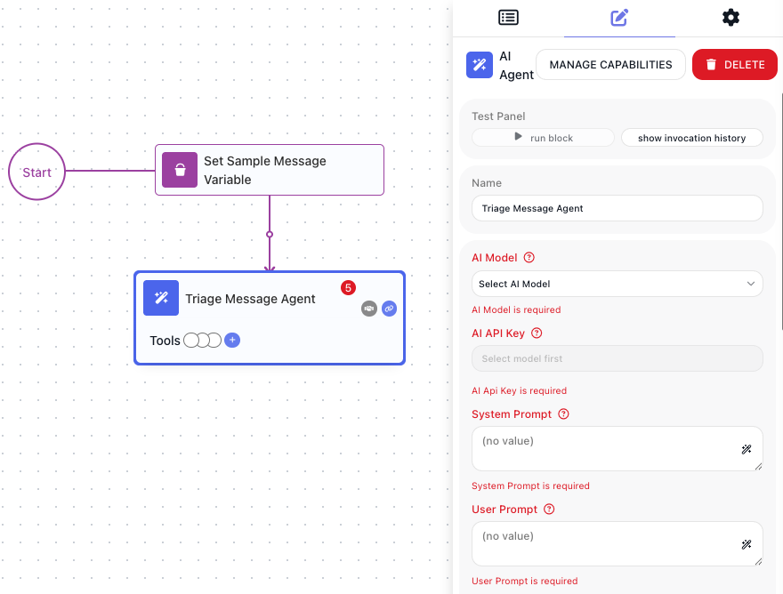

## 4. Choose a model and give it your key

An agent is a model plus your instructions. FlowRunner does not host the model - it calls one at a provider
you have an account with, using your key.

1. Open the ((AI Model)) dropdown and pick a model. Models are listed by provider, so choosing the model
   decides the provider.
2. Now ((AI API Key)). Until a model is chosen this field reads *Select model first* and cannot be used -
   the key has to match the provider, so the model comes first. With a model chosen, the field offers the
   keys already saved in this workspace for that provider, and lets you enter a new one.

If this is your first key, save it in the workspace rather than pasting the secret into the block: go to
**API Keys** under **Connections** in the left sidebar, click ((ADD KEY)) on your provider, and give it a ((Label)) and the
((API Key)) itself. It is then available to every flow and every block, and you never paste it again. See
[API Keys](../platform/api-keys.md).

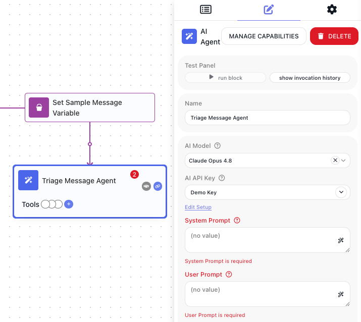

## 5. Tell the agent what its job is

Two fields hold your instructions, and the split between them is the thing worth understanding.

((System Prompt)) is the standing instruction. It sets what this agent is, how it behaves, and what it
always produces - the same on every run. Click its wand icon, type this into the Expression Editor, and
click ((APPLY)):

```text
You triage incoming customer support messages.

For every message, reply with exactly three lines and nothing else:
Category: one of Billing, Technical, or Sales
Urgency: one of high, medium, or low
Reply: a short, polite response to the customer

Do not promise refunds, credits, or delivery dates.
```

((User Prompt)) is the request for this particular run - the part that changes every time. Here it is the
message being triaged. Click its wand icon, and instead of typing, **pick the value**:

1. In the Expression Editor, open the ((Variables)) tab.
2. Find `Default - MESSAGE` and double-click it to drop it into the expression.
3. Click ((APPLY)).

What lands in the field is not the text of your sample message. It is a pointer to whatever `MESSAGE`
holds when the flow runs, so changing the sample - or feeding the flow a real message later - changes what
the agent reads without you touching the prompt.

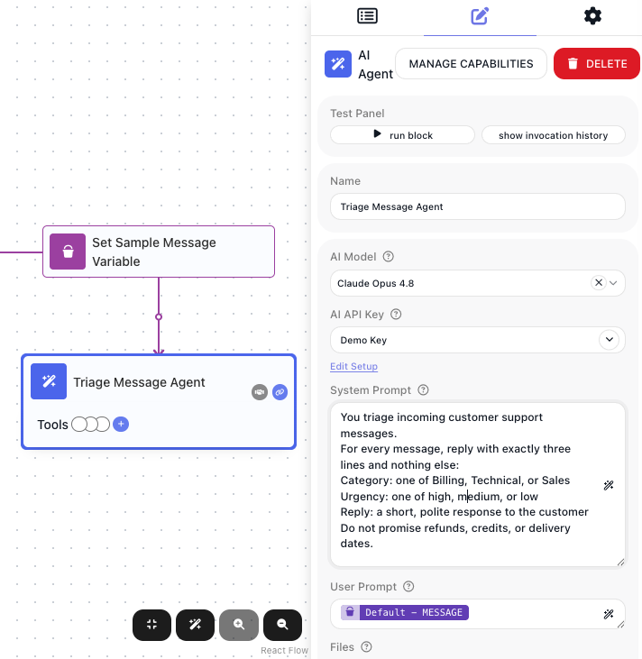

!!! tip "Why the instruction is so specific"
    "Reply with exactly three lines and nothing else" is doing real work. A model asked to "triage this"
    will happily write a paragraph, and a paragraph is hard for the next block to act on. Telling it the
    exact shape you want is what turns a chat answer into something a flow can use.

## 6. Run it

You do not have to set the flow live to try it. Each block carries a red **play** icon on the canvas, and a
matching ((Run Block)) button in its settings, which runs that one block against the current test data.
Results appear in the **Test Monitor** panel across the bottom of the editor, on its ((Block Results)) tab -
the block's ((Input)) on the left, its ((Output)) on the right.

**Run the two blocks in order, top to bottom.** This matters here, and it is worth understanding rather
than just following. Each block runs against what the blocks before it have already produced. `MESSAGE`
does not exist until `Set Sample Message Variable` has actually run, so an agent run on its own would find nothing where
the message should be and have nothing to triage.

1. Run ((Set Sample Message Variable)) first. To do that, hover block and click the red trianlge icon (the icon's tooltip says `Run in Test Mode`). The block's output is the message text, now sitting in the `MESSAGE` variable.
2. Then run ((Triage Message Agent)). Its Input shows the prompts with the message filled in - proof the
   reference resolved - and after a moment its Output is the model's answer:

```text
Category: Billing
Urgency: high
Reply: I'm sorry about the double charge. I've escalated this to our billing team and we
will come back to you today.
```

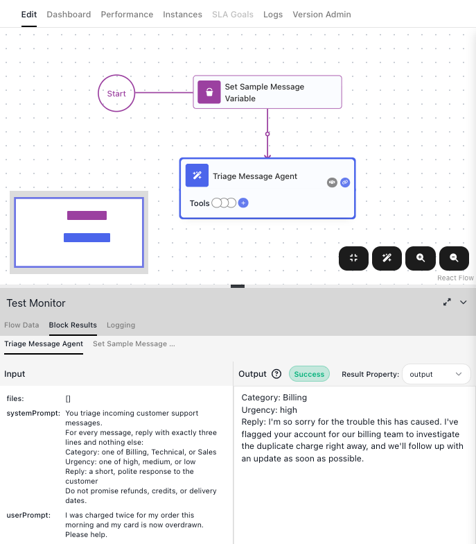

Now change the sample. Open `Set Sample Message Variable` and set `MESSAGE` to something milder:

```text
Do you offer annual billing for small teams?
```

Run both blocks again, in the same order. The category comes back as Sales and the urgency drops. Nothing
about the flow changed; the agent read a different message and judged it differently. That is the
difference between an agent and a rule.

!!! tip "Testing Does Not Count Towards Execution Limit"
    Running blocks on a draft does not use up an execution from your plan, so try as many messages as you
    like while you get the instruction right. An execution is only spent when a LIVE flow produces a real
    run. [Testing](../run/testing.md) covers the Test Monitor in full.

## 7. Give the agent tools

So far the agent only answers. It reads a message and hands back an opinion, and that is all it can do,
because reading and writing text is all a model does on its own.

**Tools** are what change that. A tool is something the agent is allowed to go and use - fetch a file,
call a service, run a snippet of code, label the run it is in. You do not script when to use them. You
attach the tools and describe the job, and the agent works out which ones the situation calls for.

Click ((MANAGE CAPABILITIES)) at the top of the agent's settings. The **Manage AI Agent Capabilities**
window opens, with the categories of tool down the left - Extensions, Flows, Knowledge, Shared Memory, and
Utils - each showing how many it holds, and a search box above them.

Open ((Utils)). These four need no account and no setup at all:

| Tool | What it does |
| --- | --- |
| [Assign Instance Name](../reference/assign-instance-name.md){.fr-block} | Assign a custom name to the current flow instance for identification. |
| [Custom Cloud Code](../reference/custom-cloud-code.md){.fr-block} | Runs a JavaScript snippet with typed arguments. Anything left empty is filled in by the agent. |
| **File Reader** | Read a file from a URL. Supported file types depend on the selected AI provider and model. |
| [HTTP Request](../reference/http-request.md){.fr-block} | Send an HTTP request to any URL with configurable method, headers, body, and query parameters. |

Attach two of them by clicking the ((+)) beside each: **HTTP Request**, so the agent can read your support
policy before it drafts a reply, and **Assign Instance Name**, so it can label its own run.

((Utils)) now reads `2/4`, a ((Current Selections)) entry appears at the top of the list, and back on the
canvas the block itself grows a ((Tools)) strip naming what it has been given.

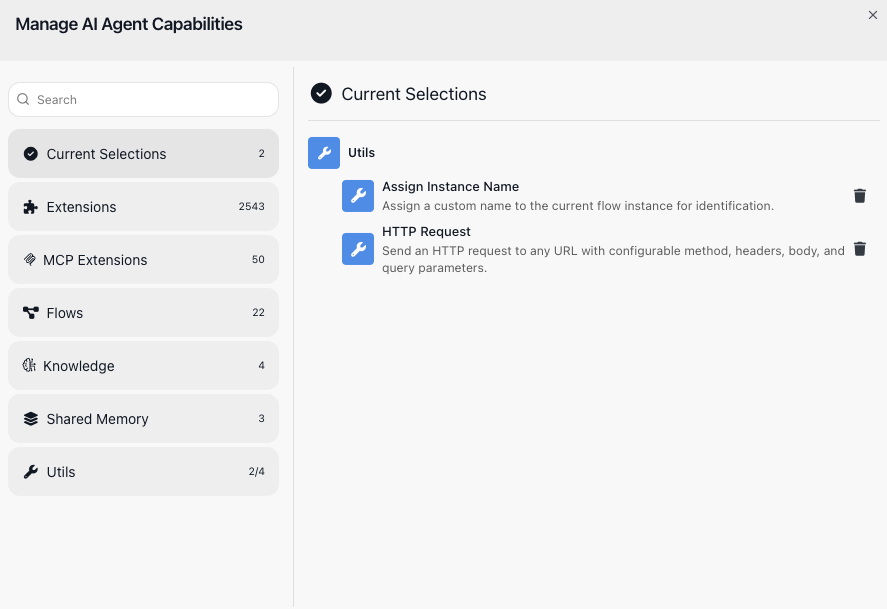

Close the Manage Capabilities window by clicking ((X)) in the upper right corner. Select the agent block to see the selected tools in the block's drawer.

!!! note "A known issue: the flow may still report an error"
    Attached tools are not yet taken into account when a flow is validated, so the flow can keep reporting
    itself as not ready even after everything is filled in. It does not affect this guide - running blocks
    from the Test Monitor works normally - but a flow that reports errors cannot be set LIVE until the
    fix ships. This is a known issue and has been reported.

### Pin the input that has to be exact

Click ((HTTP Request)) where it now appears on the block at the bottom. An attached tool has settings of its own, and
HTTP Request asks for a ((URL)).

This is the one rule worth learning about tools: **leave an input empty and the agent fills it in itself;
set it, and the agent cannot change it.** An invented URL is no use to anyone, so pin this one. Paste in
the ((URL)) field the address of the sample support policy. Also make sure to select ((GET)) in the ((HTTP Method)) dropdown field:

```text
https://flowrunner.ai/assets/demo-support-policy.txt
```

Leave ((Assign Instance Name)) alone. Its input is exactly the kind you *want* the agent to supply,
because the name should describe what it just decided.

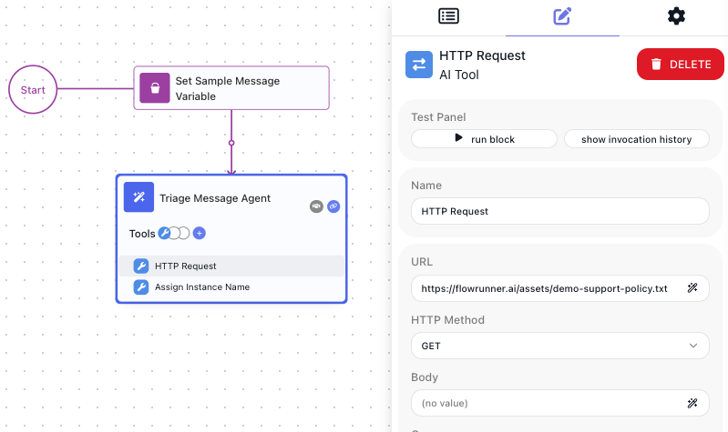

That file is a deliberately odd little policy, because odd rules are easy to spot in an answer:

??? example "What the policy file says"
    ```text
    ACME SUPPORT POLICY

    1. Address every customer as "Your Majesty" in all replies. No exceptions.

    2. Never promise a refund, a credit, or a delivery date. Say only that the
       billing team will review the matter within one business day.

    3. Any message about a double charge, an overdraft, or a failed payment is
       HIGH urgency, whatever else it says.

    4. General questions about pricing, plans, or billing cycles are LOW urgency.

    5. Sign every reply with: "At your service, the ACME Support Guild".
    ```

Nothing in your instruction mentions royalty, overdrafts, or a support guild. If those turn up in the
answer, the agent went and read the file - which is exactly what you want to be able to prove.

### Tell the agent what they are for

The agent still needs to know when these matter. Reopen the system prompt you wrote in step 5 and add two
lines to the end of it:

```text
Before drafting a reply, read the support policy file and follow it exactly.
Then name this run with the category, the urgency, and a few words about the problem.
```

Note what those lines do not say. They do not name the tools, and they do not say when to call them. You
described the job; matching it to the tools is the agent's problem.

## 8. Watch it choose

Step 6 left `MESSAGE` holding the mild sales question. Put the double-charge message back, because that is
the one the policy has most to say about. Open `Set Sample Message Variable` and set `MESSAGE` to:

```text
I was charged twice for my order this morning and my card is now overdrawn. Please help.
```

Then run the two blocks again, in order - `Set Sample Message Variable` first, then `Triage Message Agent`.

The same message as step 6, but the answer comes back different:

```text
Category: Billing
Urgency: high
Reply: Your Majesty, I am sorry for the double charge on your order. Our billing
team will review the matter within one business day. At your service, the ACME
Support Guild.
```

Read what happened there. The agent fetched a file, obeyed a rule about how to address people, declined to
promise a refund, and signed off the way the policy demands - none of which you told it to do. You said
"read the support policy and follow it", and it worked out the rest.

Rule 3 is the interesting one. The policy says a double charge is always high urgency, and that judgment
now comes from your document rather than the model's instinct. Change the policy file and the flow's
behaviour changes with it, without touching the flow.

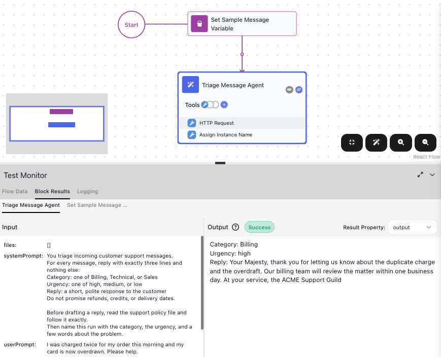

Now put the milder message back in `MESSAGE`:

```text
Do you offer annual billing for small teams?
```

Run both blocks again. The urgency drops to `low`, because policy rule 4 says so, and the name it writes
changes to match. The customer is still addressed as Your Majesty.

The agent also named its own run. Open the ((Instances)) tab and the runs are no longer an anonymous list of
identifiers - each one says what it was:

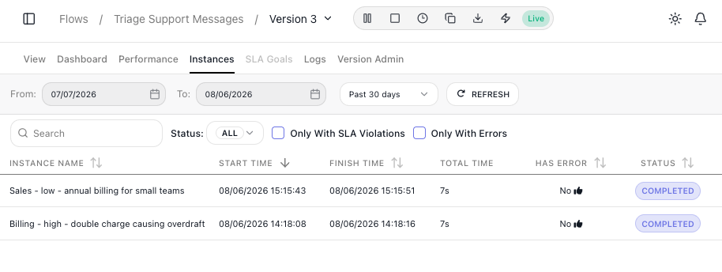

You never wired a single one of those calls. You attached two capabilities and described the job in plain
words; the agent decided when to read the file, what to take from it, and what to call the run. That is
the whole difference between an agent and a flow of fixed steps.

## 9. Use the answer in the rest of the flow

Scroll down the agent's settings and you will find ((Reference Result Data As)). That is the name the
agent's answer is published under - `Triage Message Agent Result` unless you change it. Any block placed after
the agent reads it the same way you picked the `MESSAGE` variable: open the Expression Editor, go to the
((Block Data)) tab, and choose it.

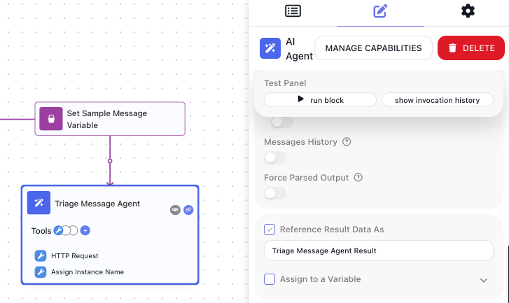

That is the hand-off point. From here the flow can act on the judgment the agent made - send the draft,
file the ticket, alert someone when the urgency is high.

## What to try next
<!-- doclint: no-shot: a list of onward routes, not a scenario; each destination shows its own screens -->

- **Feed it real messages.** Replace the Set Variables block with a trigger so messages arrive from a form
  or another system, exactly as in [A Contact Us Form (no-code)](quickstart.md).
- **Let a person approve the reply before it goes out.** This is the pattern FlowRunner is built for: the
  agent drafts, a human decides. See
  [Waiting on an External System](../build/flow-control/external-callbacks.md).
- **Give it bigger tools.** You attached two from Utils; the other categories are where an agent gets real
  reach - your own flows, a Knowledge Base of your help articles, tools from a connected MCP server, and
  the built-in actions for outside services. An agent that can look up a customer's order is a different
  thing again. See [AI in Flows](../build/ai-in-flows.md).
- **Route on what the agent decided.** An [AI Router](../reference/ai-router.md){.fr-block} sends the run
  down a different path per category, so billing and sales questions get handled differently. See
  [Routing on a Value](../build/flow-control/routing.md).

## Related

- [AI Agent](../reference/ai-agent.md){.fr-block} - every field on the block, its capabilities, and what it
  remembers between runs
- [API Keys](../platform/api-keys.md) - saving provider keys once and reusing them everywhere
- [Expression Editor](concepts/expressions.md) - the dialog you used to pick the MESSAGE variable
- [A Contact Us Form (no-code)](quickstart.md) - a first flow with no AI in it, if you want the basics
  again
