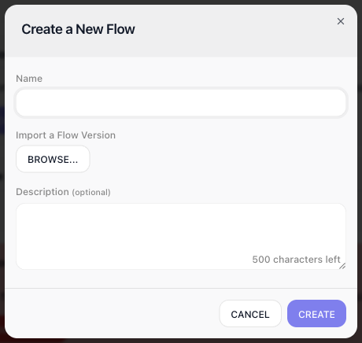
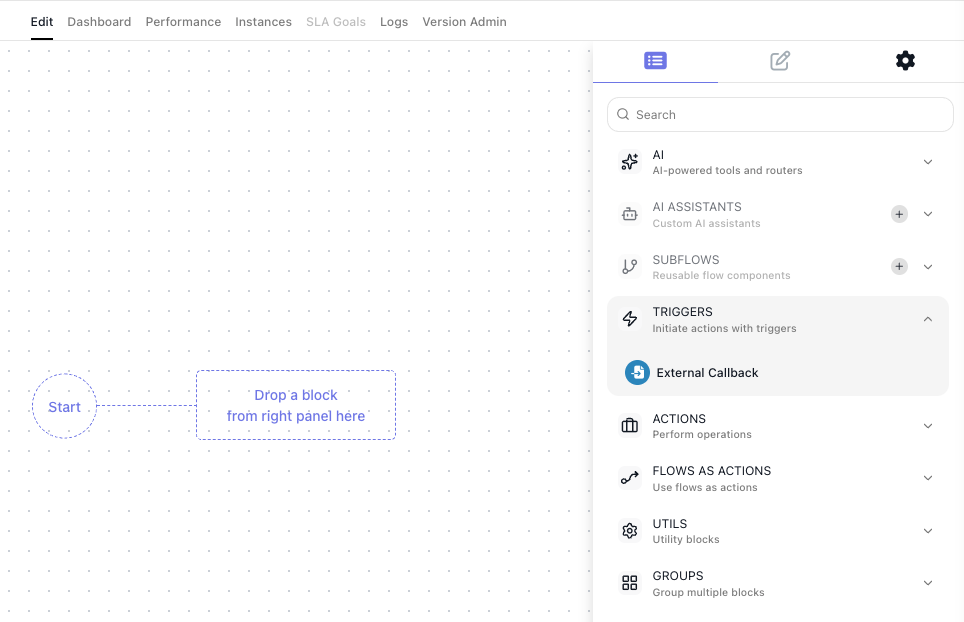
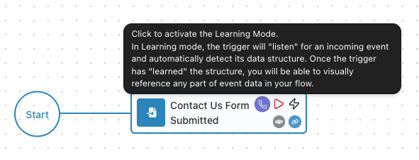
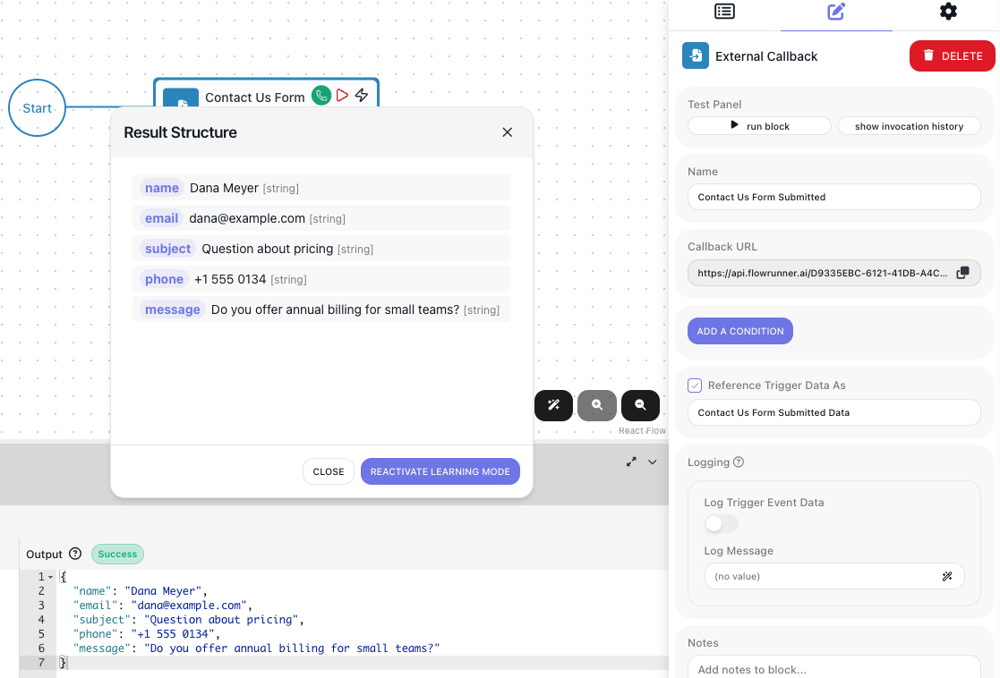
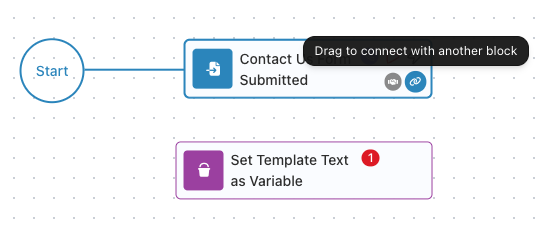
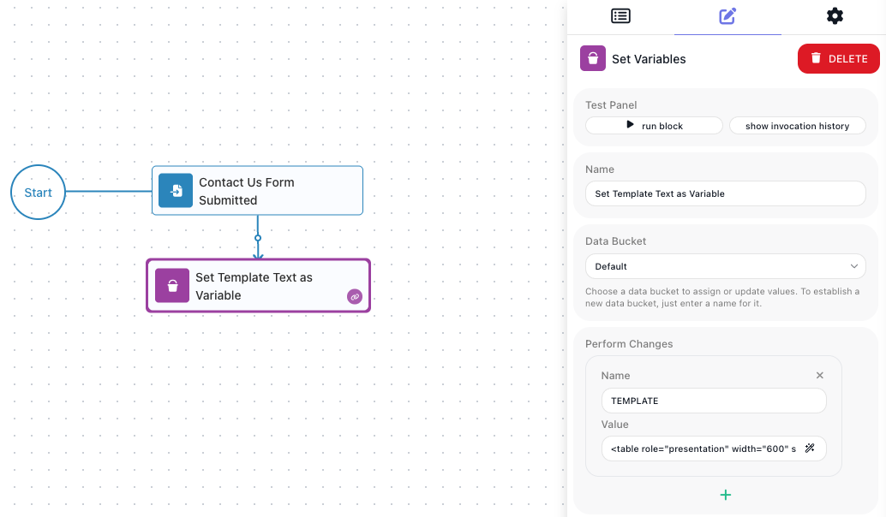
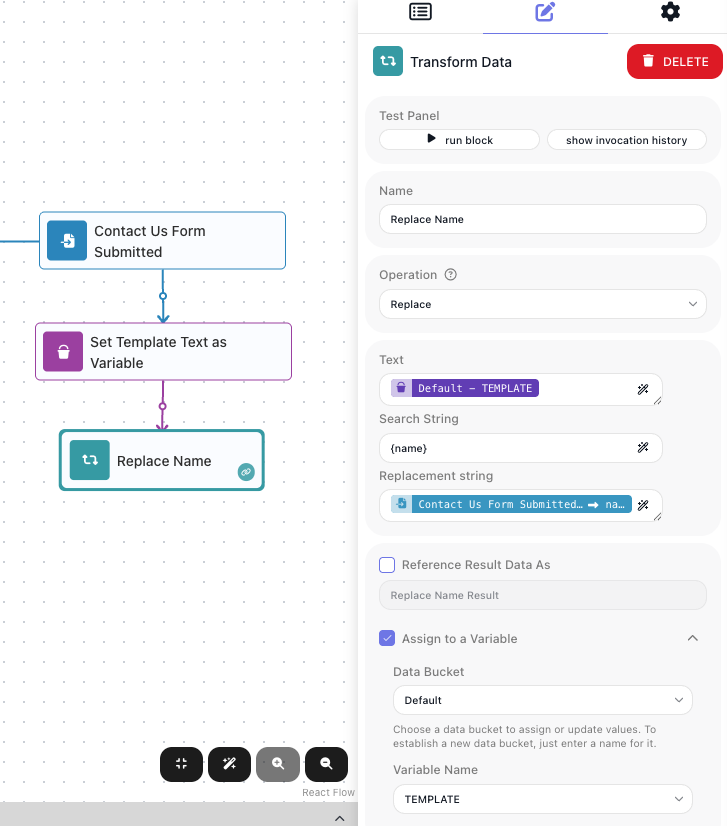
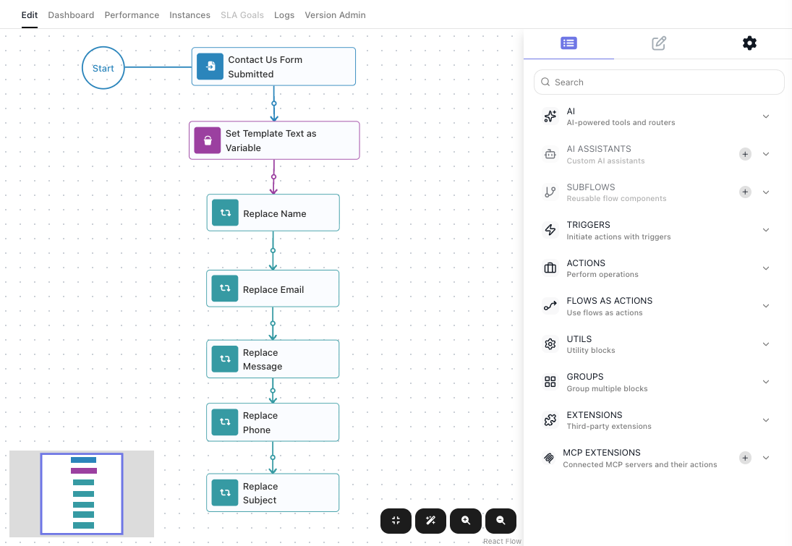
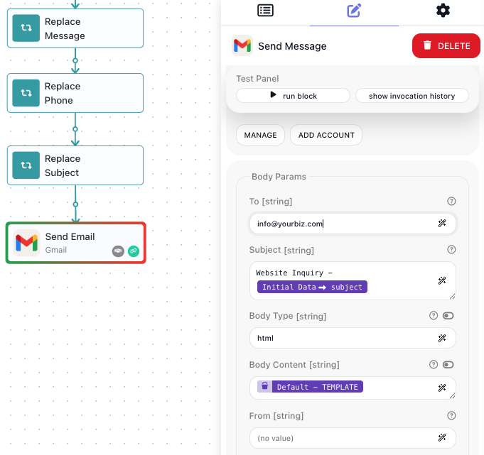

# Quick Start: A Contact Us Form (no-code)

Almost every site has a Contact Us page, and the submission has to reach a human as something readable
rather than a raw blob of fields. This guide builds the flow that does it: a website form posts to your
flow, the flow drops the submitted values into an HTML email template, and sends the result to your inbox.
It is the same flow that sits behind the contact form on our own site - flowrunner.ai.

Nothing here assumes you have used FlowRunner before. Every block is named, you are told where to find it,
and each field is filled in step by step. It takes about twenty minutes.

!!! note "What you need"
    An email account you can send from. This guide uses Gmail, and step 9 walks through authorizing it.
    Any email extension works the same way.

## The flow you are building


Read it left to right: the form arrives, the template is loaded, each placeholder in it is swapped for a
real value, and the finished HTML is emailed.

## 1. Create the flow

In the left sidebar, hover **Automate ▸ Flows** and click the ((+)) that appears. Give the flow a name -
`Contact Us` - and click ((CREATE)). 



The flow opens on an empty canvas with a ((Start)) marker and a dotted placeholder that reads "Drop a block from right panel here". The panel on the right is where every block lives, grouped into categories: **AI**, **Triggers**,
**Actions**, **Utils**, **Extensions**, and more. You build a flow by dragging blocks from there onto the
canvas.

## 2. Add the block the form will post to

A flow does not have to start with a schedule or a button. This one starts when your website posts to it,
which is what an [External Callback](../reference/external-callback.md){.fr-block} trigger is for.

1. In the right panel, expand the ((TRIGGERS)) category.
2. Drag ((External Callback)) onto the dotted placeholder next to ((Start)).
3. With the block selected, its settings appear in the right panel. Type `Contact Us Form Submitted` into
   the ((Name)) field at the top.

Naming blocks is not decoration. The name becomes how you refer to this block's data later, so a good name
now saves confusion in every step that follows.



## 3. Copy the address the form will post to

When you select a block, the interface displays its settings in the panel on the right. Select the `Contact Us Form Submitted` block and you will find ((Callback URL)) - a generated web address with a copy
button beside it. This address belongs to *this trigger*. A flow can hold several callback triggers, and
each one gets its own distinct URL.

Copy it, and set it as the form's submit target on your website.

Below the URL, notice ((Reference Trigger Data As)). Whatever the trigger receives becomes available in the flow under this name. The alias name defaults to the block's name with "Data" on the end - `Contact Us Form Submitted Data`. That is the name you will look for whenever a later step needs one of the submitted fields.


## 4. Send one test submission (optional, but it makes the rest easier)

The trigger does not know what fields your form sends until it has seen one submission. You can skip this
and type field names by hand later, but letting the trigger learn them means you pick fields from a list
instead of guessing.

Turn on ((Learning Mode)) using the purple callback icon on the block's hover toolbar:



Once the learning mode is activated, send one sample submission to the Callback URL. Any of these works:

=== "From your form"

    Submit the live form once with real-looking values. Best if the form is already wired up.

=== "With curl"

    ```bash
    curl -X POST '<paste your Callback URL here>' \
      -H 'Content-Type: application/json' \
      -d '{"name":"Dana Meyer","email":"dana@example.com","subject":"Question about pricing","phone":"+1 555 0134","message":"Do you offer annual billing for small teams?"}'
    ```

=== "From a browser tool"

    Paste the Callback URL into a request tool such as reqbin.com, set the method to POST, set the body
    type to JSON, and paste the following JSON:
    
    ```json
    {
       "name": "Dana Meyer",
       "email": "dana@example.com",
       "subject": "Question about pricing",
       "phone": "+1 555 0134",
       "message": "Do you offer annual billing for small teams?"
    }
    ```

Once a sample arrives the icon turns green. Click it to see what was captured - name, email, subject,
phone, and message, each with its value and type. Those five fields are now pickable everywhere in this
flow.



## 5. Put the email template into a variable

Your email is one long piece of HTML with gaps in it. You need somewhere to keep that text while the flow
works on it, and that is what a **variable** is: a named value the flow holds for the length of a run.

1. In the right panel, expand ((UTILS)) and drag [Set Variables](../reference/set-variables.md){.fr-block}
   onto the canvas, below the trigger.
2. **Connect it to the trigger.** The first block joined itself to ((Start)) because you dropped it on the
   placeholder. This one landed on open canvas, so nothing runs it yet. Hover the trigger block to reveal
   its action icons. The ((chain)) icon in the lower-right corner is the one that connects a block with its
   successors. Click the icon and drag onto the Set Variables block. A line joins the two.



That line represents the flow's execution path. It sets the order things happen in: the run finishes one
block, travels along the line, and starts the next. A block sitting on the canvas with nothing connected
into it never runs at all, and the flow will report an error rather than start. You will draw one of these
after every block you add from here on.

Now configure the block:

1. Name it `Set Template Text as Variable`.
2. Leave ((Data Bucket)) as `Default`.
3. Under ((Perform Changes)), a row asks for a ((Name)) and a ((Value)). Type `TEMPLATE` as the name.
4. For the value, click the wand icon at the right edge of the ((Value)) field. This opens the
   **Expression Editor** - the dialog FlowRunner uses everywhere a field can hold something more than
   typed text. You will use it again in the next step to pick form fields; for now you only need to type
   into it.
5. Paste your HTML into the editing area and click ((APPLY)).

The template is ordinary HTML with placeholders where the submitted values belong - `{name}`, `{email}`,
`{subject}`, `{phone}`, and `{message}`.

??? example "The HTML template used here"
    Placeholders appear more than once on purpose - `{email}` is both the address shown and the target of
    the Reply button, and `{subject}` appears in the subject bar and in that button's link.

    ```html
    <table role="presentation" width="600" style="background:#ffffff;border-radius:8px;">
      <tr>
        <td style="background:#16213e;padding:16px 40px;">
          <p style="margin:0;font-size:13px;color:#7f8fa6;">Subject</p>
          <p style="margin:4px 0 0;font-size:15px;font-weight:600;color:#e8e8e8;">{subject}</p>
        </td>
      </tr>
      <tr>
        <td style="padding:32px 40px 24px;">
          <table role="presentation" width="100%">
            <tr><td width="100">Name</td><td>{name}</td></tr>
            <tr><td>Email</td><td><a href="mailto:{email}">{email}</a></td></tr>
            <tr><td>Phone</td><td><a href="tel:{phone}">{phone}</a></td></tr>
          </table>
        </td>
      </tr>
      <tr>
        <td style="padding:24px 40px 32px;">
          <p style="margin:0;line-height:1.7;color:#333333;">{message}</p>
        </td>
      </tr>
      <tr>
        <td style="padding:8px 40px 36px;">
          <a href="mailto:{email}?subject=Re:%20{subject}">Reply to Lead</a>
        </td>
      </tr>
    </table>
    ```

Single braces are deliberate. FlowRunner's own expressions use double braces, so single-brace placeholders
stay plain text and are not mistaken for something the editor should work out.




## 6. Fill in the first gap

Now you swap `{name}` for the name that was submitted. The block that changes data from one shape to
another is [Transform Data](../reference/transform-data.md){.fr-block}, and it does exactly one job at a
time, chosen from a list of operations. The one you want is **Replace**, which swaps one piece of text for
another *everywhere it appears*.

!!! tip "Prefer to write code?"
    The next three steps place one block per placeholder. There is a version of this whole guide that does
    all five substitutions in a few lines of JavaScript instead:
    [A Contact Us Form (with code)](quickstart-code.md).

1. From ((UTILS)), drag ((Transform Data)) onto the canvas below the Set Variables block, then connect the
   Set Variables block to it by dragging from its ((chain)) icon.
2. Name it `Replace Name`.
3. Open the ((Operation)) dropdown, type `Replace` to filter the list, and choose ((Replace)). Three
   fields appear.
4. **((Text))** - the text to work on. Click its wand icon, and in the Expression Editor open the
   ((Variables)) tab, find `Default - TEMPLATE`, and double-click it in. Click ((APPLY)).
5. **((Search String))** - what to look for. Type `{name}`.
6. **((Replacement string))** - what to put there instead. Click its wand icon, open the ((Block Data))
   tab, expand `Contact Us Form Submitted Data`, and double-click `name`. Click ((APPLY)).
7. Tick ((Assign to a Variable)), leave ((Data Bucket)) as `Default`, and set ((Variable Name)) to
   `TEMPLATE`.

That last step is the one that matters most, and the next section explains why.



## 7. Why the block writes back into TEMPLATE

Think about what actually has to happen to your email.

You start with one piece of text containing five gaps. Filling one gap gives you a **new** piece of text
with four gaps left - and that new text is what the next block has to work on. If the second block went
back and read the original template again, it would throw away the first block's work and you would end up
with only one gap ever filled.

So each block takes whatever `TEMPLATE` currently holds, fills in its own gap, and stores the result back
into `TEMPLATE`, overwriting what was there. That is the job of the Assign to a Variable setting you
ticked in step 6: it writes the block's output into a variable instead of leaving it behind as a one-off
result.

Follow one line of the template through the flow:

| After this block | That line of `TEMPLATE` reads |
| --- | --- |
| Set Template Text as Variable | `<td>{name}</td><td>{email}</td>` |
| Replace Name | `<td>Dana Meyer</td><td>{email}</td>` |
| Replace Email | `<td>Dana Meyer</td><td>dana@example.com</td>` |

`TEMPLATE` is not a fixed value the blocks read from. It is a work in progress that each block moves one
step further along. Read it, change it, write it back is how a flow builds up a value over several steps,
and you will use the same shape any time you accumulate something - a running total, a growing list, a
message assembled in pieces.

Because each block only ever removes its own placeholder, the order of the five blocks does not matter.

## 8. Fill in the other four gaps

Add four more Transform Data blocks the same way, connecting each one to the block before it. Every one is
configured exactly
like `Replace Name` - ((Operation)) set to ((Replace)), ((Text)) set to the `TEMPLATE` variable, and
((Assign to a Variable)) writing back to `TEMPLATE`. Only two fields differ:

| Name the block | ((Search String)) | ((Replacement string)) - picked from the trigger |
| --- | --- | --- |
| `Replace Email` | `{email}` | `email` |
| `Replace Message` | `{message}` | `message` |
| `Replace Phone` | `{phone}` | `phone` |
| `Replace Subject` | `{subject}` | `subject` |



## 9. Send the email

1. In the right panel, expand ((Extensions)), find **Gmail**, and drag its ((Send Email)) block onto the
   canvas after the last Replace block. Connect the last Replace block to it, the same way as before.
2. **Sign in to Gmail.** The block needs permission to send as you, so it shows an ((OAuth Connection))
   field reading `OAuth Connection is required`. Click ((ADD ACCOUNT)); FlowRunner sends you to Google to
   sign in and approve the access, then saves the result as a connection and selects it here.
3. Set the recipient to wherever contact requests should land.
4. For the subject, open the Expression Editor and pick `subject` from `Contact Us Form Submitted Data`.
5. For the body, open the Expression Editor, go to the ((Variables)) tab, and pick `Default - TEMPLATE`.
   Every Replace block wrote back into it, so it now holds the finished HTML.
6. Make sure the body is sent as HTML rather than plain text, so the template renders.


You sign in once. Every other Gmail block in this flow picks the connection up on its own, and in any other
flow in the workspace it is there to choose without signing in again. See
[OAuth Connections](../platform/oauth-connections.md).



## 10. Run it

Set the flow LIVE using the toolbar above the canvas. Learning Mode let you send that one sample while
you were still building, but real submissions need a published flow: until the version is LIVE, a form
posting to the Callback URL starts nothing.

Now submit the form for real. Open the ((Instances)) tab and you will see the run, with a tick against every
block that finished and a summary telling you it completed without errors. The email itself should be in
your inbox.


Selecting a block shows its ((Input)) and ((Output)) side by side in ((Element Execution Details)). Above,
the trigger is selected, so the output is what the form submitted. Click through the Replace blocks in turn
and you can watch the placeholders disappear one at a time, until the last one hands finished HTML to
Gmail.

## What to try next
<!-- doclint: no-shot: a list of onward routes, not a scenario; each destination shows its own screens -->

- **Reply straight to the sender.** The template's Reply button already points at the submitter's address,
  because `{email}` was substituted inside the link as well as in the details.
- **Route it instead of just sending it.** Send billing questions somewhere different from sales ones with
  [Routing on a Value](../build/flow-control/routing.md), or let an
  [AI Router](../reference/ai-router.md){.fr-block} read the message and decide.
- **Do not lose a submission when Gmail is down.** Catch the failure and retry or record it. See
  [Handling Errors](../build/flow-control/error-handling.md).

## Related

- [External Callback](../reference/external-callback.md){.fr-block} - the trigger, its Callback URL, and
  Learning Mode in full
- [Expression Editor](concepts/expressions.md) - the dialog you used to pick values, and everything else it
  can do
- [Holding Values in Variables](../build/data-and-variables/holding-values.md) - the read-it, change-it,
  write-it-back pattern from step 7, and the other jobs variables do
- [Reshaping Data](../build/data-and-variables/reshaping-data.md) - the other Transform Data operations
