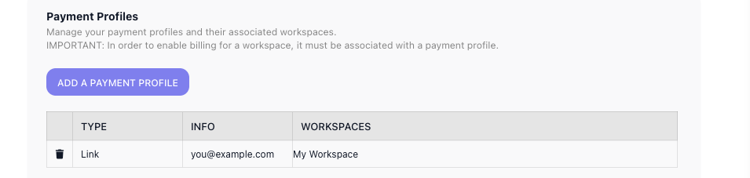

# Billing

How much your automations can run is set by your plan. Every workspace has a monthly **execution allowance** - the number of times its flows may run in a month - and the Billing page is where you see which plan you are on, what each one offers, and move to a larger one when your flows start to outgrow their room. That same allowance is what the executions counter at the top of the navigation counts against.

## What counts as an execution

An **execution** is one run of a flow - one [instance](../learn/concepts/flows-and-instances.md). Each time a flow produces an instance, the counter goes up by one, and that single count covers everything the run does from beginning to end. A run that works through fifty blocks counts the same one as a run through two: the loops, retries, waits, and parallel branches inside it add nothing on their own.

Only a **LIVE** version of a flow produces billable instances - a version you are still building or testing produces none. An instance counts when:

- The LIVE flow is set off on its own - a trigger fires, a schedule comes due, a form is submitted, or an outside system calls it over the API.
- You launch one by hand with **Run Instance** on the LIVE flow.
- One flow runs another as a step, with a [Call Flow](../reference/call-flow.md){.fr-block} block or from the **Flows as Actions** palette. The called flow starts its own instance, so it spends its own execution on top of the flow that started it.

These do not spend an execution:

- **Test runs.** Trying a flow out while you build it - running it from the editor to watch what it does - is free. Only **Run Instance** on a LIVE flow is billable.
- An inline [SubFlow](../reference/subflow.md){.fr-block}. It runs as part of the same instance, so it adds nothing.

A run counts from the moment it starts, whether or not it ends well. A flow that begins and then errors out has still produced an instance, so it spends an execution the same as one that finishes cleanly.
<!-- doclint: no-shot: conceptual explanation of how executions are counted; no single screen depicts it. Rules verified 2026-07-10: definition = one run/instance regardless of block count (matches platform/workspace.md); called flows (Call Flow / Flows as Actions) each spend an execution, inline SubFlow does not; errored runs still count. TEST-RUN rule per Mark 2026-07-10: a manual "Run Instance" (tooltip-verified label) on a LIVE flow is billable; all other test runs from the editor are free; only a LIVE version produces billable instances (matches learn/concepts/flows-and-instances.md). -->

## Plans and allowances

FlowRunner™ offers a ladder of plans - Growth, Professional, and Business - each trading a higher monthly price for a larger execution allowance, plus a custom Enterprise plan for needs beyond Business. The cards show each plan's price and monthly allowance side by side.

The plan you are on is marked ((CURRENT PLAN)), and a selector beside its price raises that plan's execution allowance without moving plans. To move up instead, use the plan's upgrade button; ((See detailed comparison)) opens the full plan-by-plan breakdown, and ((Contact us)) arranges an Enterprise plan. When your flows begin bumping against the allowance - the executions counter climbing toward its limit before the month is out - raise the allowance or move up a plan to give them more room.

## Payment profiles

Before a workspace can be charged - moved onto a paid plan, or up from the one it is on - it has to be tied to a **payment profile**. Until it is, the upgrade buttons stay disabled, and a free-credit balance shown at the top of the Billing page keeps your flows running in the meantime.

You add and manage payment profiles on the account-level ((Payment Profiles)) page, reached from your account menu at the bottom of the left navigation. It has two parts.

The first lists your **payment profiles** - the payment methods on your account. ((Add a payment profile)) hands off to a secure Stripe checkout to enter your details; each saved profile then shows its type, its identifier, and the workspaces it covers.

The second is a **Workspaces** overview - every workspace you have, each with its billing plan, the payment profile assigned to it, and its subscription renewal date. You assign a workspace's payment profile from this table; you change its plan back on the workspace's own Billing page.

<!-- verified in-product 2026-07-10 (Tests workspace Billing + account Payment Profiles, viewed only - nothing upgraded, no payment method added, stayed off the Stripe page): plan cards read Growth $45/month 12,000 (CURRENT PLAN here; the allowance is a selector offering 12,000 / 30,000 / 60,000), Professional $299/month 75,000, Business $999/month 250,000, plus "Need more? Contact us" (flowrunner-ai.webflow.io/contact) and "See detailed comparison" (/pricing). UPGRADE TO PROFESSIONAL and UPGRADE TO BUSINESS are DISABLED (the workspace has no payment profile assigned); a free-credit banner covers usage meanwhile. Payment Profiles page (/account/payment-profiles): "In order to enable billing for a workspace, it must be associated with a payment profile"; a profile has Type (e.g. Link) / Info (email) / Workspaces; "Add a payment profile" opens a live Stripe Checkout. A Workspaces table lists every workspace with its billing plan, an assignable payment-profile dropdown, and a subscription renewal date, noting plans change in Workspace Settings > Billing. Personal email + workspace name redacted in the payment-profiles screenshot. -->

## Related

- [Workspace](../platform/workspace.md) - the executions counter, and the areas a workspace holds
