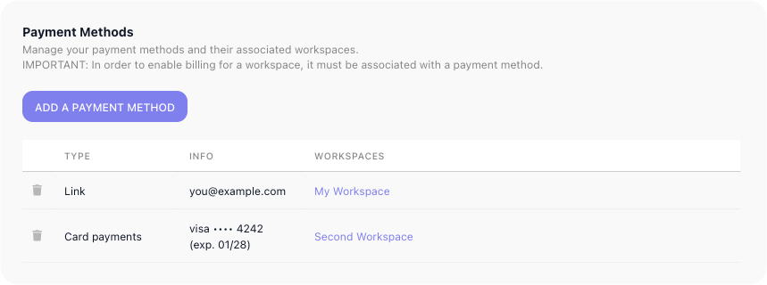

# Billing

How much your automations can run is set by your plan. Every workspace has a monthly **execution allowance** - the number of times its flows may run in a month - and the Billing page is where you see which plan you are on, what each one offers, and move to a larger one when your flows start to outgrow their room. That same allowance is what the executions counter at the top of the navigation counts against.

## What counts as an execution

An **execution** is one run of a flow - one [instance](../learn/concepts/flows-and-instances.md). Each time a flow produces an instance, the counter goes up by one, and that single count covers everything the run does from beginning to end. A run that works through fifty blocks counts the same one as a run through two: the loops, retries, waits, and parallel branches inside it add nothing on their own.

Only a **LIVE** version of a flow produces billable instances - a version you are still building or testing produces none. An instance counts when:

- The LIVE flow is set off on its own - a trigger fires, a schedule comes due, a form is submitted, or an outside system calls it over the API.
- You launch one by hand with **Run Instance** on the LIVE flow.
- One flow runs another as a step, with a [Call Flow](../reference/call-flow.md){.fr-block} block or from the **Flows as Actions** palette. The called flow starts its own instance, so it spends its own execution on top of the flow that started it.

These do not spend an execution:

- **Test runs.** Trying a flow out while you build it - running it from the editor to watch what it does - is free. Only **Run Instance** on a LIVE flow is billable.
- An inline [SubFlow](../reference/subflow.md){.fr-block}. It runs as part of the same instance, so it adds nothing.

A run counts from the moment it starts, whether or not it ends well. A flow that begins and then errors out has still produced an instance, so it spends an execution the same as one that finishes cleanly.
<!-- doclint: no-shot: conceptual explanation of how executions are counted; no single screen depicts it. Rules verified 2026-07-10: definition = one run/instance regardless of block count (matches platform/workspace.md); called flows (Call Flow / Flows as Actions) each spend an execution, inline SubFlow does not; errored runs still count. TEST-RUN rule per Mark 2026-07-10: a manual "Run Instance" (tooltip-verified label) on a LIVE flow is billable; all other test runs from the editor are free; only a LIVE version produces billable instances (matches learn/concepts/flows-and-instances.md). -->

## Plans and allowances

FlowRunner™ offers a ladder of plans - Free, Starter, Growth, Professional, and Business - each trading a higher monthly price for a larger execution allowance, plus a custom Enterprise plan for needs beyond Business. The cards show each plan's price and monthly allowance side by side; the row scrolls sideways, so the higher plans sit off the right edge until you scroll to them.

The plan you are on is marked ((Current Billing Plan)) and carries its renewal date, and a selector beside its price raises that plan's execution allowance without moving plans. To move up instead, use the plan's upgrade button; ((See detailed comparison)) opens the full plan-by-plan breakdown, and ((Contact us)) arranges an Enterprise plan. ((Manage Subscription)), at the top right of the Billing page, opens Stripe's customer portal in a new tab; you enter your account email there and Stripe sends you a sign-in link. When your flows begin bumping against the allowance - the executions counter climbing toward its limit before the month is out - raise the allowance or move up a plan to give them more room.

## Starting on a trial

A new workspace begins on a **14-day trial of the Professional plan**, with no card required to create it. The
trial is granted **once per account, not once per workspace**: the entitlement is checked against both the
account and the email address it registered with, so deleting an account and signing up again with the same
address does not earn a second one. Your second and later workspaces are therefore created without a
subscription and stay suspended until you subscribe to a plan for them - that is the normal outcome, not an
error.

To convert a trial before it runs out, pick a plan on this page. That **ends the trial immediately and
charges the new plan straight away**, and it does so even when you pick the plan the trial is already on,
or a cheaper one - a downgrade is not a way to defer the charge. A payment method has to be attached to
the workspace first; without one the change is refused.

If a trial is never converted, the trial ends and the charge is attempted anyway. When there is no card, or
the card declines, the subscription is left **past due** rather than cancelled - a cancelled subscription
cannot be restarted, and a past-due one can still be paid. The workspace is suspended and the owner is sent
a payment-failed notification; paying the outstanding invoice lifts the suspension on its own. A workspace
that has paid before is not suspended by a single failed renewal - only a final cancellation does that.

## Running out of executions

The allowance is not a surprise you meet at the end of the month. As the counter climbs, FlowRunner warns
the workspace at **80%**, **90%** and **95%** of the allowance, in the console and by email, with the
warning sharpening each time.

At **100% the flows stop**. Runs already in progress are not the point - no new instance starts until
either the next billing cycle begins and the counter resets, or the workspace moves to a plan with more
room. Nothing is lost while it is stopped: flows, logs and configuration are all still there, and raising
the plan starts them again.

## Changing plan mid-month

The two directions deliberately do not mirror each other:

- **Moving up takes effect at once.** You are charged a prorated amount for the days left in the current
  cycle, the execution counter resets to the new plan's full allowance, and the renewal date does not move.
- **Moving down takes effect at the end of the cycle.** There is no refund for the current month, you keep
  the current plan and its allowance until the cycle ends, and the new rate applies from the next renewal.

That asymmetry is why an upgrade late in a cycle is cheap in money but full in allowance, and why a
downgrade cannot be used to undo one.

## What a workspace without a paid subscription cannot do

Two operations are refused unless the workspace is on a paid subscription - **exporting a flow version**,
and **building a workspace transfer archive**:

| The subscription is | The reason given |
| --- | --- |
| on a trial | Not available on a trial subscription; upgrade to a paid subscription to use it. |
| cancelled | Not available with a cancelled subscription; renew to use it. |
| past due | Not available while a payment is outstanding; update the payment method to use it. |

Importing is deliberately untouched - the restriction is on taking work *out* of a workspace, not on
putting it in. Cloning a flow version is unaffected too, because the copy never leaves.

## Payment methods

Before a workspace can be charged - moved onto a paid plan, or up from the one it is on - it has to be tied to a **payment method**. Until it is, the upgrade buttons stay disabled, and a free-credit balance shown at the top of the Billing page keeps your flows running in the meantime.

You add and manage payment methods on the account-level ((Payment Methods)) page, reached from your account menu at the bottom of the left navigation. It has two parts.

The first lists your **payment methods** - the cards and payment accounts on your account. ((Add a payment method)) hands off to a secure Stripe checkout to enter your details; each saved method then shows its type, its identifier, and the workspaces it covers.

The second is a **Workspaces** overview - every workspace you have, each with its billing plan, the payment method assigned to it, and its subscription renewal date. You assign a workspace's payment method from this table; you change its plan back on the workspace's own Billing page.

<!-- 2026-09-09, Documentation Flows on dev.flowrunner.ai (Billing + account Payment Methods, VIEWED ONLY -
     nothing upgraded, no method added, stayed off Stripe checkout). Two fixes from Mark's review:
     - billing-plan-cards.png recaptured in light mode. The 2026-08-31 capture was taken with the
       notifications drawer open, whose backdrop darkened the whole page.
     - "Payment Profiles" is now "Payment Methods" everywhere: account-menu entry "Payment Methods",
       URL /account/payment-methods, page heading "Payment Methods", button "Add a payment method",
       banner "...it must be associated with a payment method", Workspaces table column "Payment method"
       (a per-workspace combobox, confirmed role=combobox). New shot billing-payment-methods.png replaces
       billing-payment-profiles.png; email -> you@example.com, workspace names -> My Workspace / Second
       Workspace redacted in the DOM before capture. Test-mode Visa "4242" row kept: it shows a second
       method type.
     - NEW on the Billing page since 08-31: a "Manage Subscription" button (top right, external-link icon)
       opening a Stripe customer-portal login link in a new tab (billing.stripe.com/p/login/...). Driven
       as far as the portal's login screen only: "Enter your email and we will send you a link directly to
       your customer portal." What the portal shows after sign-in was NOT driven (magic-link email).
     - 2026-09-09, Mark: the trial is on the PROFESSIONAL plan, not Growth (the FR-3321 ticket body said
       Growth; the product is the source of truth). Corrected in "Starting on a trial". -->

<!-- FR-3321 / FR-2236 / FR-2084 / FR-3444, 2026-08-31, Documentation Flows on dev.flowrunner.ai
     (Billing page, VIEWED ONLY - nothing upgraded, downgraded, or paid).
     DRIVEN AND CORRECTED HERE:
     - The plan ladder is FIVE plans plus Enterprise: Free $0 / 100 executions, Starter $5 / 300,
       Growth $45 / 12,000, Professional $299 / 75,000, Business $999 / 250,000. The page had listed only
       Growth, Professional and Business - Free and Starter were missing entirely.
     - The current-plan chip reads "Current Billing Plan", not "CURRENT PLAN" as the page had it, and it
       carries a renewal date ("Renews on: Tue Sep 15 2026").
     - The allowance control is confirmed a combobox (role=combobox) on the Starter and Growth cards, so
       the page's "selector beside its price" is right.
     - The cards row SCROLLS HORIZONTALLY: only about three cards fit, so Professional and Business are
       off the right edge. This is why the shot shows Free / Starter / Growth and the prose says the row
       scrolls - no single screenshot can hold all five. New shot billing-plan-cards.png replaces
       billing.png, which showed the old three-plan ladder and the old chip label.
     SPEC-SOURCED, NOT DRIVEN - flagged to Mark: the trial, the 80/90/95/100% warnings and the hard stop,
     the upgrade/downgrade timing, and the export/transfer refusals all come from the FR-3321 and FR-2236
     ticket bodies, not from the product. They could not be driven from here: this workspace is on a paid
     Growth plan at 0-15 of 12,000 executions, so there is no trial to observe, no threshold to cross, and
     no refusal to trigger, and exercising them would mean real charges. The error codes behind the
     refusal table (9124 trialing / 9125 canceled / 9127 past due) are recorded here but deliberately kept
     OUT of the page, which gives the reason rather than the code - a console user never sees them.
     Likewise the `trialing` subscription status and the API-level changes in FR-3321 are omitted as
     integrator-facing, not billing-page-facing.
     FR-2084 (Chargify -> Stripe) needed no change: the page already describes Stripe checkout and
     account-level Payment Profiles. FR-3444 (payment-profile endpoint returned an empty array) is a
     server fix behind that same page with no user-visible change to document.
     verified in-product 2026-07-10 (Tests workspace Billing + account Payment Profiles, viewed only - nothing upgraded, no payment method added, stayed off the Stripe page): plan cards read Growth $45/month 12,000 (CURRENT PLAN here; the allowance is a selector offering 12,000 / 30,000 / 60,000), Professional $299/month 75,000, Business $999/month 250,000, plus "Need more? Contact us" (flowrunner-ai.webflow.io/contact) and "See detailed comparison" (/pricing). UPGRADE TO PROFESSIONAL and UPGRADE TO BUSINESS are DISABLED (the workspace has no payment profile assigned); a free-credit banner covers usage meanwhile. Payment Profiles page (/account/payment-profiles): "In order to enable billing for a workspace, it must be associated with a payment profile"; a profile has Type (e.g. Link) / Info (email) / Workspaces; "Add a payment profile" opens a live Stripe Checkout. A Workspaces table lists every workspace with its billing plan, an assignable payment-profile dropdown, and a subscription renewal date, noting plans change in Workspace Settings > Billing. Personal email + workspace name redacted in the payment-profiles screenshot. -->

## Related

- [Workspace](../platform/workspace.md) - the executions counter, and the areas a workspace holds
