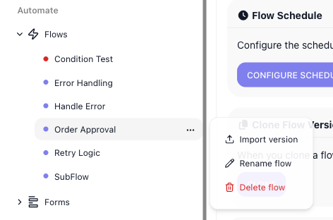
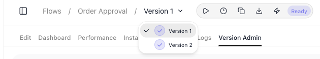
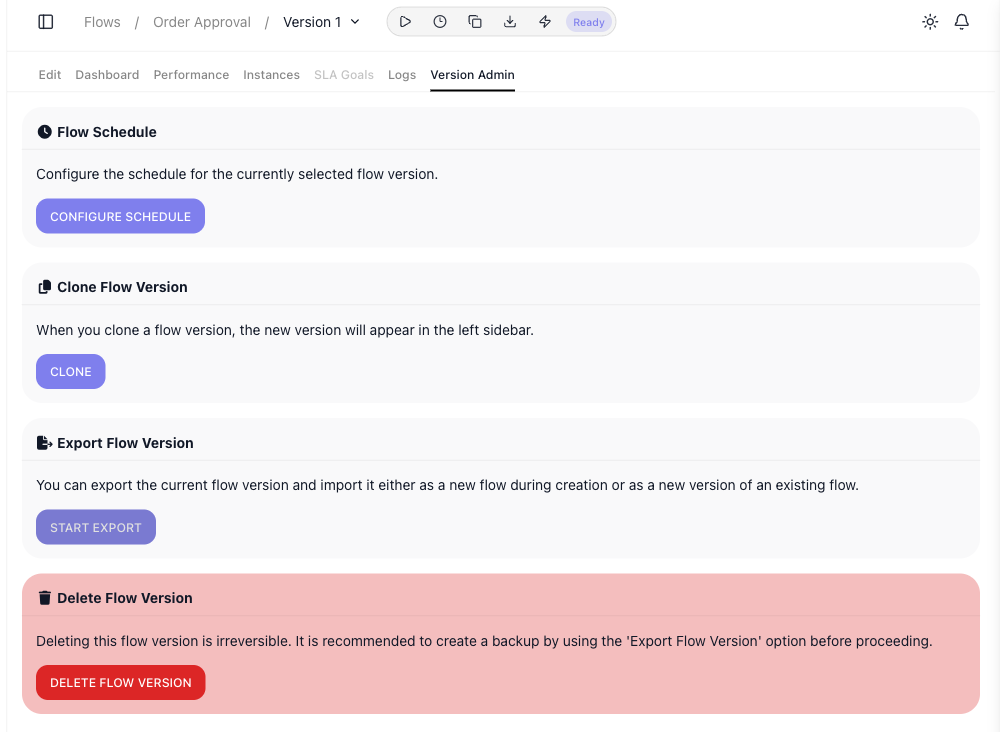

# Flows

Every automation you build in FlowRunner™ is a **flow**. This page is about managing the flows themselves - creating them, keeping versions of them, moving them in and out as files, and removing them. Building what a flow does happens in the [Flow Editor](../build/flow-editor.md); running and watching flows is covered under [Run & Monitor](../run/running-flows.md).

Your flows are listed in the left navigation under **Automate → Flows**. Each one is a row that opens the flow in the editor, and each row has a **⋯** menu holding the actions that apply to the whole flow. That list is shown under [Renaming and deleting a flow](#renaming-and-deleting-a-flow) below.
<!-- doclint: no-shot: conceptual orientation; the flow list is shown in the Renaming and deleting a flow section -->

## Creating a flow

The **+** beside the Flows heading opens the ((Create a New Flow)) dialog. Give the flow a ((Name)), optionally add a ((Description)), and click ((CREATE)) to open it in the editor. You can also start from a file: ((BROWSE...)) under ((Import a Flow Version)) picks an exported flow file, and the new flow is created from it.

!!! tip "The description is worth writing"
    The description does more than label the flow for you. When the flow is attached to an [AI Agent](../reference/ai-agent.md){.fr-block} as a tool, the agent reads its description to learn what the flow does and when to call it. A vague description leaves the agent guessing; a clear one lets it use the flow correctly. See [Flows as Agent Tools](../reference/flows-as-agent-tools-concept.md).

## Renaming and deleting a flow

Each flow's **⋯** menu, on its row in the sidebar, carries the whole-flow actions:

- ((Rename flow)) - change the flow's name.
- ((Import version)) - add an exported version file into this flow as a new version.
- ((Delete flow)) - remove the flow and all of its versions. This cannot be undone.

## Versions

A flow holds one or more **versions**. A version is a complete copy of the flow's design that you can edit, run, and schedule on its own. The version you are viewing is named in the breadcrumb at the top, and the selector beside it switches between them.

Versions let you change a flow without disturbing the one already in use: you leave the running version alone, clone it, and work on the copy. The ((Version Admin)) tab is where you manage a version.

- ((Clone Flow Version)) - ((CLONE)) makes a copy of the current version; the new version appears in the sidebar and in the version selector.
- ((Delete Flow Version)) - ((DELETE FLOW VERSION)) removes the version you are viewing. This cannot be undone, so export a backup first (below). To remove the whole flow, use Delete flow on the flow's ⋯ menu.
- ((Flow Schedule)) - ((CONFIGURE SCHEDULE)) sets when this version runs on its own; see [Scheduling](../reference/flow-scheduling-concept.md).

## Moving and backing up flows

On the Version Admin tab, **Start Export** downloads the current version as a `.json` file - a portable copy you can keep as a backup or import again, into this workspace or another. You bring a file back in two ways: as a new flow, through **Import a Flow Version** in the Create a New Flow dialog; or as a new version of an existing flow, through **Import version** on that flow's ⋯ menu. Importing as a new flow in the same workspace is how you make a separate copy of a flow.

To move an entire workspace - every flow at once - to another FlowRunner installation, use Transfer Workspace on [Workspace Settings](workspace-settings.md) instead.

<!-- verified in-product 2026-07-10 (Documentation Flows workspace; Mark authorized create/modify/delete here): flows list in the sidebar under Automate -> Flows; the "+" beside the Flows heading opens "Create a New Flow" (Name / Import a Flow Version [Browse] / Description / Create). Each flow row's ellipsis menu = Import version, Rename flow, Delete flow (delete removes the whole flow + all versions). Renamed "Order Approval Clean" -> "Order Approval" via Rename flow (worked). A flow opens to tabs Edit / Dashboard / Performance / Instances / SLA Goals / Logs / Version Admin, with a version selector in the breadcrumb + toolbar (Start flow / Schedule / Clone / Export / Run Instance). Version Admin sections: Flow Schedule (Configure Schedule), Clone Flow Version (CLONE -> created Version 2, appeared in sidebar/selector), Export Flow Version (Start Export -> downloaded "Order Approval Flow (version 1).json"), Delete Flow Version (irreversible; recommends export backup). (Is Sample Flow section is being deprecated per Mark 2026-07-10 - removed from prose and DOM-hidden before recapturing the screenshot.) Import path confirmed by the product's own Export text ("import ... as a new flow during creation or as a new version of an existing flow"). Start flow / Run Instance / Schedule belong to Run & Monitor - cross-linked, not covered here. Screenshots cropped to exclude the sidebar's personal footer. -->

## Related

- [Building a flow](../build/flow-editor.md) - assembling what a flow does
- [Running Flows](../run/running-flows.md) - starting and watching your flows
- [Scheduling](../reference/flow-scheduling-concept.md) - running a flow version on a schedule
- [Workspace Settings](workspace-settings.md) - moving or deleting the whole workspace
