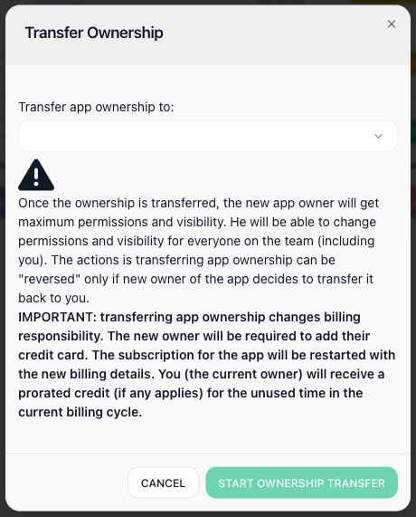

# Team

You rarely build automations on your own, and the Team page is where the rest of your people come in - to build flows alongside you, run them, and keep an eye on how they perform - with you deciding how far each one's reach goes. Bring in as many as you need: FlowRunner™ does not charge per seat, so a larger team costs nothing extra. Everyone shares the single workspace and the work inside it; what differs is what they are allowed to touch.

## Who is on the team, and what they can do

The ((Development Team)) list shows everyone in the workspace at a glance: their name and email, when they last signed in, the reach they have, and whether the workspace's notifications reach them. The row marked ((It's you)) is your own.

A member's reach is set by their ((Permissions)). The ((Owner)) holds the workspace and can do everything in it; an admin has all permissions; or you grant a mixed set, turning individual abilities on or off so someone can, say, build and run flows but not touch billing or remove people. Their ((Notifications)) say whether the workspace's alerts reach that person or stay muted for them.

As the work or the team changes, you manage the roster from the same screen. ((INVITE A TEAM MEMBER)) brings someone new in by email, with the reach you choose for them. ((DELETE SELECTED)) removes the members you tick, and ((REMOVE ME FROM THE TEAM)) is how you step out of a workspace you no longer work in.

## Transferring ownership

((TRANSFER OWNERSHIP)) hands the Owner role to another team member, in place - the workspace does not move. You pick the member from the list, and once it goes through they get maximum permissions and visibility over everyone, including you; it can be undone only if the new owner transfers it back.

Transferring ownership also moves **billing responsibility**. The new owner is asked to add their own payment method, the subscription restarts under their billing, and you receive a prorated credit for the unused time in the current cycle.

This is a person-to-person handoff within the same installation. To move the whole workspace to a different FlowRunner™ installation instead, see [Workspace Settings](workspace-settings.md#transferring-a-workspace-to-another-installation).

<!-- verified in-product 2026-07-10 (Tests workspace, Workspace settings -> Team, viewed only - nothing invited/removed/transferred): the Development Team roster lists each member with last login, a Permissions badge (Owner / All permissions / Mixed) and a Notifications badge, with "It's you" on your own row; the actions are Invite a team member, Delete selected, Remove me from the team, and Transfer ownership. Matches the page; existing screenshot depicts the same layout. Transfer Ownership dialog verified 2026-07-10 (opened, cancelled - nothing transferred): "Transfer app ownership to:" a chosen team member; the new owner gets maximum permissions/visibility over everyone incl. you; reversible only if the new owner transfers back; IMPORTANT - billing responsibility moves (new owner adds their card, subscription restarts under their billing, current owner gets a prorated credit for unused time). This is the in-place person-to-person handoff, distinct from Workspace Settings' cross-installation Transfer Workspace. Promoted to its own "## Transferring ownership" section 2026-07-10 (per Mark) so Workspace Settings can link to it. New screenshot team-transfer-ownership.png: captured in Tests, the three real teammates' names + emails redacted to Alex Rivera/Jordan Lee/Sam Patel @example.com via DOM before capture; dialog opened + cancelled, nothing transferred. -->

## Related

- [Workspace](../platform/workspace.md) - what a workspace is and the areas it holds
- [Workspace Settings](workspace-settings.md) - renaming, credentials, and transferring or deleting the workspace itself
