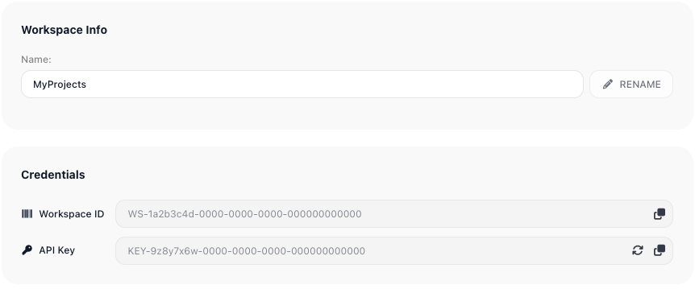
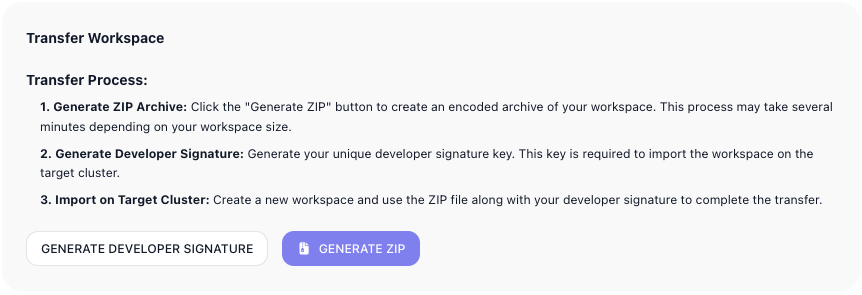

# Workspace Settings

A workspace's General settings are where you set what it is and what becomes of it: the name that tells it apart from your others, the credentials that let outside systems drive its flows, and the two ways it can end - handed to someone else, or deleted for good. You reach them from the General page, under Workspace settings in the left navigation.

## Name and credentials

A workspace's name is how you and your team tell it apart from the others you keep open - it is the label in the workspace switcher and across the app. Rename it when its purpose has drifted from its name: a "Test" space that quietly became production, a project that grew into a product. The name should still say what is inside. You change it in the ((Workspace Info)) section: edit the ((Name)) and click ((RENAME)).

A flow does not have to be started from the editor, and the ((Credentials)) section is what opens it up to the outside. It holds the two values another system needs to drive this workspace on its own - the ((Workspace ID)) that names it and the ((API Key)) that authorizes the caller. With them, a [Call Flow](../reference/call-flow.md) invocation, a trigger activation, or any program you write can start your flows from anywhere, not only from inside FlowRunner™. Treat the key like a password: if it leaks, regenerate it with the refresh icon beside the field, and the old one stops working the moment you do.

## Transferring a workspace to another installation

!!! note "Handing the workspace to another person?"
    That is a different action: [Transferring ownership](team.md#transferring-ownership) on the Team page changes the owner in place, with no export or import. Transfer Workspace, below, is the separate move to another installation.

((Transfer Workspace)) moves an entire workspace - every flow, connection, and setting - to a different FlowRunner™ installation, such as from the FlowRunner cloud to a self-hosted installation. It goes in three steps: ((GENERATE ZIP)) packages the workspace into an encoded archive; ((GENERATE DEVELOPER SIGNATURE)) issues the signature that unlocks that archive; then, on the target installation, you create a fresh workspace and import the archive with that signature to finish the move.

The Developer Signature is the password for the generated ZIP. Anyone who has both the archive and its signature can import the workspace, so send the two separately. This is also how you would hand a workspace to another person by this route - you share the archive and its signature with them.

## Deleting a workspace

When a workspace's work is finished or abandoned, deleting it clears it out completely and frees its monthly execution allowance for the workspaces still earning their keep. It removes the workspace and everything in it - flows, forms, knowledge bases, connections - and the screen says so plainly: the operation is irreversible. ((DELETE WORKSPACE)) carries it out once you confirm, so reach for it only when you are certain nothing inside is still needed.

<!-- verified in-product 2026-07-10 (Tests workspace, Workspace settings -> General, viewed only - nothing renamed/regenerated/transferred/deleted): the page has Workspace Info (Name field + RENAME), Credentials (Workspace ID + API Key, each read-only with copy; API Key has a regenerate control), Transfer Workspace (Generate ZIP + Generate Developer Signature, then import on the target), and "Delete the workspace" (marked irreversible, red DELETE WORKSPACE). Matches the page; existing screenshots depict the same sections. Corrected 2026-07-10 per Mark: Transfer Workspace is primarily a cross-INSTALLATION move (e.g. FlowRunner cloud -> self-hosted); the Developer Signature is the password for the generated ZIP; handing a workspace to another PERSON on the same installation is done via Transfer Ownership on the Team page, not this. -->

## Related

- [Workspace](../platform/workspace.md) - what a workspace is and the areas it holds
- [Call Flow](../reference/call-flow.md) - starting one flow from another, including from an API call
