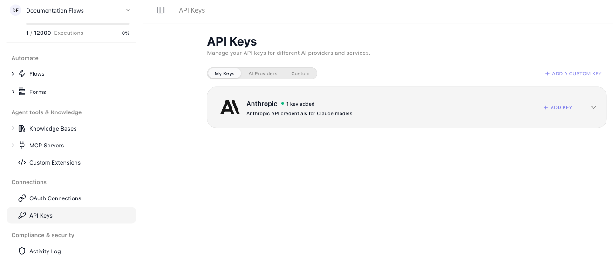
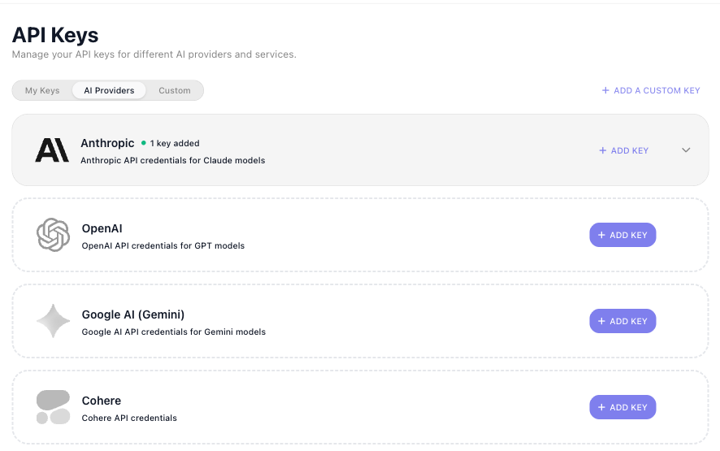
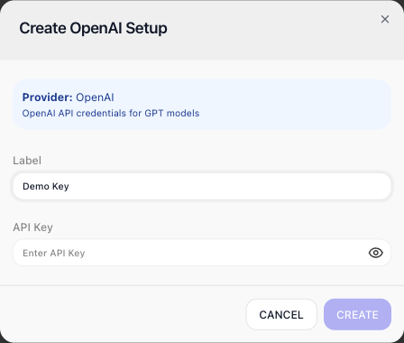
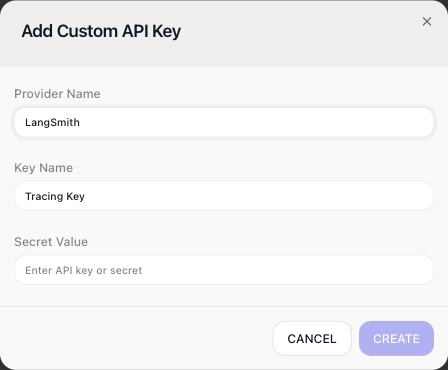
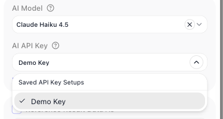
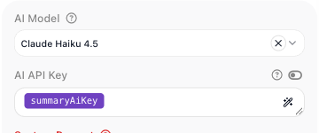
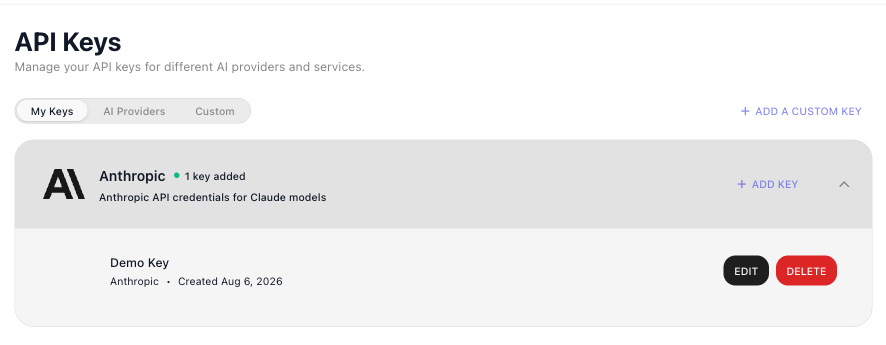

# API Keys

<!-- verified in-product 2026-08-06 (Documentation Flows workspace): sidebar Connections > API Keys;
h1 "API Keys", subtitle "Manage your API keys for different AI providers and services."; THREE tabs
My Keys / AI Providers / Custom + an ADD A CUSTOM KEY button. AI Providers rows: OpenAI, Anthropic,
Google AI (Gemini), Cohere, Mistral AI, Groq, DeepSeek, Kimi, Voyage AI ("for embedding models") -
each with ADD KEY; a provider holding a key shows "1 key added" and sorts onto My Keys. Create
OpenAI Setup dialog: Provider banner, Label, API Key (eye reveal). My Keys: provider card expands
to each setup (label, provider, Created date, EDIT/DELETE). Custom tab empty state: "Store an API
key or secret for a provider or service that isn't in the built-in AI providers list."; Add Custom
API Key dialog: Provider Name (e.g. LangSmith), Key Name, Secret Value. Block-side: AI API Key
field disabled ("Select model first") until a model is picked, then offers saved setups
("Saved API Key Setups" list) - and typing a raw key surfaces a "Save as Setup" affordance (re-driven
today on the Refund Question block). All six screenshots captured fresh today and read back. -->

Every AI block and operation in FlowRunner™ - the [AI Agent](../reference/ai-agent.md){.fr-block},
the [AI Router](../reference/ai-router.md){.fr-block}, and the rest - calls a model hosted by an
outside provider such as OpenAI, Anthropic, or Google, and each provider authenticates that call
with an API key you hold with them. **API Keys** is the workspace store for those keys: save a key
once, give it a label, and reuse it across every flow instead of pasting the same secret into
block after block. The screen lives under **Connections** in the workspace sidebar, and it holds
keys for other services too, not only the AI providers.

The screen has three tabs:

- **My Keys** - the keys you have saved, grouped by provider, with the controls to edit or delete
  each one.
- **AI Providers** - the catalog of supported AI providers, each with an ((ADD KEY)) button.
- **Custom** - keys and secrets for services outside that catalog.

## Saving a provider key

The **AI Providers** tab lists the providers FlowRunner supports - OpenAI, Anthropic,
Google AI (Gemini), Cohere, Mistral AI, Groq, DeepSeek, Kimi, and Voyage AI (embedding models) -
each with a one-line description:

Click ((ADD KEY)) on the provider you hold a key with. A setup dialog opens for that provider -
`Create OpenAI Setup`, for example - and asks for two things:

- ((Label)) - a name for this key, so you can tell it apart from other keys for the same provider.
  `Demo Key` and `Production` might both be OpenAI keys.
- ((API Key)) - the secret itself, copied from the provider's own console.

A saved key is called a *setup*. One provider can hold several setups, so you can keep a test key
and a production key side by side, or a separate key for each client.

## Saving a key for any other service

The **Custom** tab stores an API key or secret for a provider or service that is not in the
built-in list. ((ADD A CUSTOM KEY)) opens a dialog with three fields: ((Provider Name)) - the
service the key belongs to, ((Key Name)) - the label for this key, and ((Secret Value)) - the
secret itself.

## Using a key in a flow

Every AI block and operation has an ((AI API Key)) field. Choose the model first - until you do,
the field is disabled and reads "Select model first". Once the model is picked, the field offers
your saved setups:

Pick a setup by its label and the block authenticates with the provider using it - the secret
value never appears in the block. If you instead type a new key straight into that field, the
((Save as Setup)) option that appears writes it to this store under a label, so the next block,
and the next flow, can select it. Both paths leave the secret in this one place.

A flow can also record which of these keys it uses as part of its own configuration: declare a
[placeholder](../learn/concepts/placeholders.md) of type `API KEY` and choose a saved setup as its value.
The flow then stores your choice of setup rather than the secret. To have an AI step use it, flip the
switch beside the ((AI API Key)) label: the field becomes an expression, and you pick the placeholder in the
Expression Editor. Whoever sets up the flow then chooses the key in one place, without opening the AI step:

<!-- RELEASE v.1.1.2 (FR-3443), DRIVEN 2026-09-25 on PROD, Documentation Flows, flow "Ticket Summary": the
     switch (tooltip "Toggle expression input") is on the AI API Key field of AI Agent, AI Router, Condition ->
     AI QUESTION and Transform Data -> AI Transform; the placeholder resolved at Run Block (Success) and the key
     did not appear in the block's Input. Knowledge Base creation keeps a key picker only (developer's answer,
     not driven). -->

## Managing keys

The **My Keys** tab shows each provider you hold keys with; expand a provider to its setups. A
setup shows its label, its provider, and the date you created it, with two controls:

- ((EDIT)) - change the label, or replace the key value after you rotate it with the provider. The
  dialog also reveals the stored key, so treat access to this screen as access to the keys
  themselves.
- ((DELETE)) - remove the setup from the workspace. Any block set to use it stops authenticating
  until you point it at another key.

## Related

- [OAuth Connections](oauth-connections.md) - the workspace's other credential store, for services
  you sign in to
- [AI Agent](../reference/ai-agent.md){.fr-block} - an AI block whose AI API Key field draws on
  these saved setups
- [AI in Flows](../build/ai-in-flows.md) - every place a flow can put a model, and its key, to work
