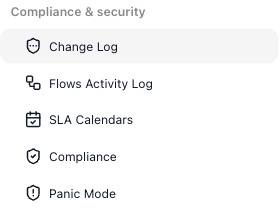
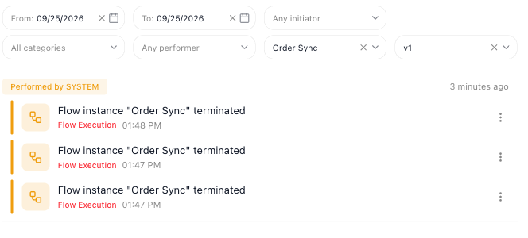

# Compliance & Security

A workspace that runs automations on a schedule, against deadlines, and on behalf of other people needs more than the editor. It needs a way to hold runs to a clock, a record of who changed what, the controls a regulated team has to satisfy, and an emergency lock for the workspace. FlowRunner™ groups those tools under ((Compliance & security)) in the workspace navigation. This page walks through the group and what each item does.

One related setting, SLA Goals, lives on each flow instead of in this group. It is covered below with SLA
Calendars because the two work together.

## SLA Calendars

A service-level agreement (SLA) is a promise about timing - this work will be done within so many hours. A
target of "four hours" usually means four working hours, so a deadline that starts late on a Friday lands on
Monday instead of over the weekend. An SLA calendar says which hours count.

A calendar has:

- **Time Zone** - a whole-hour offset from GMT, from GMT-12 to GMT+12, that anchors the calendar's hours. The
  list has no named zones, so the calendar does not follow daylight saving; change the offset when your clocks
  change.
- **Work Week** - the days that count, Monday to Friday by default, and the hours on each.
- **Excluded Dates** - named dates the calendar skips even when they fall on a working day, such as public
  holidays. ((+)) adds a row.

Pick a calendar in the selector at the top, or ((CREATE A NEW CALENDAR)) to start another. The icons beside
the selector save, clone, rename and delete the calendar you are viewing.

Each flow's **SLA Goals** tab, beside Instances in the flow's tab row, sets the target itself - how long a run
may take - and ties it to one of these calendars, so the time is measured in working hours.

!!! info "Business plan and higher"
    SLA Goals, and the SLA tracking they drive, are available on the Business plan and higher. On other plans
    the tab is greyed out. [SLA Goals](sla-goals.md) walks through composing a goal - its time targets, time
    tracking, and escalation rules.

## Change Log

When a flow that worked yesterday starts failing, the ((Change Log)) shows whether someone changed
something it depends on, who did it, and when. It records changes such as deploying, updating or deleting a
custom extension, and creating an API key. Not every change is recorded yet: creating, starting, stopping or
deleting a flow leaves no entry, and so does creating or saving an SLA calendar.

Entries are listed newest first under the name of the person who made them. Each one shows what happened, its
category, and the time; the coloured bar at its left marks the level, so a deletion stands out in red.

The ⋮ at the end of an entry opens it with the exact date and time, a sentence on what the change was, and
its level by name - **Critical Action** for a deletion (red), **Warning Action** for a deploy or a
configuration change (orange), **Info Action** for creating an API key:

The bar above the list narrows it. The filters combine, and each clears with the × inside it:

- ((From)) / ((To)) - a date range.
- ((Any initiator)) - **User** for changes a member of your team made, **System** for the rest: the
  platform's own actions, and changes the FlowRunner team makes on your workspace.
- ((All categories)) - one area: API Keys, Dynamic Forms, Flow Extensions, Flow Manage, Knowledge Base, MCP
  Servers, Workspace Billing or Workspace Manage.
- ((Any performer)) - one member of the team, or **Me**.

Your own account keeps a separate log: ((Activity Log)) in the account menu at the bottom of the left
navigation, with the same filters.

## Flows Activity Log

The ((Flows Activity Log)) lists what happened to your flows' runs across the whole workspace - a run that
was terminated, for example - in one filterable list. A flow's Instances tab shows what each run did; this
log is where you look across flows and versions at once. Its categories are **Flow Execution** and
**Realtime Triggers**, and its bar adds a flow picker, where you search by flow name or ID, and a version
picker beside it. The version picker stays greyed out, reading **All versions**, until you pick a flow. The
entries in the example read *Performed by SYSTEM*: the platform, not a person, terminated those runs.

An entry about one run, such as a terminated run, has an icon beside its title. Its tooltip reads **Open
flow instance**, and clicking it opens that run's page, where you can see where it stopped - see
[Inspecting a Run](../run/inspecting-a-run.md).

A grouped notification's ((View in Activity Log)) opens this log already narrowed to that flow and version -
see [Notifications](notifications.md#terminated-runs-of-one-flow-share-an-entry):

<!-- RELEASE SCOPE: FR-3674 (rename request) is in Jira release 'Without version/devtasks2'; the work shipped under FR-3675, whose
     Jira fixVersion is v.1.1.3 (Waiting for Release) - but its new strings are already in the app.flowrunner.ai bundle (deployed).
     DRIVEN 2026-10-06 on dev.flowrunner.ai ONLY (the same strings are in
     the app.flowrunner.ai bundle: "Change Log", "All versions", tooltip "Open flow instance"). Nav item and screen title now read
     Change Log (URL still /enterprise-security/activity-log); the account menu still says Activity Log (/account/activity-log);
     the notification button still says View in Activity Log. Flows Activity Log: filters in two rows; All versions disabled
     until a flow is picked; each "Flow instance ... terminated" title carries an icon (tooltip Open flow instance) that opens
     .../analytics/instances/<id> in the same tab. compliance-nav.png and workspace-nav.png recaptured on dev (Administration
     group, admin-only, cropped out). NOT DRIVEN: FR-3675's "System initiator disables the performer filter for a non-system
     user" (this account is a system user; the filter stayed enabled) - not claimed. flows-activity-log.png still shows the
     pre-icon entries (prod Order Sync); recapture on prod. PROD DRIVE OWED (one batched session): nav/title, account menu label,
     notification button, version picker, the icon and where it goes, filter layout, and System -> performer as a customer
     account. If the icon is not on prod, remove the icon paragraph until v.1.1.3 ships. -->
<!-- RELEASE v.1.1.2 (FR-3563, FR-3586, FR-3605, FR-3560), DRIVEN 2026-09-25 on PROD (app.flowrunner.ai),
     Documentation Flows. REPLACES the 2026-07-10 "Audit Log" section (table Date / Developer / Event / IP /
     Device with download and delete controls) - that screen no longer exists; the nav now reads Activity Log and
     Flows Activity Log (/enterprise-security/activity-log, /enterprise-security/flows-activity-log).
     DRIVEN: filter bar From / To / Any initiator (options User, System) / All categories (API Keys, Dynamic
     Forms, Flow Extensions, Flow Manage, Knowledge Base, MCP Servers, Workspace Billing, Workspace Manage) / Any
     performer (only "Me" here - single-member workspace). Picked From 09/20/2026 -> the field read "From:
     09/20/2026" with an ×; category API Keys + that date -> "No activity log events found."; × on each cleared
     it. Entry ⋮ -> dialog with performer, severity label ("Warning Action" for a config update, "Info Action" for
     an API key creation), exact timestamp, title, category, description.
     NOT ON THE PAGE, DELIBERATELY: the dialog's "Show event details" prints the event's stored JSON, and for API
     key creation and extension config updates that JSON holds the secret in clear text - filed as FR-3659
     (High, security) the same day. The page does not point readers at it until that is fixed; Mark to decide.
     Flows Activity Log: empty ("No flow activity yet.") until the throwaway Order Sync flow produced 3 terminated
     runs; filters add "Search by flow name or ID" and a version picker. Account Activity Log: account menu ->
     Activity Log (/account/activity-log), same filters, "No account activity yet." here - its content ("what
     happened to your account") is the developers' description, not seen.
     FR-3605 (developer -> account operation ids) and FR-3560 (audit-op plumbing) change nothing a reader sees.
     GATE FIX PASS, same day (concept-page-review wf_4ad8e333, major-rework; verdict file on disk):
     - Coverage DRIVEN: after creating 5 flows, deleting 3 and starting / stopping several on 2026-09-25, the log's
       newest entry was still 2026-09-22; Flow Manage and Workspace Manage both read "No activity log events
       found." Team invites / permission changes could not be tried (single-member workspace).
     - Levels DRIVEN: Deleted custom flow extension -> "Critical Action" (red bar); Deployed / Updated configs ->
       "Warning Action" (orange); Created a new API key -> "Info Action". activity-log-entry.png = the Open-Meteo
       deploy entry with Show event details COLLAPSED (no FR-3659 data in frame).
     - Flows Activity Log dropdowns: categories Flow Execution, Realtime Triggers; initiator User / System;
       performer Me; flow picker lists the workspace's flows.
     - System initiator gloss: the "FlowRunner team" half is SOURCE (FR-3560 developer answer: CRM/admin actions
       are system-attributed, shown "By Flowrunner team"); only automatic SYSTEM rows were seen.
     - Account log: content not seen (empty); page gives location + filters only.
     - DECISION FOR MARK (not on the page): whether to warn that entry details can include secrets (FR-3659).
     OPEN (older sections, unchanged): Panic Mode never driven and its text is Backendless-era (FR-2682 still open);
     SLA Calendars shot untouched default; HIPAA scope; plan gating of the logs; SLA/HIPAA/Panic shots from the
     Tests workspace.
     SECOND PASS, same day (Mark: apply the gate's fixes), DRIVEN on prod Documentation Flows (Growth plan):
     - SLA Calendars: created "Support Hours". Defaults: Time Zone GMT-7, Mon-Fri ticked, stored 09:00-18:00
       (PUT body periods from 32400 to 64800) BUT every field displays "12:00 AM"; the picker opens at 00:00;
       editing one end resets the other to 0 on save (start 08:00 -> 400 "Period 'From' should be less than
       'To'", no on-screen message; end 17:00 -> 200, stored 00:00-17:00). FILED FR-3661 (High). The per-day
       second-span control is gone. Time Zone = 25 whole-hour offsets GMT-12..GMT+12. Toolbar tooltips Save /
       Clone / Rename / Delete. Excluded Dates: date picker works; a row needs a Name ("This field should not be
       empty") or Save silently does nothing. sla-calendars.png (Tests workspace, 07-10) KEPT: it shows the
       intended 09:00 AM-06:00 PM hours and a now-removed per-day add icon; a fresh capture would show the
       FR-3661 bug. Recapture after the fix. The page no longer mentions a second span or sample hours.
     - SLA Goals tab on a flow (Growth): greyed, tooltip "Available on Business plan and higher" - backs the
       admonition. Calendar picker inside a goal NOT reachable on this plan.
     - Panic Mode plan note KEPT: FR-2682 (Open) states "Panic Mode should remain available only for Business
       and Enterprise plans" - but on this Growth workspace both buttons are ENABLED (not clicked); commented on
       FR-2682. HIPAA plan note REMOVED: no source (Jira search: FR-2233 / FR-2424 tie HIPAA only to audit-trail
       retention wording, not to the BAA screen); flowrunner.ai/pricing's FAQ
       lists audit trails (30-day Professional / 90-day Business / unlimited Enterprise), SLA tracking and
       compliance reporting (Business) but neither HIPAA nor Panic Mode; on this Growth workspace both Panic
       Mode buttons are enabled (DEACTIVATE too, while off). ACTIVATE HIPAA COMPLIANCE is disabled with the box
       unticked (box not ticked, nothing activated). The "Business Associate Agreement" link opens
       /api/public/security/compliance/files/hipaa/download as a PDF in a new tab.
     - Panic Mode screen text (the product's own, Backendless-era wording) quoted as the screen's list; the
       page's earlier gloss ("scheduled flows", "a switch to stop everything") dropped. Product text defects on
       screen: "your team's login credentials been compromised" (missing "have"); Compliance "prior to any PHI
       data is transferred to your app". compliance-hipaa.png and panic-mode.png recaptured here.
     - Activity Log / Flows Activity Log are usable on Growth; the pricing page's "audit trails" rows suggest
       retention differs by plan - not asserted on the page.
     - Activity Log after creating + saving the "Support Hours" calendar: newest entry still 2026-09-22 -> no entry.
     - 2026-09-29 MARK: "Executing BAA agreement, Panic Mode and RBAC are available in Business and above. All of
       these are required for HIPAA compliance." -> HIPAA plan note restored in that form; titles unified.
     OPEN: SLA Goals calendar picker (needs a Business workspace); Activity Log retention per plan; Panic Mode
     activation (never driven - locks the workspace); abbreviations (SLA/PHI/BAA) not added to the glossary. -->

## Compliance

!!! info "Business plan and higher"
    HIPAA compliance needs three things, all available on the Business plan and higher: an accepted Business
    Associate Agreement (below), [Panic Mode](#panic-mode), and role-based access control - the per-member
    [permissions](../manage/team.md#who-is-on-the-team-and-what-they-can-do) that limit what each person can
    see and change.

To handle protected health information (PHI) in your flows, the workspace needs a Business Associate
Agreement (BAA) in place first. ((Compliance)) is where you accept FlowRunner's electronic BAA: tick
((I accept the Business Associate Agreement)), then choose ((ACTIVATE HIPAA COMPLIANCE)). The agreement's name
is a link that opens the document, so you can read it first. Until the BAA is accepted, the workspace is not set
up to carry PHI.

## Panic Mode

!!! info "Business plan and higher"
    Panic Mode is available on the Business plan and higher.

((Panic Mode)) is for when you suspect or know your team's login credentials are compromised: one action locks
the workspace until the threat is over. The screen lists what activation does at once:

- all developer sessions with the FlowRunner Console are invalidated and terminated
- no one can reach the workspace through the Console
- all application users are logged out
- all API calls are rejected
- all Cloud Code timer executions stop

((ACTIVATE PANIC MODE)) turns it on and ((DEACTIVATE PANIC MODE)) lifts it.

<!-- verified in-product 2026-07-10 (Tests workspace, viewed only - no activation): SLA Calendars screen has Time Zone (GMT-6), Work Week (days + spans), Excluded Dates, and a Create a New Calendar button; SLA Goals is a per-flow tab (seen in the flow editor). [SUPERSEDED 2026-09-25 - the Audit Log was retired in v.1.1.2, see the release note above] Audit Log columns were Date / Developer / Event / IP Address / Device, capturing invite / remove / permission-change actions, with filter, date-range, search, and export/delete controls. Compliance shows the HIPAA Compliance card, the BAA-first requirement, the "I accept the Business Associate Agreement" checkbox, and Activate HIPAA Compliance. Panic Mode shows the credential-compromise framing, the five immediate effects (Console sessions terminated / Console access blocked / application users logged out / API calls rejected / Cloud Code timers stopped), and Activate + Deactivate buttons. Nothing was activated or accepted. Plan-gating per product owner (2026-07-10): SLA Goals & monitoring, HIPAA Compliance, and Panic Mode all require the Business or Enterprise plan. -->

## Related

- [SLA Goals](sla-goals.md) - the per-flow targets (Business or Enterprise plan) that measure a run against a deadline, using the SLA Calendars set up here
- [Notifications](notifications.md) - the grouped run messages whose View in Activity Log opens the Flows Activity Log
