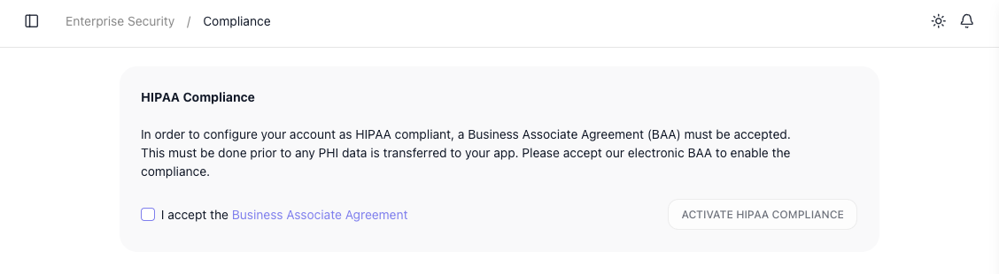

# Compliance & Security

A workspace that runs automations on a schedule, against deadlines, and on behalf of other people needs more than the editor. It needs a way to hold runs to a clock, a record of who changed what, the controls a regulated team has to satisfy, and a switch to stop everything at once. FlowRunner™ groups those tools under ((Compliance & security)) in the workspace navigation. This page walks through the group and what each item does.

The group holds four items: ((SLA Calendars)), ((Audit Log)), ((Compliance)), and ((Panic Mode)). A fifth, related setting - ((SLA Goals)) - lives on each flow rather than in this group, and is covered below alongside SLA Calendars because the two work together.

## SLA Calendars and SLA Goals

A service-level agreement (SLA) is a promise about timing - this work will be done within so many hours. To check a run against a promise like that, FlowRunner needs two things: a definition of *when the clock runs*, and the *target* it is measured against.

((SLA Calendars)) define the first part - the business-hours calendars a deadline is measured against. A target of "four hours" usually means four working hours, not four hours of wall-clock time that might span a weekend or a holiday. A calendar captures which hours and days count, so a deadline that starts late on a Friday lands at the right moment on Monday rather than over the weekend.

A calendar is built from three things. A ((Time Zone)) anchors it, so its hours mean the same moment wherever your team and customers sit. A ((Work Week)) sets which days count and the hours on each: you tick the working days - Monday to Friday by default, with Saturday and Sunday left off - and give each one a span such as 09:00 AM to 06:00 PM, adding a second span to a day whose hours are split. And ((Excluded Dates)) carve out the holidays - a named date the calendar skips even when it lands on a working day. You manage calendars from this screen: pick an existing one from the selector at the top, edit it inline, or choose ((CREATE A NEW CALENDAR)) to start another.

((SLA Goals)) define the second part - the service-level target itself. They live on the flow rather than in this navigation group, as a per-flow **SLA Goals** tab, and tie a target to one of your calendars so it is measured in working hours. The goal says how long is allowed; the calendar says which hours count toward it.

!!! info "Business or Enterprise plan"
    SLA Goals and monitoring are available only on the Business or Enterprise plan. [SLA Goals](sla-goals.md) walks through composing a goal - its time targets, time tracking, and escalation rules.

## Audit Log

The ((Audit Log)) is a record of who did what in the workspace - the trail of actions people took, so that a change can be traced back to a person and a time. Where the Instances view tells you how a flow *ran*, the audit log tells you how the workspace was *changed* and by whom.

Each entry is one logged action laid out across a row: the date and time, the developer who took it, the event itself and what it affected, and the IP address and device the action came from - so a change ties back not just to a person but to where they did it. The actions it captures center on access and membership: inviting a new developer, removing one, and changing a developer's permissions are all recorded here, each as its own entry. You work the log from the controls across the top: a filter and a date-range filter to narrow it, a search box to find a specific entry, and controls to export the records or clear them. Any row expands for its full detail.

## Compliance

!!! info "Business or Enterprise plan"
    HIPAA compliance is available only on the Business or Enterprise plan.

((Compliance)) is where a regulated workspace turns on HIPAA compliance. Handling PHI - protected health information - in your automations requires a Business Associate Agreement (BAA) to be in place first, and this screen is where you put one in place: it lays out that requirement and lets you accept FlowRunner's electronic BAA directly, by ticking ((I accept the Business Associate Agreement)) and choosing ((ACTIVATE HIPAA COMPLIANCE)). Until that agreement is accepted, the workspace is not configured to carry PHI.

## Panic Mode

!!! info "Business or Enterprise plan"
    Panic Mode is available only on the Business or Enterprise plan.

((Panic Mode)) is an emergency control for the case the screen names directly: you suspect or know your team's login credentials have been compromised, and you need the workspace locked down until the threat is over rather than disabling pieces one at a time. Activating it takes effect immediately and does several things at once:

- every developer session in the FlowRunner Console is invalidated and terminated;
- no one can reach the workspace through the Console;
- all application users are logged out;
- all API calls are rejected;
- all Cloud Code timer executions stop.

You turn it on with ((ACTIVATE PANIC MODE)) and lift it again later with ((DEACTIVATE PANIC MODE)). Because one action cuts off Console access, API traffic, and scheduled flows together, it is the switch you reach for under pressure - which is why it sits apart from everyday controls.

<!-- verified in-product 2026-07-10 (Tests workspace, viewed only - no activation): SLA Calendars screen has Time Zone (GMT-6), Work Week (days + spans), Excluded Dates, and a Create a New Calendar button; SLA Goals is a per-flow tab (seen in the flow editor). Audit Log columns are Date / Developer / Event / IP Address / Device, capturing invite / remove / permission-change actions, with filter, date-range, search, and export/delete controls. Compliance shows the HIPAA Compliance card, the BAA-first requirement, the "I accept the Business Associate Agreement" checkbox, and Activate HIPAA Compliance. Panic Mode shows the credential-compromise framing, the five immediate effects (Console sessions terminated / Console access blocked / application users logged out / API calls rejected / Cloud Code timers stopped), and Activate + Deactivate buttons. Nothing was activated or accepted. Plan-gating per product owner (2026-07-10): SLA Goals & monitoring, HIPAA Compliance, and Panic Mode all require the Business or Enterprise plan. -->

## Related

- [SLA Goals](sla-goals.md) - the per-flow targets (Business or Enterprise plan) that measure a run against a deadline, using the SLA Calendars set up here
- [Flow Scheduling](../reference/flow-scheduling-concept.md) - running flows on a schedule, the kind of timed activity an SLA measures against a deadline
