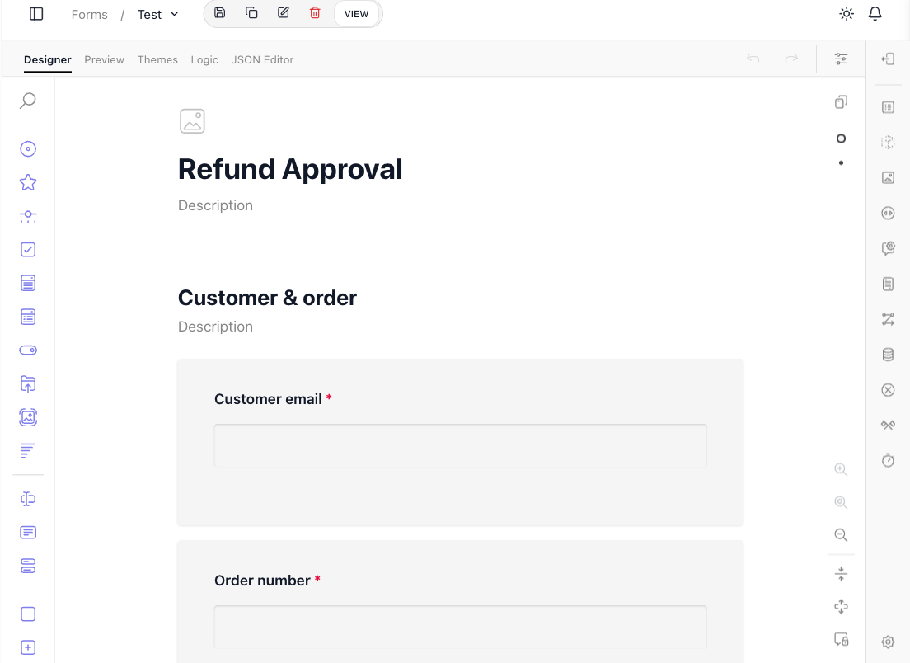
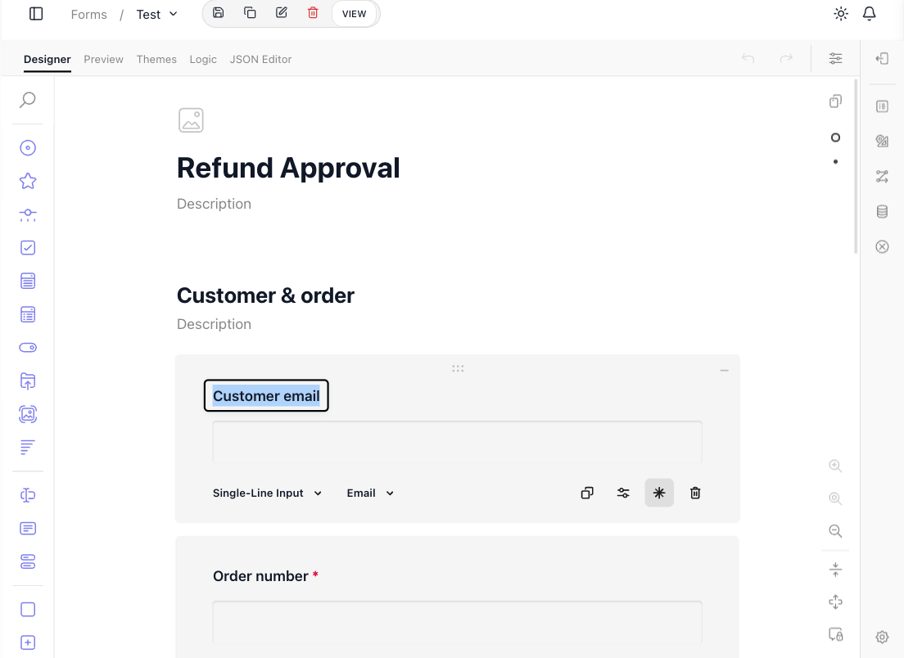
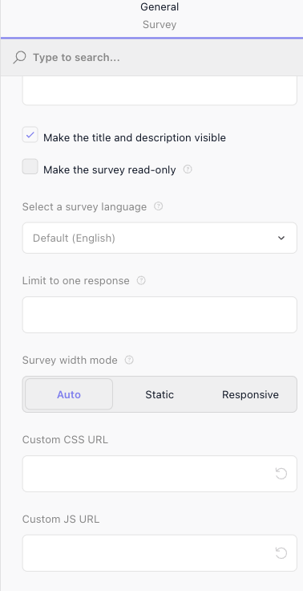
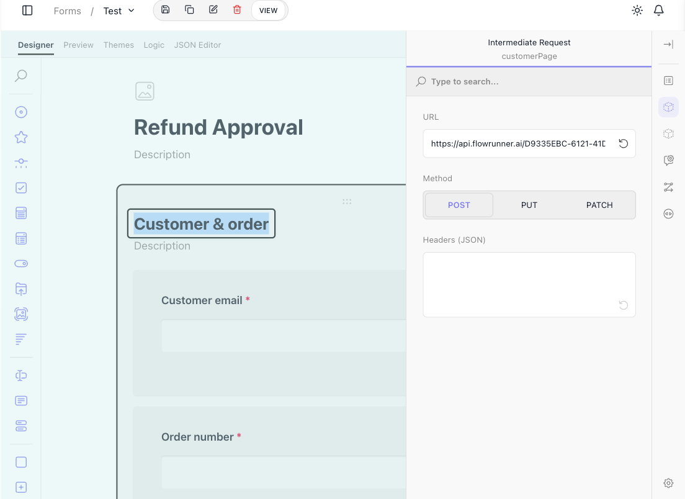
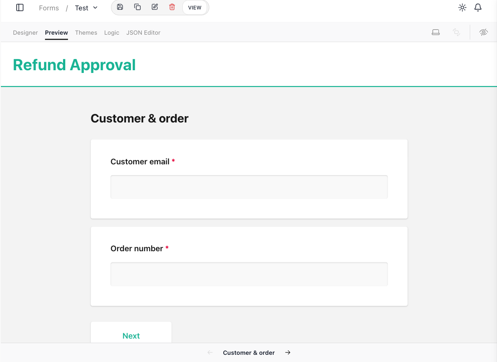

# Forms

Some of what a flow needs cannot be computed - it has to come from a person. Who approves this refund. What the customer is actually asking for. Which of three options a manager wants taken. FlowRunner™ Forms is the built-in way to gather that human input as structured data: you design a form in a visual builder, connect its pages to your flows, and publish it as a page people fill in - no separate web app to build, no outside survey tool to wire in. The answers come back in a known shape, and a flow can act on them at each step along the way and again at the end.

## What a form is for

A form collects answers to questions you decide in advance, and hands them back in a shape a flow can use. That makes it the bridge between people and automation, in the cases where the two have to meet:

- **Approvals** - a flow pauses for a human decision (approve or reject, with a reason) before it continues.
- **Intake** - a request, a support ticket, an onboarding detail - captured as fields rather than free-text email, so the flow downstream knows exactly what it is looking at.
- **Surveys and feedback** - structured responses gathered from many people, fed into the same automation that stores, scores, or routes them.

The common thread is *structured* input. Because you defined the questions, every response comes back in a known layout - a named field for each answer - which is what lets a flow branch on it, store it, or pass it on without guessing.

## Designing a form

You build a form in FlowRunner's visual form builder. You reach it from ((Forms)) in the workspace navigation, where each form you create is listed; opening one drops you into the builder on its ((Designer)) tab. You lay the form out by adding questions from the toolbox down the left and arranging them on the canvas - the form takes shape in front of you, close to how a respondent will see it.

Every question is configured in place. Select one and you set what kind of answer it takes and how it behaves - here the "Customer email" question is a ((Single-Line Input)) with its input type set to ((Email)) and marked required, alongside controls to duplicate or delete it.

The toolbox covers a wide range of question types, so most of what a form needs to ask is built in:

- **Text** - Single-Line Input, Long Text, and Multiple Textboxes for free-form answers.
- **Choice** - Radio Button Group, Checkboxes, Dropdown, Multi-Select Dropdown, a Yes/No (Boolean) toggle, Image Picker, and Ranking for picking from options.
- **Scales** - Rating and Slider for graded answers.
- **Files** - File Upload for attachments.
- **Grids and groups** - matrix questions for tabular input, and panels for grouping related questions together.

Longer forms are split into **pages** the respondent moves through in turn, and the tabs across the top of the builder carry the rest of the craft: ((Preview)) tries the form the way a respondent would, ((Themes)) restyles it, ((Logic)) adds conditional behavior - show a question only when an earlier answer calls for it - and ((JSON Editor)) exposes the form's underlying definition.

Selecting the whole form, instead of a single question, opens its **General** settings, which govern the form as a whole. Among them, ((Custom CSS URL)) and ((Custom JS URL)) point the form at your own stylesheet and script, to tailor its look and behavior beyond the built-in themes.

## Connecting a form to your flows

A form on its own just collects answers. What makes it part of FlowRunner is a two-way link: its pages drive your flows, and a flow can drive what the form does next in return - which is where a form stops being a survey and becomes a step in your automation.

Each page can carry an **Intermediate Request**: as the respondent finishes that page, the answers gathered so far are sent to a flow, and the form waits for the flow's reply before it moves on. You set it on the page - a ((URL)) that points at the flow through the [Call Flow](../reference/call-flow.md){.fr-block} API, the ((Method)) to send it with, and any ((Headers)) the call needs.

Because the form waits, the flow can shape what comes next. A page that collects an account number can hand it to a flow that looks the customer up, and the flow's reply can decide which page the respondent sees next, or fill it in for them before they get there. An Intermediate Request always blocks for exactly this reason: the flow it calls gets to alter the navigation that follows.

The flow steers the form through what its [Return Result](../reference/return-result.md){.fr-block} hands back. Two properties are read specially:

- `moveToPageName` - the name of a page. Return it and the form takes the respondent straight to that page next, instead of the one that would come in order.
- `extendNextPageData` - an object. Its properties are made available on the next page the respondent sees, ready to prefill or inform it.

Hand back neither and the form carries on to the next page in sequence.

The final submission is wired the same way, separately. **Form Submission Settings** points the completed form - every answer, from every page - at a flow to finish the job: storing the record, routing the request, or starting whatever the form was gathering input for.

## Previewing and sharing the form

The ((Preview)) tab shows the form exactly as a respondent will meet it - themed, paged, and interactive - so you can walk it end to end inside the console before anyone else does.

Every form also has its own dedicated URL, and that URL is how the form is used outside the FlowRunner console. The ((VIEW)) button in the builder's toolbar opens the form at that URL:

That dedicated URL is what you hand to respondents. They open it and fill the form in directly, with no FlowRunner sign-in of their own. As they move through it, their answers travel to the flows you wired its pages to, and the final submission to the flow that closes the loop.

<!-- verified in-product 2026-07-10 (Tests workspace, "TestForm" in the Forms builder, viewed only): builder tabs Designer / Preview / Themes / Logic / JSON Editor all present; the toolbox carries the full question-type range (Single-Line Input, Long Text, Multiple Textboxes, Radio Button Group, Checkboxes, Dropdown, Multi-Select, Yes/No, Image Picker, Ranking, Rating, Slider, File Upload, Matrix, Panel, and more); the form's General settings include Custom CSS URL + Custom JS URL; a selected page carries an Intermediate Request (URL/Method/Headers); Form Submission Settings sends the completed form to a flow (URL/Method/Headers); the form's View link is a public URL (/api/public/app/<appId>/form/<formId>, opened in a new tab with no FlowRunner sign-in). Screenshots depict a purpose-built "Refund Approval" form - same builder UI, different example, no recapture needed. NOT verified in the builder this pass (runtime navigation contract, prose-only): the moveToPageName / extendNextPageData properties the form reads from a flow's Return Result - documented behavior, product-owner-sourced. -->

## Related

- [Call Flow](../reference/call-flow.md){.fr-block} - the flow endpoint a form's pages and final submission send their answers to
- [Flows and Instances](../learn/concepts/flows-and-instances.md) - the flow and run a form's answers feed into
