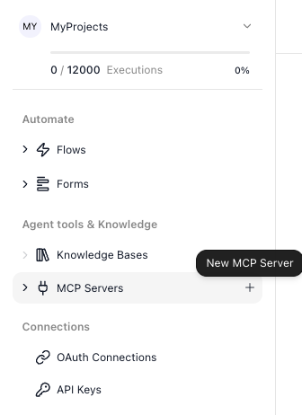
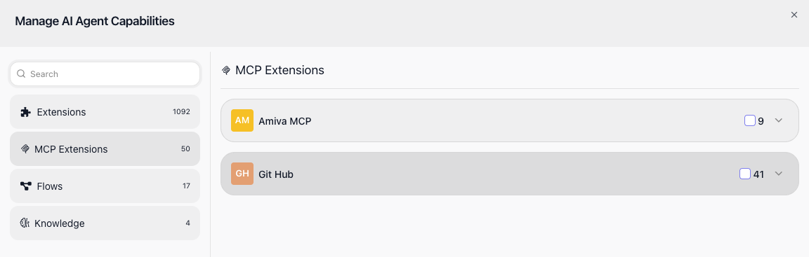
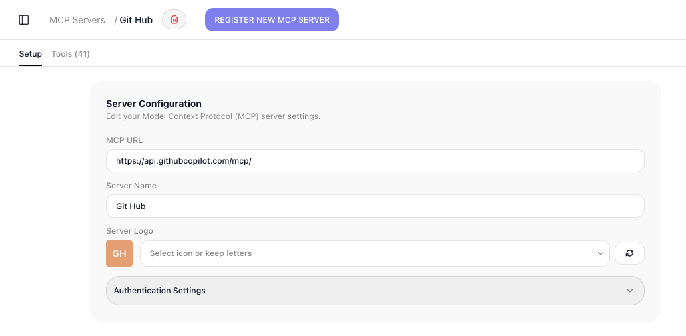

# MCP Servers

An MCP server is an outside service that publishes a set of tools - a weather lookup, a database query, a search over some system - through the Model Context Protocol, an open standard for handing tools to AI. Register one in FlowRunner™, and its tools become usable in exactly two ways. You can place a tool in a flow as a [standalone action](#using-a-tool-as-a-flow-action), or hand it to an [AI Agent](../reference/ai-agent.md) as a tool the agent calls on its own while it works. One registration brings a whole catalog of outside capability into your workspace, without you building or hosting any of it.

## Registering a server

You manage servers from the workspace, under **Agent tools & Knowledge ▸ ((MCP Servers))**. To register one, hover the ((MCP Servers)) menu item and click the ((+)) that appears.

The ((+)) opens the ((Register MCP Server)) form:

Fill it in:

- ((MCP URL)) - the publicly reachable address of the server. FlowRunner calls this to read the tool catalog, so it has to be open to the internet, not a private address.
- ((Server Name)) - a label for the server in the FlowRunner UI. It is how the server appears in the block list and to your agents, so name it for what it does.
- ((Server Logo)) - auto-generated initials, a preset icon, or a background color, so you can tell servers apart at a glance.
- ((Authentication Settings)) (optional) - if the server is protected, supply what it expects: token authentication (a ((Custom Header Name)), which defaults to `Authorization`, plus the ((Token))), or ((OAuth 2.0)) credentials (a ((Client ID)) and ((Client Secret))).

When you register an MCP server, FlowRunner reaches out, confirms it can talk to it, and reads in the tool catalog. If that fails, it is almost always one of three things: the URL is not reachable from the public internet, the credentials are wrong, or the server does not actually speak MCP.

## Using a tool as a flow action

A registered server's tools appear in the editor's block list under ((MCP Extensions)), grouped by the server they came from.

Drag one onto the canvas like any other action, fill in its inputs, and read its result in the steps that follow. The inputs use the same Expression Editor as every other block, and the result reads downstream like any other result - if a tool runs under the alias `Get Issue Result`, a later block reads {{Get Issue Result->title}}.

## Using a tool with an AI Agent

The same tools are available to an [AI Agent](../reference/ai-agent.md). In the agent's ((Manage Capabilities)) window, the ((MCP Extensions)) group lists your servers:

Attach a whole server or pick individual tools,[^capacity] and from then on the agent decides for itself when a tool fits the task and calls it. With an agent, you do not fill in a tool's inputs or read its result yourself - the agent supplies the inputs as it works and uses whatever comes back.

[^capacity]: Attach only the tools an agent actually needs. Every capability you give an agent is described to the model on every run, so a long list makes each call's prompt larger and gives the model more options to weigh - which tends to slow it down, cost more, and make it likelier to reach for the wrong tool. A focused set of tools is faster, cheaper, and more accurate than a sprawling one. A single server can publish dozens of tools, so attach the few that fit the agent's job rather than the whole server.

## Managing a registered server

Open a server to manage it on its own screen:

Its ((Setup)) tab holds the same configuration you registered it with, so you can change the URL, name, logo, or authentication there. Its ((Tools)) tab lists every tool the server exposes, which is how you confirm a server is connected and see what it offers. To drop a server you no longer need, remove it with the trash icon by its name.

Removing a server takes its tools out of the block list and out of every agent's reach at once. Any flow that still calls one of those tools will fail when it runs, so before you remove a server, make sure nothing depends on it - or update those flows first.

## Related

- [AI Agent](../reference/ai-agent.md) - attaching MCP tools to an agent through Manage Capabilities
- [OAuth Connections](oauth-connections.md) - other ways FlowRunner reaches outside services
- [Error Handling](../reference/error-handling-concept.md) - catching a tool call that fails so the run does not stop
