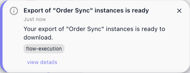
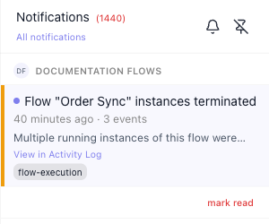

# Notifications

Once a flow is LIVE, its runs happen without you watching, so **FlowRunner™** tells you when something
happened that you would want to know about - a run that terminated, a payment that failed, a limit you are
close to. Those messages collect in the notification panel, and this page is about reading them and keeping
the list under control.

## Opening the panel

The bell in the top-right of the console opens the panel down the right-hand side. The badge on the bell
shows how many messages are waiting, so you can tell at a glance whether anything arrived without opening
anything; the panel's title repeats the full count.

Clicking anywhere outside the panel closes it again. The second icon in its header pins it open instead, so
it survives moving between screens - useful while you are watching a flow you started a moment ago, and the
reason the panel is sometimes already open when you arrive.

## What a notification tells you

Each entry shows:

- **The title** - what happened; for a run, the flow it happened to, so a glance down the column is enough
  to spot the one that matters.
- **When it arrived** - a time, or how long ago.
- **A line of detail** under that.
- **A source chip** - the part of the platform the message came from, such as `flow-execution`.

A dot at the start of a row marks it as one you have not read yet; opening an entry does not clear it. Click
an entry to open it in full: the pop-up adds a level - **Warning** for a terminated run, **Info** for an export that is ready - and the reason behind
it, which for a terminated run is the block that failed and its error. ((Open flow instance)) goes to the run
itself, and ((Show details)) lists the message's raw data: the flow, its version, the run's id and the
reason.

## Terminated runs of one flow share an entry

A flow whose runs keep terminating shows up once, with a count, instead of filling the panel. Runs of the
same flow that terminate within the same hour share one entry: it reads *Flow "Order Sync" instances
terminated*, its time line gives the span and the number of runs ("Today at 1:47 pm–1:48 pm · 3 events"),
and the arrows in its pop-up step through the runs one by one (*1 / 3*). The same happens when you stop a
flow while several of its runs are still going. A different flow, or the next hour, starts a new entry.
Only terminated runs are grouped; every other kind of message arrives as its own entry.

Runs you launched yourself that terminate do not also pop up in the corner of the screen; they wait in the
panel.

((View in Activity Log)) on a grouped entry opens the
[Flows Activity Log](compliance-and-security.md#flows-activity-log), filtered to that flow and version from
the start of that hour to the latest run, with one row per run:

## Workspace and account messages

The panel belongs to you, so it lists messages from every workspace you belong to, each under that
workspace's heading - like the DOCUMENTATION FLOWS heading in the panel above. Messages about something you
asked for yourself, such as an [instance export](../run/inspecting-a-run.md#taking-the-list-away-as-csv) being
ready, sit under **YOUR ACCOUNT** at the top:

A message like this also pops up in the corner of the screen as it arrives, and stays until you close it with
its ×. Its **view details** link opens the same pop-up an entry in the panel does:

The entry carries no download link; the link to the file goes to the address on your account.

## Keeping the list short

Use these to keep the list short:

- The link under the panel title switches which messages are listed. It reads ((Unread only)) while you are
  seeing everything, and ((All notifications)) once you have narrowed it - each time, the label names the
  view you would move to.
- ((mark read)) under a workspace's messages clears that workspace's unread messages out of the list in one
  go.

<!-- RELEASE v.1.1.2 (FR-3568, FR-3415, FR-3560), DRIVEN 2026-09-25 on PROD (app.flowrunner.ai), Documentation Flows:
     built the throwaway flow "Order Sync" (Start -> HTTP Request "Fetch orders" GET
     https://orders.example.invalid/api/orders), started it, launched 3 LIVE runs from the Launch Flow Instance
     dialog at 13:47-13:48 (all TERMINATED), stopped it again. The panel then held ONE entry for them:
     'Flow "Order Sync" instances terminated' / 'Today at 1:47 pm–1:48 pm · 3 events' / 'Multiple running
     instances of this flow were terminated.' / View in Activity Log / flow-execution. Clicking it opened a
     pop-up with "Workspace: Documentation Flows", Warning, the reason text, Open flow instance (href to that
     run's instance page), Show details, and paging "1 / 3" -> "2 / 3". View in Activity Log opened
     /enterprise-security/flows-activity-log?dateFrom=…&dateTo=…&flowId=…&version=1 with the Flow filter on
     Order Sync / v1 and the date inputs on that day, listing three 'Flow instance "Order Sync" terminated'
     rows, "Performed by SYSTEM".
     NO TOAST appeared for any of the three runs (checked for 8 s after each launch). The developer says a
     grouping type toasts only its first occurrence and never toasts your own action; the first run here was
     launched by me, so the missing toast fits "your own action" - not asserted on the page.
     Shots: notifications-panel.png is cropped to the panel's header + the Documentation Flows group only (the
     account belongs to other workspaces whose groups sit below; nothing of theirs is in frame).
     notifications-mark-read.png (three ungrouped TD Sandbox entries) is retired - under grouping it no longer
     depicts the product; Mark read is in the new panel shot.
     GATE FIX PASS, same day (concept-page-review wf_6a87808a, major-rework; verdict file on disk):
     - Show details on the Order Sync pop-up DRIVEN: it prints flowId, flowName, version, executionId, reason,
       workspaceId, workspaceName - nothing secret for this event (unlike the Activity Log's details, FR-3659).
       Account-scope messages (codes, reset links) not seen here, so not checked.
     - Severity: the pop-up labels a terminated run "Warning" (the old 08-31 note saying severity is not
       observable is superseded).
     - Read state: the Order Sync entry opened at ~13:51 and paged to 2/3 was still unread at 14:27 - opening
       does not mark it read.
     - Badge: the console header's bell shows a red "99+" badge in every capture; the panel title shows "(1440)".
     - View in Activity Log URL: dateFrom 20:00:00Z (the top of the hour, UTC) to dateTo 20:48:02Z (the latest
       run); flowId + version=1. The date inputs display only the day.
     - SOURCE ONLY (FR-3568 developer note, 2026-09-17), not driven: the hour bucket is the UTC clock hour; a
       different flow or the next hour starts a new entry; a stop that terminates several running instances
       groups the same way; no toast for your own action (consistent with the three silent launches); one email
       per group per hour.
     Times vary with age: the grouped entry read "Today at 1:47 pm–1:48 pm · 3 events" four minutes after the
     burst and "40 minutes ago · 3 events" at 14:27; entries from other days read "September 23, 3:30 pm".
     Bullet worded to cover both. Clicking "Unread only" switched the link to "All notifications" (captured as
     notifications-unread-only.png) and back.
     SOURCE ONLY, NOT ON THE PAGE: FR-3415 makes account events (workspace invitation, export ready/failed,
     password reset, login code, email confirmation) arrive in-app too, with codes and links only in the email,
     and a new unified email design; FR-3568 sends one email per group per hour. None could be triggered here
     without real emails. FR-3560 is audit-row plumbing (WS_DEVELOPER_INVITED row "Invited "<name>" to the
     team") with no notification.
     SECOND PASS, same day (Mark: apply the gate's fixes), DRIVEN on prod Documentation Flows:
     - Export instances to CSV on Order Sync's Instances tab -> a POP-UP in the top-right corner "Export of
       "Order Sync" instances is ready / Just now / Your export of "Order Sync" instances is ready to download /
       flow-execution / view details" that stayed until closed with its x; "view details" opened the detail
       pop-up (Info, "3 minutes ago", flow-execution, CLOSE only - no download link). The panel lists it under
       a YOUR ACCOUNT heading (MA avatar) at the top, above the workspace headings, with its own mark read.
       So a message you caused yourself CAN pop up: the earlier "no toast for your own action" is now scoped
       to terminated runs you launched (three silent launches, driven). The source chip for the export is
       flow-execution too, so the chip does NOT separate run messages from account messages - that claim
       was cut. The emailed link (FR-3415 / inspecting-a-run.md) was not checked.
     - notifications-your-account.png cropped to the panel top ending above the next workspace heading (a
       customer workspace - out of frame deliberately); notifications-popup.png from the pop-up.
     NOT DRIVEN (kept as SOURCE): the stop case, the hour boundary, a second flow in the same hour, N+ paging. -->

## Related

- [Inspecting a Single Run](../run/inspecting-a-run.md) - opening the run behind a flow-execution message
- [Compliance & Security](compliance-and-security.md#flows-activity-log) - the Flows Activity Log that View in Activity Log opens
- [Billing](../manage/billing.md) - the execution-limit warnings that arrive here

<!-- FR-2561 (Notification Service) DRIVEN 2026-08-31, Documentation Flows on dev.flowrunner.ai, using 23
     real notifications - 11 "Flow \"TD Sandbox\" Terminated" generated by that day's own API drives, plus a
     second workspace's group.
     EXERCISED, not just viewed: the header bell opens/closes the panel; click-outside closes it; ESCAPE
     DOES NOT (tried, panel stayed). The panel is PINNABLE - a pin control in its header keeps it open
     across navigations and a full page reload, which is why it can be open on arrival; unpinning it
     restored normal behaviour. The filter link was toggled both ways: showing everything it reads
     "Unread only" with 23 entries listed; clicking it listed 11 and the label became "All notifications"
     - so the label names the view you switch TO. "Mark read" was clicked once: the header count went
     23 -> 12 (-11, exactly the Documentation Flows unread count) and that whole workspace group left the
     list, so the control acts on a WORKSPACE GROUP, not a single entry.
     GROUPING: entries are grouped under a workspace heading (DOCUMENTATION FLOWS, and a second workspace).
     This is grouping, not leakage - an earlier reading of mine that called it leakage was wrong.
     SOURCE TAG: only `flow-execution` was observable; the ticket's other tags (billing, security, system,
     account) were not produced, so the page names flow-execution as an example and does not list a set.
     NOT ASSERTED, DELIBERATELY: (1) the exact meaning of the header count - after Mark read it equalled
     the number of listed entries, which does not fit a plain "unread" or a plain "total" reading, and the
     data was already mutated by then, so the page says only "how many messages are waiting" and does not
     define it; (2) "Dismiss All" - the ticket specifies one, but NO such control exists in the panel, only
     the per-group Mark read (REPORTED TO MARK); (3) severity levels, retention, real-time push and email
     delivery, all specified in FR-2561 but none observable from the console.
     SHOT: panel captured at 300x1050, cropped to the viewport so only the authorized Documentation Flows
     group is in frame - the second workspace's group starts at y=1190, below the fold. Read back before
     use. All 23 entries are the same terminated-run message because TD Sandbox's Get Order block fails, so
     the shot shows no variety of source tags; flagged to Mark. -->
