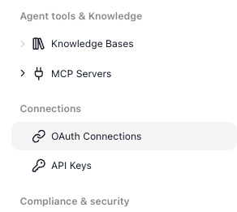
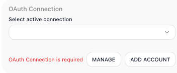
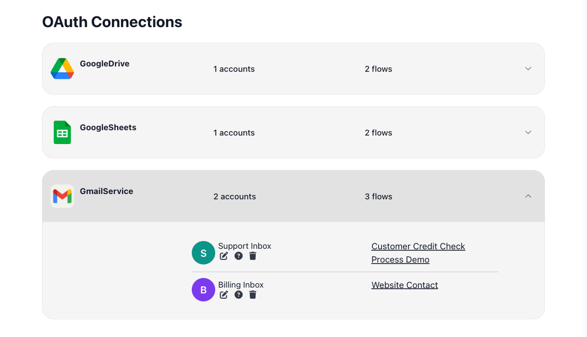
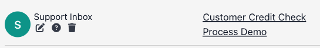

# OAuth Connections

Before a flow can read your Google Sheet, send mail from your Gmail account, or post an invoice to Xero, you have to sign in to that service and grant FlowRunner™ permission to act for you.[^oauth] That one-time sign-in produces an *OAuth connection* - a stored authorization tied to a single account on a single service. ((OAuth Connections)) is the screen where every connection your workspace has built up lives, so you can see which accounts are authorized, trace which flows depend on each one, and remove any you no longer want FlowRunner to use.

## Where connections come from

You do not add a connection on this screen - you authorize one from inside a flow. Every block that talks to an OAuth service, such as a Gmail, Google Sheets, or Xero action, carries an ((OAuth Connection)) field where you choose which authorized account the block should act as:

Until you pick one, the block reports `OAuth Connection is required`. Click ((ADD ACCOUNT)) to authorize: FlowRunner sends you to the service to sign in and approve the access the block needs, then saves the result as a connection - which is exactly what lands on this screen. From there you rarely set it again. Within the same flow, every other trigger and action block from that same extension - its other Gmail blocks, say - picks up the connection automatically. And in every other flow in the workspace, that saved connection is there to choose in the ((OAuth Connection)) field whenever you use the same service - no signing in again either way. ((MANAGE)) beside the field jumps straight here.

## Seeing what is connected

Connections are grouped by service, and each service shows how many accounts you have authorized and how many flows draw on them:

Expand a service to see its authorized accounts, and under each account, the flows it serves. A single service can hold more than one account - here two Gmail accounts, each drawn on by different flows. Click a flow's name to open it. A service can also read `0 flows`, meaning the account is authorized but nothing currently uses it - a safe candidate to remove.

## Managing a connection

Every authorized account carries three controls:

- ((Rename Connection)) - give the connection a label that is clearer than the raw account name. The new name is only how it reads on this screen; the authorization behind it is untouched.
- ((Connection Info)) - show any details a flow has saved for the connection. These are optional, so unless something stored them, it reports that none were provided.
- ((Delete)) - delete the connection, dropping the stored authorization so no block can use that account any more.

Deleting a connection cannot be undone, and any flow that relied on it will fail the next time it runs, until you authorize a replacement account in those flows. The accounts and flows on this screen tell you precisely what depends on a connection, so check them before you delete one.

<!-- verified in-product 2026-07-10 (Tests workspace, OAuth Connections screen): connections are grouped by service (MailchimpMarketing / Slack / CloseCRMService), each showing account and flow counts; expanding a service shows its authorized account (mark@flowrunner.ai) with the flow that uses it (CloseCRM) and three per-account controls - a pencil (Rename Connection), a "?" (Connection Info), and a trash (Delete). Structure matches the page; existing screenshots (a GmailService example) depict the same layout. The block-side OAuth Connection field (Select active connection / ADD ACCOUNT / MANAGE) is from the original capture. -->

## Related

- [API Keys](api-keys.md) - the workspace's other credential store, for the keys that AI blocks and outside services use
- [MCP Servers](mcp-servers.md) - registering tool servers, the other kind of outside service a flow reaches
- [Compliance & Security](compliance-and-security.md) - the activity logs, panic mode, and the rest of the workspace's access controls

[^oauth]: This applies only to services that support OAuth - the standard where you sign in and grant access rather than hand over a secret. A service that authenticates another way, with an API key or token, is connected differently: you supply that credential on the block that uses it rather than authorizing an account here.
