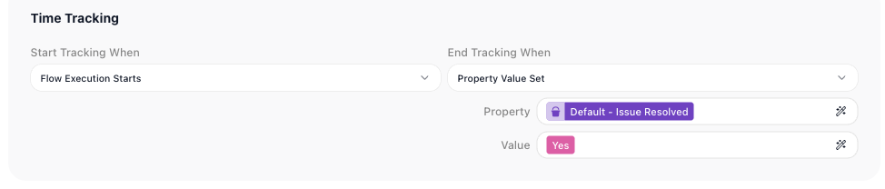
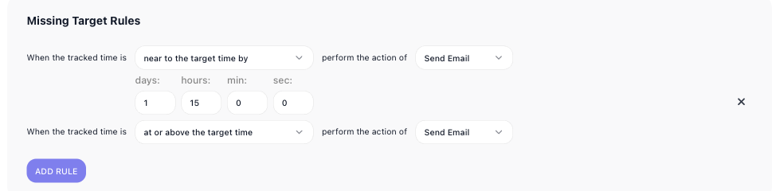

# SLA Goals

An SLA goal is how FlowRunner™ holds a flow run to a deadline - resolve this support issue within two working days, say - and escalates when a run is about to miss it. It is a per-flow setting, on the flow's SLA Goals tab, and is available on the Business or Enterprise plan.

An SLA goal works with an SLA Calendar. The goal sets the target - how long a run is allowed - and the [SLA Calendar](compliance-and-security.md) it points at defines which hours count toward it, so "two working days" is measured in business hours, not wall-clock time that might span a weekend.

A flow can hold several goals; each has a name, an on/off switch, and three parts.

## The target

Pick a goal from ((Selected Goal)), name it under ((Goal Name)), and switch it on with ((Enabled)). A goal's first part is its ((Time Targets)) - the deadline. You give a ((Target)) - a span in days, hours, minutes, and seconds - and pick the ((Calendar)) it is measured against, so the target counts only working hours.

A target can depend on a value in the run. Point ((Property)) at a flow property and give a ((Value)); the target then applies to runs where that property holds that value. Add a target per value - a tight deadline for urgent cases, a looser one otherwise - and let ((All Other Values)) catch the rest. In the screenshot, a single target of two days covers "All Other Values" of the Issue Resolved property.

## When the clock runs

((Time Tracking)) sets when the goal's clock starts and stops. ((Start Tracking When)) chooses what starts it - here, Flow Execution Starts - and ((End Tracking When)) what stops it - here ((Property Value Set)), when the flow sets the Issue Resolved property to Yes. The working time between the two is what the target is checked against.

## Escalating a late run

((Missing Target Rules)) decide what happens as a run approaches or passes its target. Each rule fires an action - such as Send Email - on a condition: when the tracked time is ((near to the target time by)) a span you set, or ((at or above the target time)). The goal in the screenshot sends an email 1 day 15 hours before the target, and another once the target is reached. Add as many rules as you need.

<!-- verified in-product 2026-07-10 (Calibrate workspace, Business plan, "Test Flow" -> SLA Goals tab): a goal "Support Issue Resolved" (Enabled) with Time Targets (Property = Default/Issue Resolved, Value = All Other Values, Calendar = DefaultCalendar, Target = 2 days), Time Tracking (Start = Flow Execution Starts, End = Property Value Set -> Issue Resolved = Yes), and two Missing Target Rules (near the target by 1d 15h -> Send Email; at or above -> Send Email). Selected Goal picker + Create/Clone/Delete + Add Target/Add Rule present. SLA Goals is available on the Business or Enterprise plan (per product owner); verified here on a Business-plan workspace. -->

## Related

- [Compliance & Security](compliance-and-security.md) - where SLA Calendars, the working-hours calendars a goal measures against, are set up
- [Flow Scheduling](../reference/flow-scheduling-concept.md) - running flows on a schedule, the kind of timed activity a goal measures against a deadline
