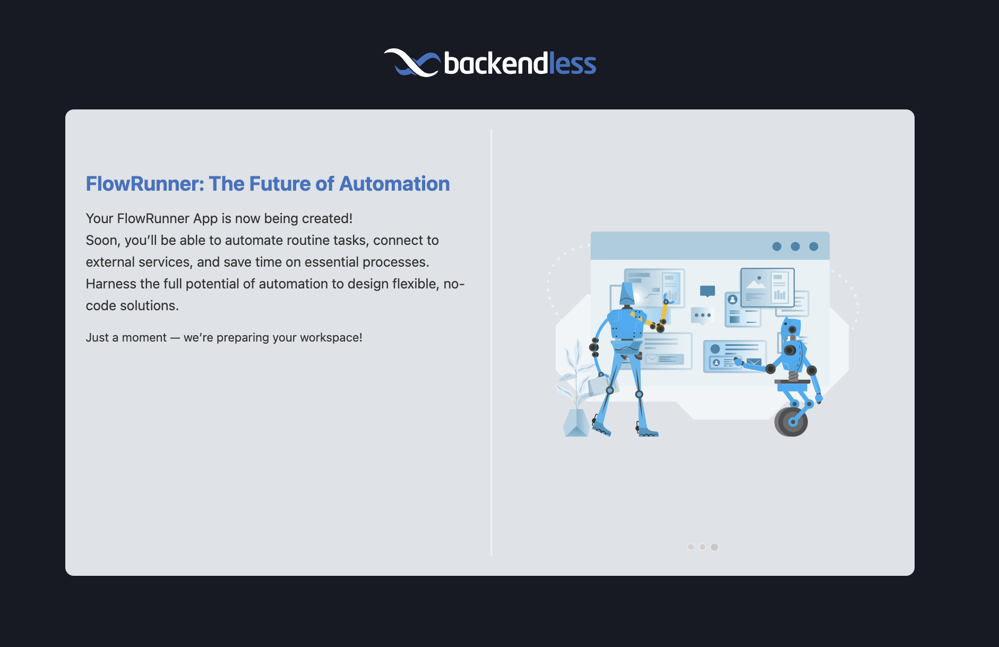

# **Quick Start Guide**  

FlowRunner™ is a powerful tool for automating workflows, and getting started is a straightforward process. Whether you’re new to Backendless or already have experience with its platform, this guide will help you set up your workspace and begin exploring FlowRunner™.  

## **:one: Access the Backendless Console**  

To begin, navigate to the [Backendless Console](https://develop.backendless.com/c/flow-runner). This is your central hub for managing applications and accessing FlowRunner™.  

!!! note "Backendless Console in Different Geographies"  
    Backendless is available in multiple hosting zones. To access FlowRunner™ in a specific hosting zone, use the following URLs:  
      
    :flag_us:: [https://develop.backendless.com/c/flow-runner](https://develop.backendless.com/c/flow-runner)  
    :flag_eu:: [https://eu-develop.backendless.com/c/flow-runner](https://eu-develop.backendless.com/c/flow-runner)  

## **:two: Log In or Create an Account**  

You can log in using your Google or GitHub credentials for quick access. Alternatively, if you don’t already have an account, create one using your email and password. Once your account is ready, log in to continue.  

## **:three: Set Up Your Workspace**  

If you’re new to Backendless, you’ll be greeted with a welcome screen as the system creates your workspace. This screen serves as your introduction to FlowRunner™ and its features.  

  

For users who already have applications in Backendless, the welcome screen offers two options. You can either create a new training/demo workspace specifically for FlowRunner™ (**this is the recommended option**) or access FlowRunner™ within the context of an existing application.  

  

## **:four: Explore the Demo Workspace**  

Once your workspace is ready and you’ve selected the FlowRunner™ training/demo workspace, you’ll be presented with a collection of demo flows. These sample flows showcase various features and techniques available in FlowRunner™, providing an excellent starting point for your exploration.  

To learn more about these flows and how they work, refer to the [**Demo/Training Flows**](./training/about-demo-flows.md) section of this guide, where you’ll find detailed walkthroughs and explanations.  


## **:five: Create Your First Flow**  

Now that your workspace is set up, let’s **build your first automation!**  

### **What Will You Build?**  

In this tutorial, you’ll create a **flow that fetches news articles from an external API, analyzes their sentiment using AI, and logs the results in real-time.** This simple yet powerful example will teach you how to:  

- **Connect with external APIs** to retrieve data dynamically.  
- **Leverage AI tools** for decision-making and sentiment analysis.  
- **Log flow progress** for monitoring and debugging.  

### **Before You Begin**  

Before diving into building your first flow, ensure you’ve completed the following setup steps:  

✅ **Create a Backendless Developer Account**  
Sign up for a free account at the [Backendless Console](https://develop.backendless.com/c/flow-runner). This account gives you access to FlowRunner™ and all the tools needed to build, test, and run your flows.  

✅ **Obtain an API key from [NewsAPI.org](https://newsapi.org/)**  
Register for an API key to fetch live news articles in your flow.  

✅ **Log in to the Backendless Console**  
Once your account is ready, navigate to [**FlowRunner™**](https://develop.backendless.com/c/flow-runner) to start building your flow.  

By completing these steps, you’ll have everything in place to start building and running your first FlowRunner™ automation.  

### **Follow the Guided Tour or Watch the Video**  

To help you get started, we provide two ways to learn:  

=== "Guided Tour"
    Step-by-step interactive walkthrough.  
    <!--ARCADE EMBED START--><div style="position: relative; padding-bottom: calc(56.25% + 41px); height: 0; width: 100%;"><iframe src="https://demo.arcade.software/uMByp6E6o4FadJG69Wzm?embed&embed_mobile=tab&embed_desktop=inline&show_copy_link=true" title="Create Your First FlowRunner™ Flow - Guided Tour" frameborder="0" loading="lazy" webkitallowfullscreen mozallowfullscreen allowfullscreen allow="clipboard-write" style="position: absolute; top: 0; left: 0; width: 100%; height: 100%; color-scheme: light;" ></iframe></div><!--ARCADE EMBED END-->

=== "Video Tutorial"
    Watch an in-depth explanation with a real-time demo.  
    <iframe style="width: 100%; aspect-ratio: 16 / 9;" src="https://www.youtube.com/embed/xbf4H0tRCjA?si=tCyDN-POAuJwWF7a" title="YouTube video player" frameborder="0" allow="accelerometer; autoplay; clipboard-write; encrypted-media; gyroscope; picture-in-picture; web-share" referrerpolicy="strict-origin-when-cross-origin" allowfullscreen></iframe>

The following "static" values are used in the flow:

* **URL** in the **HTTP Request** block:
  ```
  https://newsapi.org/v2/everything
  ```
* **Query** in the **HTTP Request** block:
    ```
    q="Quantum Computing"&apiKey=YOUR-API-KEY
    ```
* AI Router Prompt:
    ```
    You are provided a collection of JSON objects. These objects represent news 
    articles. You will need to find the following three properties in each 
    object: title, description, and content. You will need to analyze the 
    sentiment in these articles for Quantum Computing
    ```
---

## **Next Steps**  

With these simple steps, you’re ready to explore FlowRunner™ and start automating your workflows. 
