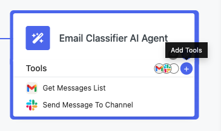

# AI Agent Block

The **AI Agent** block brings artificial intelligence into your FlowRunner™ workflows. Unlike regular automation blocks that always follow the same sequence, the AI Agent can read your instructions, pick the best tools, and decide how to use them. This gives your flows flexibility to handle complex scenarios with very little setup.

Think of the AI Agent as a smart teammate inside your flow. You provide it with prompts and tools, and it figures out the best way to complete the task.

!!! info "How AI Agents Differ from Regular Blocks"
    Regular blocks run step by step in a fixed order. AI Agents are different because they can:

    - Choose which tools to use  
    - Decide the order of actions  
    - Remember past interactions  
    - Adapt based on results  

## How the AI Agent Works

When you add an AI Agent to your flow, you are giving it the role of a decision-maker. It receives instructions through prompts, looks at the tools you connected, and decides how to use them. By default, the agent can choose the order of tool execution and adapt as it goes.

If you prefer more control, you can also specify the order of tool usage yourself. In that case, the agent will follow the procedure you outline instead of deciding on its own.

In short, the AI Agent reads your prompt, understands the goal, and either orchestrates the tools dynamically or executes them in the order you defined.

## Configuring the AI Agent Block

Before your AI Agent can run, you need to configure its main properties. These settings define which model the agent uses, what instructions it follows, and whether it remembers past interactions.

The configuration includes:

* **AI Provider** — the large language model service to use. FlowRunner™ supports OpenAI, Anthropic, Mistral, Cohere, Groq, DeepSeek, and Google Gemini.
* **AI Model** — the specific model from the chosen provider.
* **API Key** — the provider’s API key, required for authentication.
* **System Prompt** — defines the agent’s role, rules, and overall behavior.
* **User Prompt** — defines the task or question for the current run.
* **Memory (Message History)** — controls how many past messages the agent remembers. By default, memory is enabled and set to 15 messages.

The next sections explain prompts and memory in more detail.

## Writing Prompts

Prompts are the instructions that drive the AI Agent’s behavior. You use two types of prompts: **system prompts** and **user prompts**. Both can use the [Expression Editor](../flow-editing/expressioneditor.md) to pull in dynamic data from your flow.

### System Prompt

The system prompt defines the agent’s role and rules. Here you describe what the agent is, what it can do, how it should use tools, what output format to follow, and any limits it must respect. You can keep the prompt fixed or make it dynamic with the Expression Editor.

### User Prompt

The user prompt describes the task for the current run. This usually includes the immediate goal, data from earlier flow blocks, and any special instructions. With the Expression Editor, you can insert context such as trigger data, variables, or results from previous steps.

## Memory and Context

The AI Agent automatically keeps track of context during execution. By default, memory is **enabled** and stores up to **15 messages** in the run history. This allows the agent to build on past interactions instead of starting fresh every time.

### Adjusting Memory

If you want to change this behavior:

1. Open the AI Agent properties.
2. Look for the **Messages History** setting.
3. Change the number of past messages to keep (up to 15) or turn the setting off completely if you do not want the agent to remember context.

!!! info "Memory Persistence"
    Memory is shared across different runs of the same flow version. This means multiple executions can use the same context, which is helpful for multi-interaction workflows.

### When Memory Helps

Since memory is on by default, your agent will usually remember the last 15 messages. This is useful for conversational chatbots, multi-step approvals, customer support systems, or data processes that build on previous results. You can reduce the number of stored messages or disable memory if your flow doesn’t need history.

## Giving Your Agent Tools

Tools are what make the AI Agent powerful. Each tool you add gives the agent new abilities, so it can handle a wider range of tasks.

At the same time, adding too many tools can sometimes reduce accuracy. Current AI models may struggle to choose efficiently when faced with a very large toolset. For best results, start with only the tools the agent truly needs. You can always add more as you refine your flow.

### What Counts as a Tool

Any FlowRunner™ action can be a tool. That includes built-in actions like **Send Email** or **HTTP Request**, integrations like Gmail, Slack, or Airtable, and even custom extensions you create.

### Adding Tools

To add tools to your AI Agent:

1. Select the AI Agent block in your flow.
2. Click **Manage Tools** in the properties panel or the **Add Tools** icon in the AI Agent block itself:

    

3. Pick from the list of available actions.
4. Repeat the process to add as many tools as you need.

Each tool you connect expands what the agent can do.

### Configuring Tools

When you add a tool, you can decide how its fields should be set. Some fields can use **fixed values** that you enter directly. Others can pull in **dynamic values** from another part of the flow, such as a trigger, an action, a transformer, a variable, or a placeholder. If you leave a field empty, the AI Agent will decide what to put there during execution.

To configure a tool:

1. Click on the tool inside the AI Agent.  
2. Set it up as you would configure a standalone action.  
3. Fill in any fields you want fixed or linked to data from elsewhere in the flow.  
4. Leave fields empty if you want the AI to determine them dynamically.

!!! note "Flexible Tool Configuration"
    Tool fields can be set in different ways. You can enter a fixed value, or you can link the field to data coming from another block in your flow, such as a trigger, an action, a transformer, a variable, or a placeholder. If you leave a field empty, the AI Agent will decide what value to provide during execution. Fields you configure will always use the values you defined, while empty fields let the agent act on its own. This balance gives you both control and flexibility.

## Monitoring with LangSmith

For deeper insight into how your AI Agent makes decisions, you can connect FlowRunner™ with **LangSmith** from LangChain. This integration shows you what the agent understood, which tools it used, and how it responded.

To enable LangSmith monitoring:

1. In the AI Agent properties, open **LangSmith Settings**.
2. Toggle on **Enable LangSmith**.
3. Enter your API key, project name, and account cluster.
4. Optionally, add a trace label for organization.

LangSmith helps you debug agent behavior, analyze why it chose certain tools, check token usage, and compare different prompts or setups. It is also helpful for performance tuning, since you can see how long each step takes.

## Best Practices

Follow these tips to get the most out of AI Agents.

* **Write Clear Prompts**: Make system prompts specific and give examples if formatting is important. Define boundaries for what the agent should and should not do. Test and refine as needed.

* **Pick the Right Tools**:  Only add tools that are relevant to the task. While each tool you add expands the agent’s abilities, adding too many can sometimes have the opposite effect. Current AI models may struggle to pick the best option when faced with an overly large toolset, which can reduce accuracy or efficiency.

    A good approach is to start with just the essential tools, test the flow, and then add more only if the agent needs them. Pre-configure common values to ensure consistency, and group related tools so the agent better understands how they connect.

* **Keep It Fast**: Keep message history as short as possible for quicker execution. Use LangSmith to spot slow steps and manage token costs.

* **Plan for Mistakes**: Add error handler blocks after AI Agents. Include fallback instructions in prompts. Log agent decisions for debugging and test with varied inputs to ensure reliability.

## Common Uses

AI Agents are great in many scenarios. You can use them for customer service routing, document classification, content moderation, approval workflows, data analysis, or orchestrating tasks across multiple systems.

## Troubleshooting

If your AI Agent doesn’t behave as expected:

1. Check your prompts for clarity.
2. Review tool setup and required fields.
3. Turn on LangSmith for detailed logs.
4. Test tools independently of the AI Agent.
5. Start simple, then add complexity.

!!! tip "Testing AI Agents"
    Use FlowRunner’s test mode to experiment with prompts and tool setups before running them in production.
