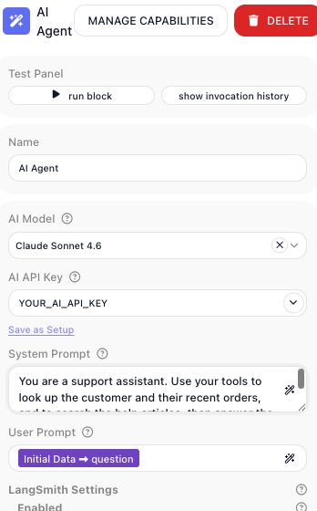

<!-- GENERATED FILE - do not edit. Source: block-knowledge/ai-agent.yaml. Regenerate: make refgen -->
# AI Agent

This block sends a request to a large language model and returns its answer. You give it a model, a System Prompt that sets the model's role, and a User Prompt that carries the actual input, and the block hands back whatever the model replies.

## How it works

Think of it as one call to an AI model, configured entirely from the panel. The System Prompt is standing instruction - the role and rules the model keeps for every request - and the User Prompt is the specific input for this call, which is usually an expression that pulls in a previous block's result. You pick the model and the API Key that authorizes the call, the block sends both prompts, and the model's reply becomes this block's result. By default that reply is plain text. You can also attach Capabilities - tools the model is allowed to reach for while it works - so the model can do more than answer from the prompt alone: call a built-in integration action, run another flow, query an external tool server, or look something up in a Knowledge Base. When you attach tools, the model decides on its own whether and when to use them to fulfill the request.

## When to use it

Reach for it whenever a step needs a model to produce language: summarizing a long result, classifying or extracting fields from messy input, drafting a message, or answering a question. It is also how you build an agent - attach Capabilities and the model can take actions, not only return text, so it can look up a record or run a flow as part of answering. It suits work where the exact wording can vary, not steps that need an identical value every time.

## Example

Suppose an earlier [HTTP Request](http-request.md){.fr-block} block fetched a customer support ticket, and you want the agent to triage it - decide how urgent it is and pull out a one-line summary - so a later block can route it. The block returned this ticket:

```json
{
  "id": "TCK-4821",
  "subject": "Cannot log in after password reset",
  "body": "I reset my password an hour ago and now the app rejects every login. I have a demo with a client in 30 minutes and I am completely locked out. Please help urgently."
}
```

In the System Prompt, set the model's role and rules so they hold for every ticket:

```text
You are a support triage assistant. Read the ticket and classify its urgency as
one of: low, normal, high. Write a one-sentence summary of the problem. Do not
invent details that are not in the ticket.
```

In the User Prompt, feed in the ticket from the previous block. Because the User Prompt is an expression, you reference the <span class="fr-block">HTTP Request</span> result there rather than pasting the ticket text, so a fresh ticket flows in on every run. To make the result usable downstream, turn on Force Parsed Output and describe the shape you want in the System Prompt - for example, fields named `urgency` and `summary`. With that on, the model returns JSON instead of prose:

```json
{
  "urgency": "high",
  "summary": "Customer is locked out after a password reset and needs access before a client demo in 30 minutes."
}
```

That object is the block's result. A later block can read its `urgency` field to route the ticket - say, page the on-call team when it is high - and show the `summary` so a human sees the gist without opening the full ticket. Run the same flow on a calmer ticket and you would get the same two fields back, with `urgency` more likely to read `normal` or `low`.



## Configuration

| Field | Description |
| --- | --- |
| AI Provider | Required. Which model vendor to call, for example ANTHROPIC. Picking a provider determines which models and keys are available in the fields below. |
| AI Model | Required. The specific model to call, listed under the chosen provider (for example a Claude, GPT, or Gemini model). |
| AI API Key | Required. The saved key that authorizes the call, chosen from the keys you have registered in the API Keys registry. Without a valid key the call cannot run. |
| System Prompt | The standing instruction that sets the model's role, behavior, and rules, applied to every request this block makes. |
| User Prompt | The specific input or question for this call. It is commonly an expression that references a previous block's result, so the input changes from run to run. |
| Manage Capabilities | Opens a modal where you attach the tools the model may use while it works, organized into four groups - Extensions (built-in integration actions), MCP Extensions (tools published by registered external tool servers, grouped by server, where you take a whole server or expand it to pick individual tools), Flows (other flows the model can run as tools), and Knowledge (Knowledge Bases the model can search). The modal also has a search box and a link to register a new tool server. |
| Messages History | When on, the model is also fed the messages from recent prior runs of this block, up to the limit you set (maximum 20), so it can carry context across separate interactions. |
| Force Parsed Output | When on, the block asks the model to return structured JSON instead of plain text, by adding an instruction to your System Prompt. Use it when a later block needs to read specific fields from the result. |
| LangSmith Settings | Connects this block to LangSmith, an external service for tracing and monitoring AI calls, so you can inspect what was sent and returned. |

**Common settings** (available on most blocks):

| Field | Description |
| --- | --- |
| Name | A label for this block on the canvas. |
| Reference Result Data As | The alias used to reference this block's result in later blocks. |
| Assign to a Variable | Optionally store the result in a Data Bucket variable too; you choose the bucket and the variable name. |
| Skip Block | When on, the block is skipped during execution and the value in Simulated Result is used as its output. |
| Logging | What to log to the Logging panel while the flow is LIVE, both on start and on completion. |
| Notes | Freeform notes for documenting the block; they do not affect execution. |

## Things to watch for

- The output is not deterministic: the same prompts can come back worded differently from one run to the next, so this block suits work where the wording can vary, not a step that needs an identical value every time. Write downstream steps to tolerate that, and when a later block needs the result in a fixed shape, turn on Force Parsed Output so the model returns structured JSON instead of prose.
- When you attach a tool but leave one of its inputs blank, the model fills that input in itself while it runs. That is convenient, but it means the value is the model's guess. If an input has to be a specific value, set it explicitly so the model cannot choose its own.
- The block cannot run without a provider, a model, and a valid API Key. The key comes from the API Keys registry; register one there first if the AI API Key dropdown is empty.
- Messages History only carries context when it is turned on, and even then only up to the limit you set (maximum 20). With it off, each run starts with no memory of earlier runs.
- While testing, you can avoid a real model call - and its cost - by turning on Skip Block and putting a sample reply in Simulated Result, so the rest of the flow runs against that stand-in instead.

## Related

- [AI Router](ai-router.md)
- api-keys-registry
- knowledge-bases
- mcp-servers
- manage-capabilities
