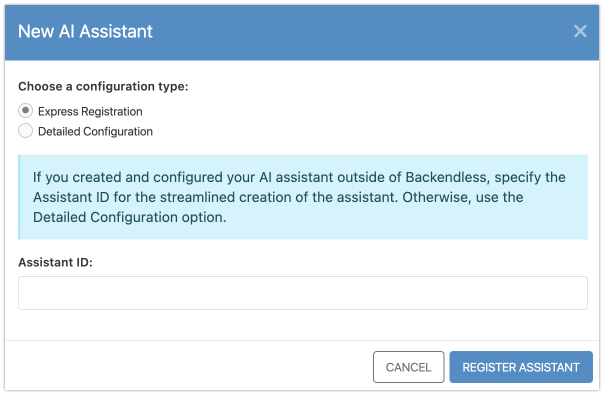
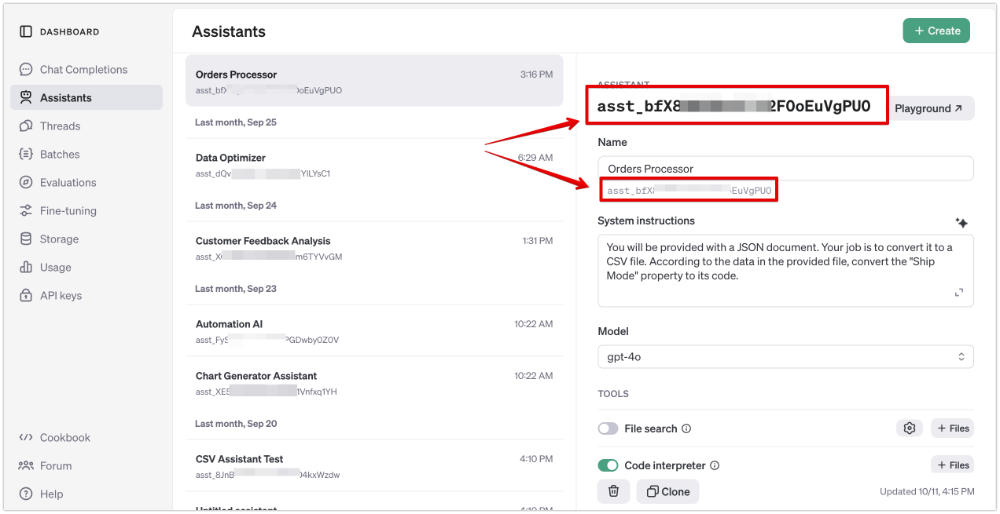
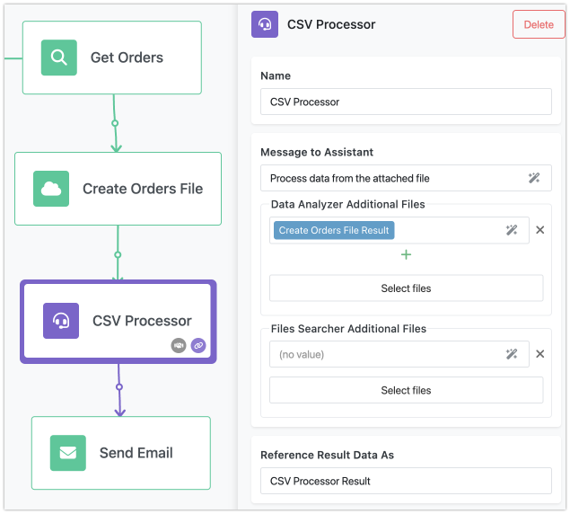

# AI Assistants in FlowRunner

FlowRunner’s AI Assistants bring the immense power of AI's advanced intelligence directly into your workflows, making virtually any task imaginable, from in-depth data analysis to creative content generation, a seamless part of your automation. This feature opens up new possibilities for processing documents, generating reports, visualizing data, and much more, all as integral parts of your flow. The AI Assistants’ results can also be further leveraged throughout your automation. For instance, you might connect an assistant to interpret a database query result, create visualizations, and then embed those visualizations into a dynamically generated PDF report using FlowRunner’s PDF Generator action.

In FlowRunner™, each AI Assistant appears as an **action block** within a flow. You may have multiple AI Assistants tailored for different tasks, each with specific configurations and capabilities. To add an AI Assistant to your flow, start by creating an AI Assistant block using the **Create AI Assistant** option.


!!! danger "IMPORTANT" 
    It’s important to remember that FlowRunner™ defaults to using a shared "demo" OpenAI account, which is ideal for testing but has limited functionality. For sustained and definitely production use, we recommend updating your FlowRunner™ setup with your personal OpenAI API key.

    To add your API key, go to the [OpenAI API Keys page](https://platform.openai.com/api-keys), generate a new key, and then paste it into the **Third Party API Keys** section under the **Manage** screen in the Backendless Console. This way, you retain access to any assistants you create or configure directly in your OpenAI account, allowing for broader usage outside FlowRunner™.

## Creating a New AI Assistant

When you select the **Create AI Assistant** option, the **New AI Assistant** popup appears. Here, you can either create a new assistant or import an existing one from your OpenAI account. 

When creating a new AI Assistant, you can choose from two setup methods:

1. **Express Registration**: 

    For this option, simply enter the Assistant ID from your OpenAI account.

    

    To retrieve the Assistant ID, ensure your API key is entered in the Backendless Console (see the **IMPORTANT** note above), then go to [OpenAI Assistants](https://platform.openai.com/assistants), copy the assistant ID, and paste it into the **Assistant ID** field in the **New AI Assistant** popup shown above. 
    
    
    
    By clicking the **REGISTER ASSISTANT** button, FlowRunner™ imports the assistant details, creating a dedicated assistant action in the toolbar.

2. **Detailed Configuration**: 
    This option lets you fully configure a new AI Assistant directly in FlowRunner™, defining specific capabilities and settings to customize its functions in your workflows.

## Configuring an AI Assistant

When using the **Detailed Configuration** option, FlowRunner™ offers a range of settings to help you tailor the assistant’s behavior.

### Basic Assistant Details

Define essential information about the assistant’s purpose and capabilities.


- **Assistant Name**: Choose a short, descriptive name indicating the tasks this assistant will handle.
- **Assistant Capabilities**: You can select one or both of the following options:
    
    - **Data Analyzer**: Ideal for assistants performing data processing or analysis on provided files. This allows the assistant to write and execute code tailored to the files’ content.
    - **Data Search in Files**: Designed for extracting data from files, this is useful when specific information needs to be located within the files provided.
  
    When configuring capabilities, you can also upload files to equip the assistant with any specific knowledge, data structures, or sample data it might need. If both capabilities are selected, assign each file to the appropriate capability.

- **Instructions**: Use this field to outline general guidance for the assistant. Avoid specific requests here, as you will provide specific instructions at runtime based on your flow’s needs.

### Advanced Configuration

These additional settings offer control over how the assistant responds:


- **Response Format**: Choose from `AUTO`, `TEXT`, or `JSON OBJECT`. When an assistant has "Data Analyzer" or "Data Search in Files" enabled, only `TEXT` is available.
- **Model**: Specify the preferred language model (LLM), which will impact both the assistant’s response quality and your OpenAI usage costs.
- **Temperature**: Adjusts how deterministic the assistant’s responses are. Lower temperatures yield more consistent responses, while higher temperatures encourage variety.
- **Top P**: Controls the assistant’s creativity level by determining the range of word choices. A lower setting restricts to straightforward responses, while higher values make responses more imaginative.

If you have configured the assistant through your OpenAI account (with your API key), you can also access and test it independently in the [OpenAI Playground](https://platform.openai.com/playground/assistants), which is helpful for diagnostics.

### Adding AI Assistants to a Flow

Once configured, your assistant will appear in the **AI ASSISTANTS** section of the FlowRunner™ toolbar. To add it to your flow, simply drag it into the editor.

For example, the screenshot below shows an assistant named **CSV Processor** added to a flow. Notice that the assistant’s properties include a **Data Analyzer Additional Files** field. This field appears when you have enabled the **Data Analyzer** capability during setup, allowing you to specify extra files for analysis as part of the flow.



To tailor your assistant’s tasks, use the **Message to Assistant** property to set specific prompts for each flow step. This prompt can reference data generated by previous actions in the flow. Use the [Expression Editor](../flow-editing/expressioneditor.md) to help compose this prompt by linking it to other flow components.

## Handling AI Assistant Responses

Once an AI Assistant completes its task, the response follows this format:

```json
{
  "decision": "text response from the assistant"
}
```

If the assistant generates a file, the response expands to include the file’s URL:

```json
{
  "decision": "text response from the assistant",
  "fileURL": "absolute URL to a file generated by the assistant"
}
```

For multiple files, the response includes each file URL within a list:

```json
{
  "decision": "text response from the assistant",
  "files": [
    { "fileURL": "absolute URL to a file generated by the assistant" },
    { "fileURL": "absolute URL to a file generated by the assistant" }
  ]
}
```

These responses integrate seamlessly into FlowRunner™, enabling your automation to continue processing AI Assistant outputs, whether for report generation, data visualization, or further analysis.