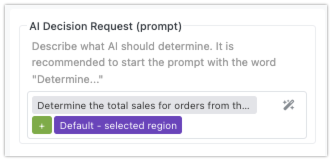

The **AI Router** block in Backendless Flow Runner helps you make AI-powered decisions within your app. You send a custom prompt to the AI, and based on that, it returns one of the preconfigured outcomes, called *Expected Decisions*. Each Expected Decision represents a possible response from the AI, and each one leads to a different branch in your flow, allowing you to route the logic of your app based on the AI's answer.

In addition to the prompt, you can provide *Decision Data* - larger sets of information such as database query results. While smaller pieces of data (like flow variables) can be included directly in the prompt, using Decision Data helps when dealing with larger or more complex data. This ensures the AI has all the context it needs without cluttering the prompt itself.

For every Expected Decision, the AI Router block creates a block connector. Each connector links to a different branch of your flow, which allows you to control what happens next based on the AI’s response. This makes the AI Router block a flexible tool for building intelligent workflows that respond dynamically to the data your app processes.

???+ info "AI Router and OpenAI Integration"
    The **AI Router** block in Backendless uses the **OpenAI API** to process prompts and make decisions. By default, FlowRunner comes with a built-in API key that allows you to experiment with the AI functionality. However, this key is provided for demonstration purposes only and has a **limited number of requests**.

    If you plan to use the AI Router in production or require a higher request limit, it’s recommended that you configure the system with your own OpenAI API key. This ensures you have full control over the number of API calls and can use the AI functionality without restrictions.

    **Setting Your OpenAI API Key**

    To configure the AI Router with your own OpenAI API key:

    1. In the **Backendless Console**, navigate to the **Manage** section.
    2. Select **Third Party API Keys** from the menu.
    3. Enter your API key and the name of the model in the provided fields.

    Once your key is set, all AI-related requests in your flows will use your OpenAI API account, allowing for a more seamless and scalable integration.

    By using your own API key, you gain access to OpenAI's full set of features and request limits, making it suitable for apps that rely heavily on AI-driven decision-making.

## AI Router in Action
Consider the example below, where the AI Router is used to analyze sales data. Several key actions are happening here:

1. The **AI Decision Request** (or the AI prompt) contains the following static text:  
  ```  
  Determine the average Sales amount of the orders  
  coming from Michigan (based on the zip code).  
  ```

2. The **Decision Data** includes the result of a previous action (`Get Orders`), which retrieves order data from the database.

3. There are three **Expected Decisions** defined for the AI to choose from:  
    - `More than 1000`  
    - `Less than 1000`  
    - `Everything Else` (you will learn about this option later in the chapter).


To better understand the AI’s work in this example, take a look at the data it processes:  


Notice the "Postal Code" column in the dataset. Although the prompt only references "zip code" without explicitly naming the column, the AI understands that "Postal Code" column values refer to zip codes and is able to identify which of those belong to Michigan. Additionally, the AI processes the sales data and calculates the **average Sales amount** (as requested in the prompt) for orders from that region. Based on this calculation, the AI produces a response that matches one of the **Expected Decisions**.

## Constructing Prompts

When working with the **AI Router** block, constructing an effective prompt is key to guiding the AI in making accurate decisions. You can create either **static** or **dynamic** prompts, depending on the data and context of your flow. Regardless of which type you use, you'll build the prompt using the **Expression Editor**, which allows you to reference various data elements from your flow.

### Static vs. Dynamic Prompts

- **Static Prompts** are fixed and do not change. These prompts contain predefined text that the AI will always receive in the same form, regardless of the flow’s state or any actions that occurred previously. For example:  


- **Dynamic Prompts** adapt based on the flow’s data. These prompts can reference variables, action results, or transformers, making them flexible and able to respond to real-time information. For example, you can include the results of previous actions like database queries, or data triggered by an event, to adjust the prompt accordingly. An example of a dynamic prompt might look like:  


    In this case, **`Default - selected regiion`** variable would dynamically change based on user input or previous flow steps.

### Using the Expression Editor

Both static and dynamic prompts are constructed using the [Expression Editor](../flow-editing/expressioneditor.md), a tool that allows you to reference data from your flow. For dynamic prompts, this is where the true flexibility lies — you can pull in:

- **Results of Previous Actions or Transformers**: Use outputs from earlier steps in the flow to provide the AI with context that changes dynamically. For example, you could reference the result of a transformer that calculates a total, or the result of a database query.
  
- **Trigger Event Data**: If your flow is triggered by an external event, such as user input or an API call, you can reference that event data in your prompt.

- **Variables**: Any variables you've defined in the flow can be inserted into the prompt to further customize it based on real-time data.

### Best Practices

To ensure that the AI makes decisions efficiently and accurately, follow these recommendations when constructing your prompt:

- **Avoid Including Large Data Items in the Prompt**: For large data elements, such as the results of database queries or large lists, it's best to avoid embedding them directly in the prompt. Instead, attach them separately using the **Decision Data** section. This ensures the prompt remains concise while still providing the AI with all the context it needs to make an informed decision.
  
- **Start the Prompt with "Determine"**: It's recommended to begin your prompt with the word "Determine." This sets a clear expectation for the AI to analyze the provided information and make a decision that aligns with one of the **predefined Expected Decisions**. For example, your prompt might look like:  
    ```
    Determine if the total sales exceed $10,000 for the attached orders
    ```

By following these guidelines, you ensure that your prompts are both efficient and clear, helping the AI deliver accurate responses that can be routed through your flow based on the **Expected Decisions**.

## Decision Data

The **Decision Data** section in the AI Router block is an optional yet powerful tool that allows you to send additional data to the AI. This data provides the AI with the context it needs to make more informed decisions based on your prompt. Each Decision Data element has two key components: a **name (or label)** and the actual **data**. These elements help ensure that the AI has access to all the relevant information without overloading the prompt itself.

### Structuring Decision Data

When using Decision Data, each element is defined with a **name** and the corresponding **data**. The name acts as a reference label that you can use in the prompt to ensure the AI knows which data to work with. For example, if you're asking the AI to process sales orders, you might create a Decision Data element with the name "Orders" and assign it the result of a previous **database query** that fetched the sales data.

It is recommended to reference the Decision Data elements by their **name** in the prompt. For instance, if you include sales data under the name "Orders," your prompt might look like this:  
*"Determine the total sales from the attached Orders."*

By keeping the data separate from the prompt, you avoid overloading the prompt with large datasets, while still providing the AI with all the information it needs to make a decision.


### Data and Expression Editor

You can define the actual data for each Decision Data element using the **Expression Editor**. This gives you flexibility to dynamically compose data from multiple sources or actions within the flow. For example, the data provided to the AI might come from:

- The **result of a database query** that retrieves relevant records.
- The **output of an API service call**, like an external system's response.
- A **response from another AI assistant** or an earlier action in your flow.

The Expression Editor allows you to pull in data from various parts of your flow, combine it as needed, and assign it to the appropriate Decision Data element. This dynamic approach makes your AI Router setup highly adaptable to real-time data and changes within the app.

### Best Practices

- **Label Your Data Clearly**: The name of each Decision Data element should match how it’s referenced in the prompt. This helps ensure clarity and consistency between the data and the task you're asking the AI to complete. For example, if the prompt mentions "Orders," the Decision Data element should also be named "Orders."
  
- **Avoid Overloading the Prompt**: Use Decision Data for larger or more complex datasets like database query results or API responses. This keeps the prompt concise while ensuring the AI has all the context it needs. The Decision Data section is designed to handle large data elements efficiently.

- **Dynamic Data Composition**: Since the Expression Editor allows for dynamic data input, you can compose Decision Data from various sources in real time, ensuring the AI receives the most relevant and up-to-date information for each task.

## Expected Decisions

**Expected Decisions** are predefined outcomes that you set up for the AI to choose from when it processes the prompt and any **Decision Data**. These are the possible results the AI can return, and each decision directs the flow down a specific path in your app. Defining clear and meaningful Expected Decisions is crucial because they guide how the AI interacts with the data and how your flow responds.

### Defining Expected Decisions

When creating Expected Decisions, it’s important to ensure that each option is relevant to the context of your prompt and any data shared with the AI. For example, if your **Decision Data** includes a list of sales orders and your prompt asks the AI to calculate total sales, Expected Decisions like `A`, `B`, and `C` would not make sense because they don't directly relate to the task or data (unless the data explicitely references `A`, `B`, and `C`). Instead, decisions such as `More than $10,000` or `Less than $10,000` would be far more informative and aligned with the prompt.

The key is to make sure that each Expected Decision is **understandable** and **specific** based on the data the AI is analyzing. This makes the AI’s choice more accurate and predictable.


### Decision Handling

For every Expected Decision you define, the AI Router block creates a **connector**. Each connector represents a different possible outcome, meaning that every Expected Decision must be accounted for. You will need to connect each Expected Decision to a **successor block** in your flow, which defines the next action to take based on that decision.

For instance, if your Expected Decisions are `Positive`,  `Negative`, and `Neutral` (as shown in the image above), you will have three connectors for these decision from the AI Router block. You will need to attach a block to handle each of these outcomes — perhaps one that triggers a notification for asking the user for a review, and another alerts the account manager to schedule a follow-up.

### The "Everything Else" Decision

The AI Router block also includes a predefined decision called **"Everything Else"**. This is a special catch-all decision that the flow uses if the AI doesn’t select any of the Expected Decisions you've defined. This can be helpful as a fallback option, ensuring that your flow doesn’t break if the AI’s response doesn’t match any specific outcome. You can use "Everything Else" to handle unexpected or unanticipated results, allowing you to log the outcome or take a default action.

### Key Considerations

- **Relevant and Informative Decisions**: Ensure that your Expected Decisions are closely tied to the context of the prompt and Decision Data to ensure meaningful AI responses.
  
- **Connector Creation**: Each Expected Decision will generate a connector in the AI Router block, and each connector must have a corresponding successor block to handle the AI’s decision.

- **Fallback with "Everything Else"**: Always account for the **"Everything Else"** decision, which handles cases where the AI’s response doesn’t match any of the predefined Expected Decisions.

By setting up thoughtful Expected Decisions, you give the AI a clear range of outcomes to choose from, ensuring your app's flow runs smoothly and logically no matter what the AI decides.