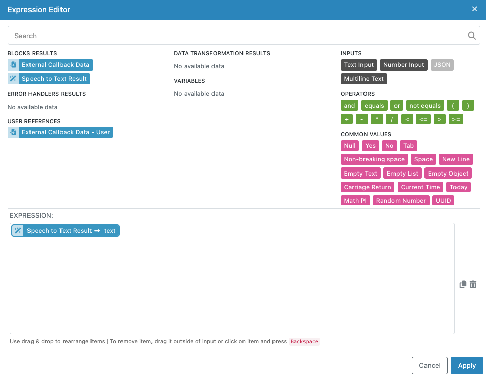

# Speech to Text Block

The Speech to Text block converts audio recordings into written text using OpenAI's advanced Whisper models. This block provides accurate transcription capabilities for over 90 languages, making it ideal for applications that need to process spoken content such as meeting recordings, voice messages, podcasts, interviews, and multimedia content.

The block leverages OpenAI's state-of-the-art speech recognition technology, which excels at handling challenging audio conditions including background noise, accents, and technical language. Whether you're building accessibility tools, content moderation workflows, or voice-driven applications, this block provides reliable speech-to-text conversion with flexible configuration options.

Common use cases include transcribing customer support calls, generating subtitles for video content, processing voice notes and recordings, creating searchable text from audio archives, and enabling voice input for form submissions or content creation workflows.

## Input Configuration

The Speech to Text block requires audio input and offers several configuration options to optimize transcription results for your specific needs.


### Model Selection

The Model selection is optional. The dropdown allows you to choose which Whisper model to use for transcription. Different models offer various trade-offs between speed, accuracy, and computational requirements. Available models typically include options like `whisper-1` for general use, with newer models like `gpt-4o-transcribe` offering improved accuracy and language recognition. Choose models based on your requirements for speed versus accuracy.

### File URL

The File URL field accepts a publicly accessible URL pointing to your audio file. This field supports the Expression Editor, allowing you to reference audio URLs from previous blocks in your workflow, such as file upload results or audio processing outputs.

**Supported Audio Formats**: The block accepts common audio formats including MP3, MP4, MPEG, MPGA, M4A, WAV, and WebM files. Audio files must be accessible via public URLs without requiring authentication.

**File Size Limitations**: Audio files are limited to 25MB in size. For larger files, consider splitting them into smaller segments or re-encoding at lower bitrates while maintaining acceptable audio quality for transcription.

### Language

The Language field allows you to specify the language of the audio content. While Whisper can automatically detect languages, explicitly specifying the language often improves transcription accuracy, especially for shorter audio segments or when dealing with accents. Use standard language codes (e.g., "en" for English, "es" for Spanish, "fr" for French). The field supports the Expression Editor, enabling dynamic language selection based on previous workflow steps or user inputs. When left empty, the model will attempt automatic language detection.

### Prompt

The Prompt field provides context to help guide the transcription process. This optional parameter is particularly useful for maintaining consistency across multiple audio segments or when dealing with specialized terminology, proper nouns, or specific formatting requirements. Effective prompts include relevant context about the audio content, proper spellings of names or technical terms, and examples of the desired transcription style. For example: "This is a medical consultation discussing patient symptoms and treatment options. Key terms include hypertension, diabetes, and cardiovascular health."

Longer prompts (approaching the 224-token limit) tend to be more reliable at steering the model's output style and terminology choices.

### Temperature

The Temperature parameter controls the randomness and creativity of the transcription output. This numeric value ranges from 0 to 1, where lower values produce more deterministic and focused results, while higher values introduce more variability. For most transcription tasks, use low temperature values (0.0 to 0.2) to ensure the most accurate and consistent results. Higher temperatures might be useful in creative contexts where you want slight variations in phrasing, but they can also introduce transcription errors. A temperature of 0 forces the model to use deterministic decoding for maximum consistency.

## Understanding the Results

The Speech to Text block returns the transcribed text as a string that can be used by subsequent blocks in your workflow. The response format structure is shown below - it consists of the `text` property that contains the text of the transcription:

**Example Input**: Audio file containing: "Hello, welcome to our company meeting. Today we'll discuss quarterly results and future planning."

**Example Output**:
```json
{
  "text": "Hello, welcome to our company meeting. Today we'll discuss quarterly results and future planning."
}
```

### Accessing Transcription Results

The transcribed text becomes available to subsequent workflow blocks through the Expression Editor. You can reference the complete transcription or use it as input for further processing such as content analysis, sentiment detection, or text summarization.



### Quality Considerations

Transcription accuracy depends on several factors including audio quality, speaker clarity, background noise levels, and language complexity. The Whisper models perform well with:

- Clear speech at normal speaking pace
- Minimal background noise
- Standard accents and pronunciation
- Audio recorded at adequate volume levels

For optimal results, ensure audio files have good signal-to-noise ratios and avoid heavily compressed or distorted recordings when possible.

## Configuring the Block

Like all FlowRunner™ blocks, you can customize how the Speech to Text block appears in your workflow and how its results are referenced by subsequent blocks.

### Block Naming

Use the "Name" field to assign a descriptive name that reflects the block's purpose in your workflow. Examples include "Customer Call Transcription," "Meeting Notes Generation," or "Voice Message Processing" to make your workflow more readable and maintainable.

### Result Reference

The "Reference Result Data As" field determines how other blocks in your workflow access the transcription results. Choose clear, descriptive names like "TranscriptionResult" or "AudioText" that make sense when building expressions in subsequent blocks.

## Implementation Strategies

### Multi-Language Workflows

For applications handling multiple languages, combine language detection with conditional logic to route transcriptions appropriately. You can use the language parameter dynamically based on user selections or automatic detection from previous workflow steps.

### Large File Processing

When working with audio files larger than 25MB, implement file splitting strategies in your workflow. Process audio in segments and combine the resulting transcriptions, using prompts to maintain context between segments.

### Quality Control and Validation

Consider implementing validation steps after transcription to check for common issues like very short outputs (indicating potential silence or processing errors) or unusually long outputs (indicating potential repeated content or hallucinations).

### Integration with Content Moderation

Combine speech-to-text processing with content moderation blocks to automatically review transcribed content for policy violations, creating comprehensive audio content review workflows.

### Cost Optimization

For high-volume transcription needs, consider using appropriate model sizes based on your accuracy requirements. Smaller models process faster and cost less, while larger models provide better accuracy for challenging audio conditions.