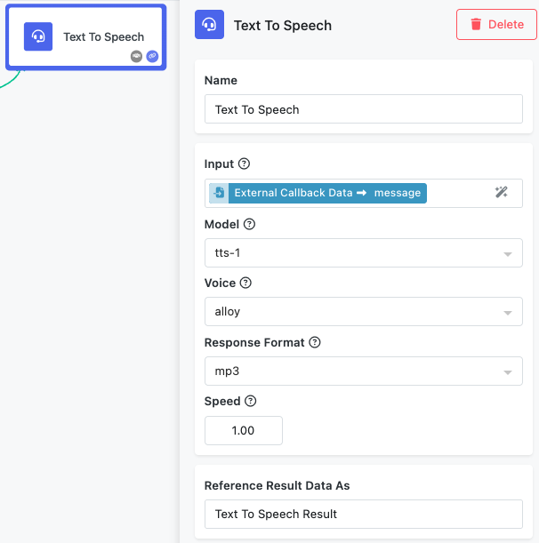

# Text to Speech Block

The Text to Speech block converts text into natural-sounding spoken audio using OpenAI's advanced TTS models. This block provides high-quality voice synthesis with multiple voice options, making it ideal for creating voiceovers, audio content, accessibility features, and interactive voice applications.

The block leverages OpenAI's state-of-the-art text-to-speech technology, which produces human-like speech with natural intonation, rhythm, and pronunciation. Whether you're building educational content, narrating blog posts, creating audio books, or adding voice capabilities to applications, this block delivers professional-quality speech synthesis.

Common use cases include generating voiceovers for multimedia content, creating audio versions of written articles, building voice assistants and chatbots, producing educational narrations, and enhancing accessibility by providing audio alternatives to text content.

## Input Configuration

The Text to Speech block offers comprehensive configuration options to customize the voice output according to your specific requirements.

### Input Text

The Input field accepts the text content you want to convert to speech. This field supports the Expression Editor, allowing you to reference text from previous blocks in your workflow such as document processing results, user inputs, or dynamically generated content.

**Text Limitations**: The input text is limited to 4,096 characters per request, which equals approximately 5 minutes of audio at normal speaking speed. For longer content, consider splitting the text across multiple Text to Speech blocks or implementing text chunking in your workflow.

**Text Formatting Tips**: The models handle punctuation naturally to create appropriate pauses and intonation. Use standard punctuation marks for natural speech flow, and consider breaking long sentences into shorter ones for better pronunciation and pacing.

### Model Selection

The Model dropdown allows you to choose between different TTS models that offer varying levels of quality and processing speed.

**Available Models**:

- **tts-1**: Optimized for real-time applications with faster processing speed
- **tts-1-hd**: Higher quality model optimized for best audio fidelity
- **gpt-4o-mini-tts**: Newer model variant with enhanced capabilities

Choose `tts-1` for applications requiring quick response times, such as real-time voice assistants. Select `tts-1-hd` when audio quality is the primary concern, such as for professional narrations or content creation.

### Voice Selection

The Voice dropdown provides access to multiple preset voices, each with distinct characteristics and personality traits.

**Available Voices**:

- **alloy**: Neutral voice that works well for general applications
- **echo**: Clear, professional tone suitable for business content
- **fable**: Warm, storytelling voice ideal for narratives
- **onyx**: Deep, authoritative voice for formal content
- **nova**: Bright, engaging voice perfect for educational content
- **shimmer**: Expressive voice with dynamic range

**Recent Voice Additions**: Newer models may include additional voices such as ash, ballad, coral, sage, and verse. Voice availability depends on the selected model.

Voice characteristics can vary based on language and content type. Consider testing different voices with your specific content to find the best match for your application's tone and audience.

### Response Format

The Response Format dropdown determines the audio file format for the generated speech, allowing you to choose the most appropriate format for your use case.

**Available Formats**:

- **mp3**: Compressed format ideal for web applications and streaming (default)
- **opus**: Efficient compression, excellent for real-time applications
- **aac**: High-quality compression, widely supported across platforms
- **flac**: Lossless compression for highest audio quality
- **wav**: Uncompressed format for professional audio production
- **pcm**: Raw audio data for custom processing applications

Choose compressed formats (mp3, opus, aac) for web applications and mobile use. Select lossless formats (flac, wav) when audio quality is critical or when further audio processing is required.

### Speed Control

The Speed field allows you to adjust the playback speed of the generated speech. This numeric field accepts decimal values to fine-tune the speaking rate.

**Speed Range**: Values between 0.25 and 4.0 are supported

- **0.25**: Very slow, useful for learning applications or detailed explanations
- **1.0**: Normal speaking speed (default)
- **1.5**: Slightly faster, good for efficient content consumption
- **2.0**: Fast pace, suitable for quick information delivery
- **4.0**: Very fast, primarily for rapid content review

Higher speeds can affect pronunciation quality, especially for complex words or technical terms. Test different speeds with your content to find the optimal balance between pace and clarity.

## Understanding the Results

### Accessing Audio Results

The generated audio becomes available through the `fileURL` property of the block's response structure. You can access the property in subsequent workflow blocks through the Expression Editor. Depending on your workflow design, you can save the audio to storage, stream it directly to users, or combine it with other media content.

### Quality Considerations

Audio quality depends on several factors:

**Model Selection**: The `tts-1-hd` model generally produces higher quality output compared to `tts-1`, but with longer processing times.

**Voice Compatibility**: Different voices perform better with different types of content. Formal content often works well with `echo` or `onyx`, while storytelling benefits from `fable` or `nova`.

**Text Preparation**: Well-structured text with proper punctuation produces more natural speech patterns. Consider adding pauses with punctuation and breaking complex sentences into shorter segments.

**Language Support**: While the models support multiple languages, performance may vary. The voices are optimized for English but can handle other languages with varying degrees of effectiveness.

## Configuring the Block

### Block Naming

Use the "Name" field to assign a descriptive name that reflects the block's purpose in your workflow. Examples include "Article Narration," "Customer Greeting Voice," or "Educational Content Audio" to make your workflow more readable and maintainable.

### Result Reference

The "Reference Result Data As" field determines how other blocks in your workflow access the generated audio. Choose clear, descriptive names like "AudioOutput" or "SpeechResult" that make sense when building expressions in subsequent blocks.

## Implementation Strategies

### Content Segmentation

For content longer than 4,096 characters, implement text chunking strategies. Split content at natural break points such as paragraph boundaries or sentence endings to maintain speech flow continuity across segments.

### Voice Consistency

When using multiple Text to Speech blocks in a single workflow, maintain voice consistency by using the same voice and model settings throughout the process, unless intentional voice changes are desired for different speakers or content types.

### Performance Optimization

For applications requiring real-time response, use the `tts-1` model with compressed audio formats like `opus` or `mp3`. For content creation or archival purposes, prioritize quality with `tts-1-hd` and lossless formats.

### Accessibility Enhancement

Combine text-to-speech with content moderation and text processing blocks to create comprehensive accessibility solutions. Ensure audio content includes appropriate pauses and emphasis for screen reader compatibility.

### Multi-language Support

While the models support multiple languages, consider implementing language detection and voice selection logic to optimize speech quality for different languages in international applications.

### Cost Management

Monitor usage carefully as text-to-speech processing incurs costs based on character count. Implement caching strategies for frequently requested content and consider text preprocessing to remove unnecessary characters or formatting.