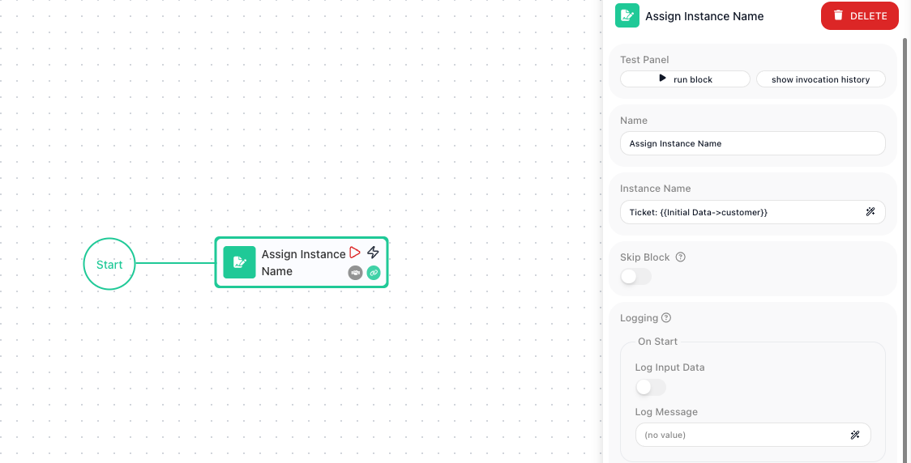

<!-- GENERATED FILE - do not edit. Source: block-knowledge/assign-instance-name.yaml. Regenerate: make refgen -->
# Assign Instance Name

This block gives the current run of your flow a human-readable name. You supply a name, and that name stands in for the run's Instance ID wherever the run is listed.

## How it works

Every time a flow runs, that run is one instance, identified by a long, machine-generated Instance ID (a GUID - a string of letters and numbers like `2ECB07CF-...`). This block sets a display name for the instance it runs in. From the moment it runs, the Instances tab shows the name you gave instead of the GUID. The name can be fixed text or built from values already in the run.

## When to use it

Reach for it when you will later go looking for a specific run in the Instances tab and a row of identical GUIDs would not help you find it. A name built from the run's own data - the customer email, an order number - turns that list into something you can scan. Put it early in the flow: the name only applies from the point this block runs, so a run that fails before reaching it is still listed by its GUID.

## Example

Suppose a flow runs once per support ticket, and each run starts with this trigger payload, which the flow exposes as Initial Data:

```json
{
  "customer": "acme@example.com"
}
```

Drop an <span class="fr-block">Assign Instance Name</span> block in early, and set its Instance Name to a composite that pulls the customer in from Initial Data, so each run announces who it is for:

```text
Ticket: {{Initial Data->customer}}
```



Here `{{Initial Data->customer}}` reads the `customer` field from that payload, so for the payload above this run is named `Ticket: acme@example.com`. Open the Instances tab and that is the row you see, instead of a GUID. A second run for a different customer gets its own name the same way, so the two are simple to tell apart.

## Configuration

| Field | Description |
| --- | --- |
| Instance Name | Required. Static text, dynamic values, or a composite (e.g. "User: {{name}}"). |

## Behavior

- Sets the instance's name; appears in the Instances list (else the raw GUID shows).

## Things to watch for

- This block does not produce an output you can reference later in the flow - it only sets the run's display name.
- Assign early so the name is visible throughout the instance lifecycle.

## Related

- instances-concept
- expression-editor
