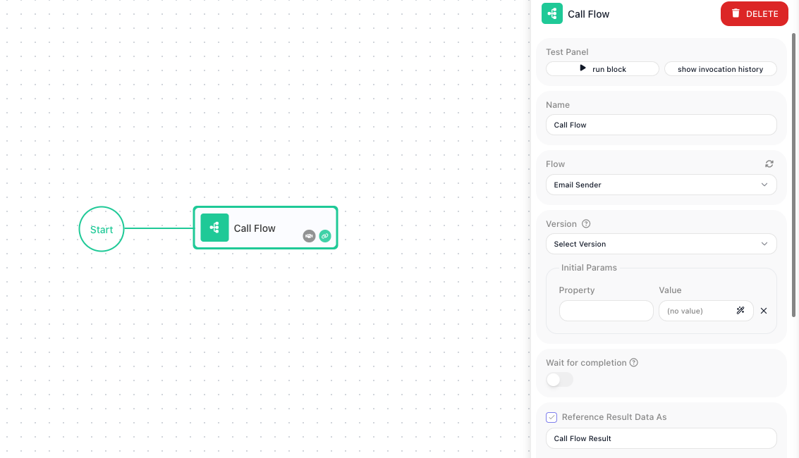

<!-- GENERATED FILE - do not edit. Source: block-knowledge/call-flow.yaml. Regenerate: make refgen -->
# Call Flow

This block runs another one of your flows as a step inside this one. You pick the flow to run, hand it the values it needs to start, and you can either wait for it to finish and read back what it produced, or let it run on its own while this flow keeps going.

## How it works

Think of it as calling one flow from another, the way one task hands off part of its work to a second task. When the flow reaches this block, it starts a fresh run of the flow you chose - a separate Instance with its own data. The values you supply become that run's Initial Data, so the called flow reads them the same way it would read the payload from its own trigger. What happens next depends on **[Wait](wait.md){.fr-block} for Execution**. With it on, this flow stops at the block until the called flow finishes, and the value the called flow sends back with its [Return Result](return-result.md){.fr-block} block becomes this block's result. With it off, this flow does not wait: it gets back only an `executionId` - an identifier for the run it kicked off - and continues immediately, while the called flow finishes on its own.

## When to use it

Reach for it when a piece of logic is worth keeping as its own flow and running from several places - creating a record, sending a notification, running a billing routine. Building that work once as a standalone flow and calling it keeps each flow shorter and means a fix lives in one place instead of being copied around. Turn **<span class="fr-block">Wait</span> for Execution** on when you need what the called flow produces before this flow can carry on, and off when you only need to set the work in motion and do not care to wait for it - for example launching a long job you will check on later. If the reusable steps only ever run inside this one flow, a [SubFlow](subflow.md){.fr-block} keeps them inline without a second flow to manage.

## Example

Suppose you have a flow named Create Beneficiary that takes a few details, writes a beneficiary record, and finishes with a <span class="fr-block">Return Result</span> block that hands back the new record's id. You want to use it from a parent flow that is setting up an account, where an earlier block, Create IRA, has already produced the account it belongs to.

Add a <span class="fr-block">Call Flow</span> block, choose Create Beneficiary as the flow to run, and turn on **<span class="fr-block">Wait</span> for Execution** so the parent flow waits and reads back the id. Then map the values the called flow needs to start. Each row is a name paired with an expression: the name has to match a value the called flow expects in its Initial Data, and the expression is where it comes from here. Bind a row named deposit_id to the account id the earlier block produced:

```text
Flow to run:        Create Beneficiary
Wait for Execution: on

Initial Data params:
  deposit_id   <-  {{Create IRA Result:id->}}
  first_name   <-  {{Initial Data:beneficiary.firstName->}}
  last_name    <-  {{Initial Data:beneficiary.lastName->}}
```

When the parent flow reaches this block, it starts a run of Create Beneficiary with those three values as its Initial Data, then pauses. Create Beneficiary writes its record and its <span class="fr-block">Return Result</span> block sends back the new id, say `{ "id": 88412 }`. That object becomes this block's result, so the next block in the parent flow can read the id and go on to link the beneficiary to the account. Had you turned **<span class="fr-block">Wait</span> for Execution** off instead, the block would hand back an `executionId` right away and the parent flow would continue without waiting for the beneficiary record to be written.



## Configuration

| Field | Description |
| --- | --- |
| Flow to run | Required. The flow this block runs. Only flows that are LIVE - published and ready to run - appear in the list and can be called. |
| Initial Data params | The values handed to the called flow to start its run. Each row pairs a name, which has to match a value the called flow expects in its Initial Data, with an expression that supplies it from this flow. |
| <span class="fr-block">Wait</span> for Execution | When on, this flow waits for the called flow to finish and this block's result is the value from the called flow's <span class="fr-block">Return Result</span> block. When off, this flow does not wait and the block returns an executionId for the run it started. |

**Common settings** (available on most blocks):

| Field | Description |
| --- | --- |
| Name | A label for this block on the canvas. |
| Reference Result Data As | The alias used to reference this block's result in later blocks. |
| Assign to a Variable | Optionally store the result in a Data Bucket variable too; you choose the bucket and the variable name. |
| Logging | What to log to the Logging panel while the flow is LIVE, both on start and on completion. |
| Notes | Freeform notes for documenting the block; they do not affect execution. |

## Things to watch for

- You can only call a flow that is LIVE. A flow still in draft does not appear in the list, so publish it before you try to call it.
- What the block hands back depends on <span class="fr-block">Wait</span> for Execution. With it on, the result is the value from the called flow's <span class="fr-block">Return Result</span> block; with it off, the result is only an executionId - an identifier for the run, not the work it produced. If a later step expects the called flow's output, leave <span class="fr-block">Wait</span> for Execution on.
- If you are not waiting, the called flow runs on its own afterward, so this flow finishing does not mean the called flow has finished too.

## Related

- [SubFlow](subflow.md)
- [Return Result](return-result.md)
- [Synchronize](synchronize.md)
- initial-data-concept
