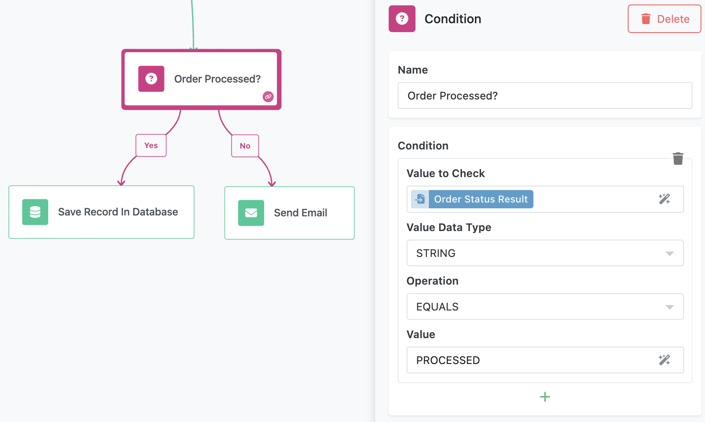
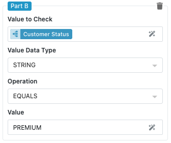
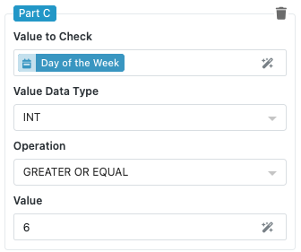
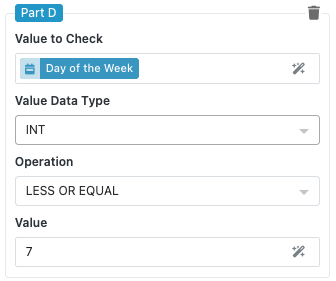
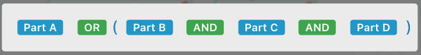

# Condition Block

The Condition block is the primary decision-making component in FlowRunner™, allowing your workflow to branch into different paths based on logical evaluations. This block creates a fork in your automation where the flow follows one route if the condition evaluates to true (`Yes` path) and another route if it evaluates to false (`No` path).

The Condition block is essential for building intelligent workflows that respond dynamically to data, user inputs, business rules, and changing circumstances. Whether you need to validate user permissions, check business hours, evaluate data quality, or implement approval workflows, the Condition block provides the logical foundation for sophisticated automation decision-making.

Common use cases include user access control based on roles or permissions, business rule enforcement such as discount eligibility or shipping options, data validation and quality checks, workflow routing based on priority or urgency levels, and time-based automation that behaves differently during business hours versus weekends.

## Block Configuration

The Condition block uses the same condition configuration system described in the [Conditional Logic chapter](../flow-editing/conditions.md), supporting single checks and multiple parts connected with AND/OR operators.

### Building Your Condition Logic

The Condition block accepts any combination of condition checks, from simple single evaluations to complex multi-part expressions with parenthetical grouping.

**Single Check Example**: Evaluate whether a user's account status equals "Premium" to determine if they have access to advanced features.

**Multi-Part Example**: Check if it's a weekday AND the current time is during business hours AND the user has the required permissions before allowing certain operations.

- 
- 
- 
- 

### Condition Configuration Fields

The condition configuration within the Condition block includes:

1. **Value to Check**: Select the data you want to evaluate using the Expression Editor
2. **Value Data Type**: Choose the appropriate data type (String, Int, Double, Boolean, Datetime, Image, JSON Object, JSON Array)
3. **Operation**: Select the comparison or evaluation operation based on the data type
4. **Additional Fields**: Dynamically appearing fields based on the selected operation

For complete details on available operations and configuration options, refer to the [Conditional Logic](../flow-editing/conditions.md) chapter.

## Understanding Block Execution

The Condition block evaluates your configured logic and directs flow execution based on the result.

### Execution Flow Paths

**Yes Path**: When the condition evaluates to `true`, the flow continues along the Yes branch. Connect subsequent blocks to this path for actions that should occur when the condition is met.

**No Path**: When the condition evaluates to `false`, the flow continues along the No branch. Connect alternative actions or error handling logic to this path.

## Practical Implementation Examples

### User Permission Check

Configure a condition that checks if a user has the required role for accessing a specific feature:

**Value to Check**: `Initial User > roles`  
**Value Data Type**: JSON ARRAY  
**Operation**: CONTAINS VALUE  
**Value**: "Administrator"

This creates a simple branch where administrative users follow one path while other users are directed to an access denied or alternative workflow path.

### Business Hours Validation

Create a condition that determines if the current time falls within business hours:

**Value to Check**: `Get Hour Operation Result`  
**Value Data Type**: INT
**Operation**: GREATER OR EQUAL  
**Value**: 9

**AND**

**Value to Check**: `Get Hour Operation Result`  
**Value Data Type**: INT 
**Operation**: LESS THAN  
**Value**: 17

This multi-part condition ensures operations only proceed during standard business hours (9 AM to 5 PM).

## Configuring the Block

Like all FlowRunner™ blocks, you can customize how the Condition block appears in your workflow and how its results are referenced by subsequent blocks.

### Block Naming

Use the "Name" field to assign a descriptive name that reflects the block's decision logic. Examples include "Check User Permissions," "Validate Business Hours," or "Verify Required Data" to make your workflow more readable and self-documenting.

### Result Reference

The "Reference Result Data As" field determines how other blocks in your workflow access the condition evaluation results. Choose clear names like "PermissionCheck" or "ValidationResult" that make sense when building expressions in subsequent blocks.

## Best Practices for Condition Blocks

### Logical Flow Design

Design your Yes and No paths to handle all possible scenarios gracefully. Consider what should happen when conditions are not met and provide appropriate alternative actions or error handling.

### Complex Condition Management

For very complex logical evaluations, consider whether to use one comprehensive Condition block or multiple simpler blocks in sequence. Multiple blocks often provide better readability and easier debugging, while single complex blocks offer better performance.

### Error Handling Integration

Connect your Condition block to Handle Error blocks when appropriate, especially when dealing with data that might be missing or invalid. This ensures your workflow can handle unexpected scenarios gracefully.

### Testing and Validation

Test your Condition blocks with various data scenarios including edge cases, null values, and boundary conditions. Use clear test data to verify that your logical expressions behave as expected.

### Performance Considerations

When using multiple condition checks within a single block, order them strategically. Place the most likely conditions first in OR expressions and the most restrictive conditions first in AND expressions to optimize evaluation performance.

### Documentation and Maintenance

Use descriptive block names and consider adding comments or documentation blocks near complex conditions to explain the business logic. This helps with maintenance and team collaboration.