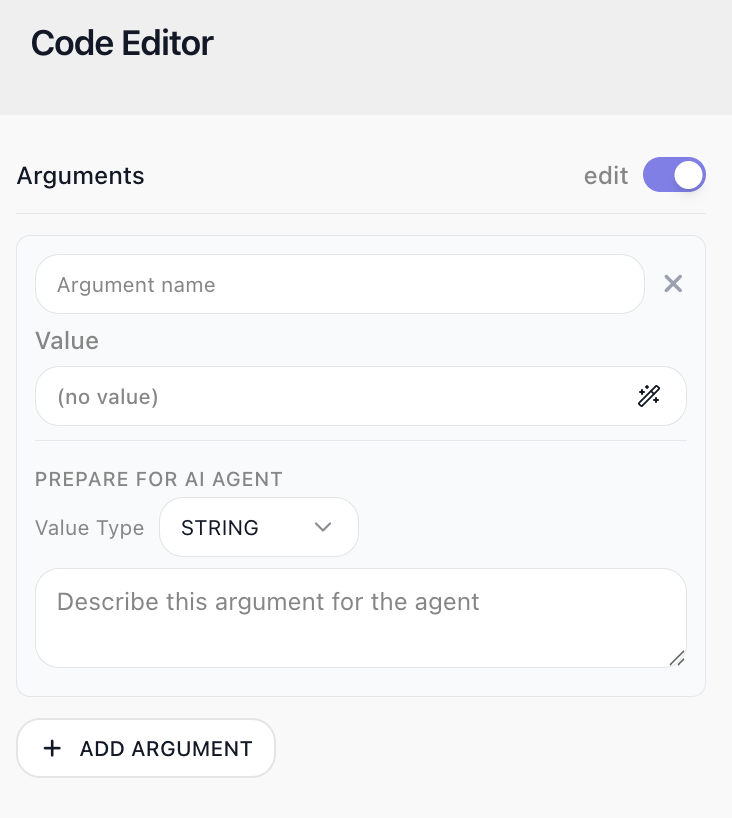

<!-- GENERATED FILE - do not edit. Source: block-knowledge/custom-cloud-code.yaml. Regenerate: make refgen -->
<!-- doclint: allow-unlinked: Custom Cloud Code -->
# Custom Cloud Code

This block runs a snippet of JavaScript as a step in your flow. You pass values in as named arguments, write your logic, and the value you return becomes the block's result.

## How it works

Each time the flow reaches this block, your code runs once, on the server, as a single step.
Data flows in through the <span class="fr-control">Arguments</span> list on the block's configuration panel. Each
argument is a name plus a value -
typically an expression that reads a previous step's result. Press <span class="fr-control">Open Code Editor</span> to
write the code; inside the Code Editor, each argument name is a ready-to-use top-level
variable. The values arrive already typed, so an array stays an array you can call
`.filter()` on. Whatever your code returns
becomes the block's result, which later blocks read in the Expression Editor under the
block's result alias - by default, <span class="fr-expr">Custom Cloud Code Result</span>.

Each run starts clean - nothing your code sets persists from one run to the next.

## When to use it

Reach for it when a few lines of code would be cleaner than wiring up several blocks to do the same thing. Reshaping an API response, computing a value, or combining two blocks' outputs is often a short snippet, where the no-code equivalent might be a chain of [Transform Data](transform-data.md){.fr-block} blocks that clutters the flow. It is also how you do something genuinely custom that no built-in block offers. The code can even reach the web itself with `fetch`, but save that for the occasional call a snippet genuinely needs: a dedicated block like [HTTP Request](http-request.md){.fr-block} shows its call on the canvas, records it in run history, and can retry on failure, none of which a fetch buried in code gets you. You will find the block in the Actions group of the block palette.

## Example

Suppose an upstream Fetch Orders block (an <span class="fr-block">HTTP Request</span>) fetched a list of orders, and the rest of the flow needs one question answered: how many orders are still open, and which ones - a count to branch on, and the ids to save for the follow-up. Say the fetched list looks like this:

```json
[
  { "id": 1002, "status": "open" },
  { "id": 1003, "status": "shipped" },
  { "id": 1005, "status": "open" }
]
```

This block - named Count Open Orders here - answers that question. In its <span class="fr-control">Arguments</span> list, add one argument named `orders`, and for its value pick the Fetch Orders block's result in the Expression Editor. Then write the code in the Code Editor, opened with <span class="fr-control">Open Code Editor</span>:

```javascript
// "orders" is the array returned by the HTTP Request block
const open = orders.filter(order => order.status === "open");
return {
  openCount: open.length,
  openIds: open.map(order => order.id),
};
```

The screenshot below shows the editor with `orders` bound beside this code:


Against the sample list above, the code returns this - the block's result:

```json
{
  "openCount": 2,
  "openIds": [1002, 1005]
}
```

Downstream blocks read the result through its alias - left at its default, <span class="fr-block">Custom Cloud Code</span> Result. In this flow, an Any Open? block (a [Condition](condition.md){.fr-block}) checks whether <span class="fr-expr">Custom Cloud Code Result → openCount</span> is greater than 0, and its Yes branch leads to Save Open Order Ids (a [Set Variables](set-variables.md){.fr-block} block), which stores <span class="fr-expr">Custom Cloud Code Result → openIds</span> in an Open Order Ids variable - ready for whatever notification or reporting step the flow adds next. The count and ids the code computed drive the rest of the flow. On the canvas, the chain reads left to right:


## What the code can use

The runtime is the isolated JavaScript environment described above. Modern language
features are all there, and a set of familiar globals comes with them:

- `fetch` - real network access. It works as it does in a browser: pass headers as a
  plain object and the body as a string, and read the response with `.json()` or
  `.text()`. There are no `Headers`, `FormData`, or `Blob` constructors, so stick to
  plain objects and strings.
- `crypto` - `randomUUID()`, `getRandomValues()`, and the WebCrypto `subtle` API.
- `Buffer` - base64 and hex conversions, and binary data generally.
- Timers - `setTimeout` and `setInterval` really wait. To pause your code, wrap one in a
  Promise and await it: `await new Promise(r => setTimeout(r, 300))`.
- Text and URLs - `TextEncoder` and `TextDecoder`, `atob` and `btoa`, `structuredClone`,
  `URL` and `URLSearchParams`, and `AbortController`.

These globals are everything the runtime provides - anything they do not cover still
comes into the flow through blocks. What is deliberately not here is Node.js itself; the
exact list is under Limitations below.

<!-- verified in-product 2026-08-14 (Documentation Flows "Runtime Probe", post release 1.0.13 / FR-3102): present = fetch, Buffer, crypto (randomUUID/getRandomValues/subtle - SHA-256 digest verified), setTimeout/setInterval/clearTimeout (real 300ms delay), queueMicrotask, TextEncoder/TextDecoder, atob/btoa, structuredClone, URL/URLSearchParams, AbortController/AbortSignal. fetch verified live: GET api.github.com 200 + JSON; POST postman-echo with plain-object headers + string body echoed both. Absent = require, process, dynamic import ("A dynamic import callback was not specified"), Blob, File, FormData, Headers, Request, Response, ReadableStream/WritableStream/TransformStream/CompressionStream, WebSocket, EventTarget, MessageChannel, BroadcastChannel, performance/Performance, Crypto/SubtleCrypto constructors. -->
<!-- doclint: no-shot: a runtime capability list; the Code Editor itself is shown in the example above -->

## As an AI Agent tool

<span class="fr-block">Custom Cloud Code</span> can also be given to an [AI Agent](ai-agent.md){.fr-block} as a tool, so the agent runs a snippet
on its own when it decides it needs to - to do a calculation or reshape some data mid-task.
You attach it from the agent's <span class="fr-control">Manage Capabilities</span> window, where it is listed under
<span class="fr-control">Utils</span>. The tool then appears in the <span class="fr-control">Tools</span> row on the agent block, and selecting it
there opens the tool's own configuration.

A tool turns the block's usual data flow around: instead of the flow handing every value
in, the agent supplies what you leave open. Leave the code or an argument value empty and
the agent provides it at runtime; a filled value is locked - the agent cannot see or
override it.

In the tool's Code Editor, each argument gains two extra fields under
<span class="fr-control">Prepare for AI Agent</span>:

- <span class="fr-control">Value Type</span> - the data type the agent must supply, such as a string or a number.
- <span class="fr-control">Description</span> - what the argument is for, written for the agent. Together with the
  type, this is how the agent knows what to pass, and when to reach for the tool.

As an ordinary block step, none of this appears: an argument is just a name and a value.

<!-- attach flow re-verified in-product 2026-08-14 (Documentation Flows, post 1.0.13 / FR-3227): Manage Capabilities -> Utils lists exactly Assign Instance Name / Custom Cloud Code ("Runs a JavaScript snippet with typed arguments. Anything left empty is filled in by the agent.") / File Reader / HTTP Request, each with a + to add. Added tool shows in the agent node's "Tools" row; clicking it opens a config panel headed "Custom Cloud Code / AI Tool" with Name, OPEN CODE EDITOR, Notes, and the helper text verbatim: "Leave the code or an argument value empty to let the agent provide it at runtime. Filled values are locked - the agent cannot see or override them." The old "tools drawer" phrasing was replaced with these verified surfaces. -->



## Configuration

| Field | Description |
| --- | --- |
| Arguments | The values your code can use. Each argument has a name and a value, where the value is either static or an expression that references a previous block's result. Inside the code, each argument is available as a top-level variable of the same name. |
| Code | The JavaScript to run. Press <span class="fr-control">Open Code Editor</span> to write it in the full-screen Code Editor, where the <span class="fr-control">Arguments</span> panel sits beside the editor. Return the value that becomes this block's result. |

**Common settings** (available on most blocks):

| Field | Description |
| --- | --- |
| Name | A label for this block on the canvas. |
| Reference Result Data As | The alias used to reference this block's result in later blocks. |
| Assign to a Variable | Optionally store the result in a Data Bucket variable too; you choose the bucket and the variable name. |
| Skip Block | When on, the block is skipped during execution and the value in Simulated Result is used as its output. |
| Logging | What to log to the Logging panel while the flow is LIVE, both on start and on completion. |
| Notes | Freeform notes for documenting the block; they do not affect execution. |

## Behavior

- async/await and Promises are supported; a returned Promise is awaited and unwrapped automatically before the result is captured.
  ```javascript
  return Promise.resolve({ count: 3 });   // result is { count: 3 }
  ```
- fetch makes real calls; await it and read the reply from the Response.
  ```javascript
  const reply = await fetch(url, { method: "POST", headers: { "Content-Type": "application/json" }, body: JSON.stringify(payload) });
  return await reply.json();
  ```
- Throwing an Error sets the block's status to Error; the message keeps the error's name as a prefix.
  ```javascript
  throw new Error("orders is empty");   // the block fails with "Error: orders is empty"
  ```
- A thrown bare string also fails the block, with that string as the message - though a real Error object remains better style.
  ```javascript
  throw "nope";   // the block fails with "nope"
  ```
- Even null passes through as-is; nothing is converted to text on the way in.
  ```javascript
  return Array.isArray(orders);   // true when orders came from an array-returning block
  ```
- Any JSON-serializable return value works, scalars included.
  ```javascript
  return 42;   // the block's result is 42
  ```

## Limitations

- You cannot load external libraries or packages - the globals listed under What the code can use are everything available. There is no require, no import, no process, and none of the Node modules (fs, http, zlib, and the rest).
- The server runs in UTC with the en-US locale. Date and number formatting for other locales still works - Intl carries the full locale data.
- The result is serialized as JSON. Map, Set, and RegExp become empty objects; NaN and Infinity become null; and undefined, functions, and Symbols are dropped.
- Code runs in non-strict (sloppy) mode - assigning to an undeclared variable does not throw, so a typo in a variable name can fail silently.
- Time is not the tight limit - runs that compute or wait for over a minute complete fine. Memory is. Every <span class="fr-block">Custom Cloud Code</span> block, <span class="fr-block">Custom Cloud Code</span> tool on an <span class="fr-block">AI Agent</span> and custom extension action in a workspace runs in the same environment, so everything running at the same moment shares one memory ceiling, and that ceiling depends on the workspace billing plan. Code that goes over it is stopped, and the block fails with "Cloud Code execution was interrupted: the execution environment stopped responding while running your code. This usually means the code crashed the process or exceeded the environment's memory limit. Please review your code and run it again." A crash for any other reason gives the same message, so check both how much data the code holds at once and what else was running at the same time.
- A value that cannot be JSON-serialized - a BigInt, or an object with a circular reference - fails the block with "Return value is not JSON-serializable", naming what could not be converted.
- An un-awaited promise rejection crashes the execution environment and fails the block the same way. Await every promise, or attach a .catch().

## Related

- [AI Agent](ai-agent.md)
- [HTTP Request](http-request.md)
- [Handle Error](handle-error.md)
