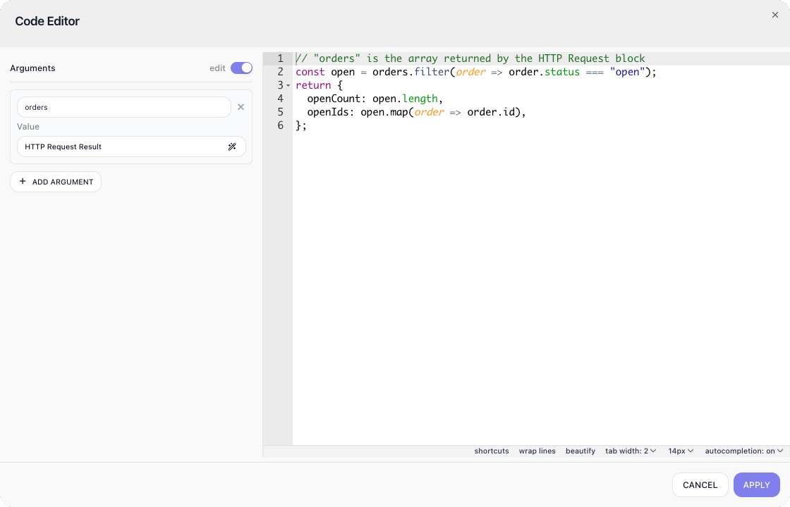

<!-- GENERATED FILE - do not edit. Source: block-knowledge/custom-cloud-code.yaml. Regenerate: make refgen -->
# Custom Cloud Code

This block runs a snippet of JavaScript as a step in your flow. You pass values in as named arguments, write your logic, and the value you return becomes the block's result.

## How it works

Each time the flow reaches this block, your code runs once, on the server, as a single step. The arguments you declare arrive as ready-to-use variables, already typed as the arrays, objects, and numbers they were upstream, and whatever your code returns becomes the block's result for the rest of the flow to use. The code runs in its own isolated sandbox, created fresh on every run, which keeps it fast and predictable.

## When to use it

Reach for it when a few lines of code would be cleaner than wiring up several blocks to do the same thing. Reshaping a payload, computing a value, or combining two blocks' outputs is often a short snippet, where the no-code equivalent might be a chain of [Transform Data](transform-data.md){.fr-block} blocks that clutters the flow. It is also how you do something genuinely custom that no built-in block offers. The one thing it is not for is reaching outside the flow: the code has no network or file access, so let blocks like [HTTP Request](http-request.md){.fr-block} and the database actions handle input and output, and use your code to work on what they return.

## Example

Suppose an upstream <span class="fr-block">HTTP Request</span> block fetched a list of orders. Declare an argument named orders bound to that block's result, then shape it down to what the next step needs:

```javascript
// "orders" is the array returned by the HTTP Request block
const open = orders.filter(order => order.status === "open");
return {
  openCount: open.length,
  openIds: open.map(order => order.id),
};
```



The block's result is the object you return, which later blocks read through its alias, <span class="fr-block">Custom Cloud Code</span> Result.

## Configuration

| Field | Description |
| --- | --- |
| Arguments | The values your code can use. Each argument has a name and a value, where the value is either static or an expression that references a previous block's result. Inside the code, each argument is available as a top-level variable of the same name. |
| Code | The JavaScript to run, written in the Open Code Editor modal. Return the value that becomes this block's result. |

**Common settings** (available on most blocks):

| Field | Description |
| --- | --- |
| Name | A label for this block on the canvas. |
| Reference Result Data As | The alias used to reference this block's result in later blocks. |
| Assign to a Variable | Optionally store the result in a Data Bucket variable too; you choose the bucket and the variable name. |
| Skip Block | When on, the block is skipped during execution and the value in Simulated Result is used as its output. |
| Logging | What to log to the Logging panel while the flow is LIVE, both on start and on completion. |
| Notes | Freeform notes for documenting the block; they do not affect execution. |

## Behavior

- async/await and Promises are supported; the block waits for them before capturing the result.
  ```javascript
  return await Promise.resolve({ ok: true });
  ```
- If you return a Promise, it is awaited and unwrapped automatically.
  ```javascript
  return Promise.resolve({ count: 3 });   // result is { count: 3 }
  ```
- Throwing an Error sets the block's status to Error, using the error's message.
  ```javascript
  throw new Error("orders is empty");
  ```
- Throw a real Error object, not a bare string or number; a non-Error throw still fails the block, but its message is lost.
  ```javascript
  throw "nope";   // fails the block, but the message is gone
  ```
- Arguments arrive as native, typed JavaScript values (arrays, objects, numbers, null); nothing is stringified.
  ```javascript
  return Array.isArray(orders);   // true when orders came from an array-returning block
  ```
- A floating, un-awaited promise rejection is ignored, and the block returns normally.

## Limitations

- It is a V8 sandbox (roughly ES2023), not Node. There is no require, fetch, process, Buffer, crypto, setInterval, btoa, or structuredClone.
- The server runs in UTC with the en-US locale; full ICU data is available.
- The result is serialized as JSON. Map, Set, and RegExp become empty objects; NaN and Infinity become null; and undefined, functions, and Symbols are dropped.
- Code runs in non-strict (sloppy) mode in a fresh isolate each time, so nothing persists between runs or instances.
- Execution is capped at 10 seconds. Around 400MB of allocation is fine, and deep recursion raises a RangeError.

## Related

- expression-editor
- [HTTP Request](http-request.md)
- [Handle Error](handle-error.md)
