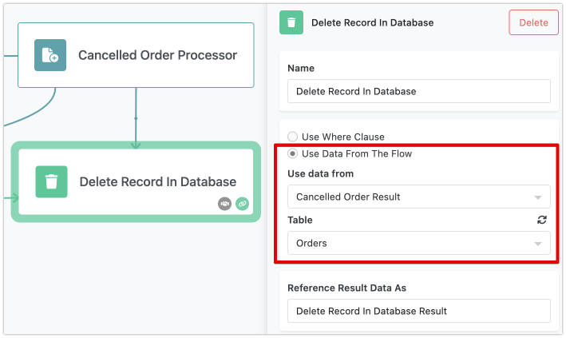

The "Delete Record in Database" action block makes it easy to remove records from your Backendless database. Whether you need to delete a single record or multiple records that match certain criteria, this block offers a simple and effective way to manage your data.

## Deleting a Single Record
When you want to delete a specific record, you'll use the **Use Data From The Flow** option. If you have data in your flow that matches a record in your database, this option lets you delete that record. You just need to select the relevant data in your flow and specify the database table where the record is stored. 

Imagine you have a record that was the result of another action, trigger, or transformer - this data element, which must be in a key/value structure format, should include an `objectId` key. The `objectId` is a unique identifier that tells Backendless exactly which record to delete. Once you've selected the right data element, you’ll also need to specify which table in your database the record belongs to. When the action runs, the identified record in that table is removed.

## Deleting Records with a Query
To delete one or more records that match specific criteria, use the **Use Where Clause** option. This option allows you to create a database query using the [Expression Editor](../flow-editing/expressioneditor.md), which Backendless will then run against your specified table. The query, written in Backendless' ["where clause" syntax](https://backendless.com/docs/rest/data_search_with_where_clause.html), defines the conditions that the records must meet to be deleted. When this action is executed, any record in the selected table that matches the query conditions is deleted.

## Action Result
The result of the "Delete Record in Database" action is the number of records that were successfully deleted. This information can be helpful in confirming that the deletion was carried out correctly and can be used in further steps within your flow. If you'd like, you can give this result a custom name using the **Reference Result Data As** field, making it easier to refer to in subsequent actions.

In essence, the "Delete Record in Database" action block simplifies the process of removing unnecessary records, whether you’re dealing with a single item or a group of records that meet certain criteria. With the ability to seamlessly integrate this action into your flow, you can ensure that your database stays organized and up-to-date.