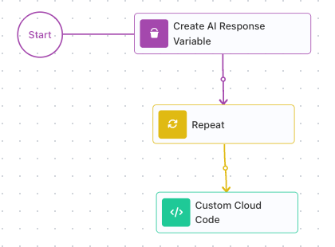

<!-- GENERATED FILE - do not edit. Source: block-knowledge/error-handling-concept.yaml. Regenerate: make refgen -->
<!-- doclint: allow-unlinked: Error Handling -->
# Error Handling

Error handling is how a flow copes with a step that fails instead of dying on the
first thing that goes wrong. A service is down, a database write is rejected, a piece
of input makes no sense - with error handling in place, the flow catches that failure
and follows a recovery path you built, so it keeps going on its own terms rather than
stopping where it broke.

## How it works

By default, a flow stops the moment any block fails. Nothing after the failing block runs. For
steps that only move data around that is fine, but a step that calls an outside service can fail
for reasons that have nothing to do with your flow - and then the whole run gives up on the first
hiccup.

A [Handle Error](handle-error.md){.fr-block} block changes that, one block at a time. You wire the block that might fail to a
Handle Error - the failing block points to the handler. From then on that block has two exits: its
normal path when it succeeds, and the Handle Error when it fails. On failure the flow does not
stop; it takes the Handle Error path and runs the recovery steps you built there.

- A block wired to a Handle Error is a **handled failure** - the flow recovers and keeps going.
- A block with no Handle Error is an **unhandled failure** - it stops the run.

Once a failure is caught, the recovery steps can read the error. It comes back through the Handle
Error's result alias - Handle Error Result by default - which you open in the Expression Editor,
under Block Data:

A caught error has up to three fields:

- **message** - a description of what went wrong. Always present.
- **source** - the name of the block that failed. Always present.
- **code** - a numeric error code. There for some failures, absent for others (a [Custom Cloud Code](custom-cloud-code.md){.fr-block} block that throws carries none).

Build your recovery on message and source, since they are always there; use code when the failure
has one. Note that message is the raw failure text - sometimes an internal string rather than a
sentence written for a user - so pair it with source when you show it to a person.

You read a field with an expression like Handle Error Result → message. And because source
names the block that failed, one Handle Error can guard several blocks at once and still tell you
which one broke:

## When to use it

Design error handling around any step that can fail for reasons outside your
control - not the steps you fully control, but the ones that depend on something else
behaving. An [HTTP Request](http-request.md){.fr-block} to a service that might be down, a database write that might
be rejected, an [AI Agent](ai-agent.md){.fr-block} that might choke on its input, a file upload that a network
blip might interrupt. Each of those is a place where, on a bad day, the step fails
through no fault of your flow. Ask of every such step: if this fails, do I want the
whole run to stop, or do I want to recover. Wherever the answer is recover, connect that step
to a Handle Error. The steps that only move data around, on the other
hand, rarely need one.

<!-- doclint: no-shot: conceptual - guidance on which steps deserve a Handle Error; the block's wiring is shown in How it works -->
<!-- verified: default-stop behavior (a failing block ends the run) and divert-and-continue confirmed via the legacy error-handler.md + the captured AI Agent failure (code 28063) used on this page; source names the failing block (product owner, 2026-06-23). -->

## Reacting to different errors

Different failures deserve different responses, and the **code** is what lets you tell them
apart. Inside the recovery path, send the flow through a [Condition](condition.md){.fr-block} that branches on the code:

- A **temporary** failure - a timeout, a service briefly down - is worth another try. [Wait](wait.md){.fr-block} a
  moment and run the step again.
- A **permanent** failure - malformed or invalid input - will fail the same way every time,
  so retrying is pointless. Route it to a person instead.

The caught error also carries source and message, so the path that hands a case to a person can
name which block failed and why.

Two things to remember about **code**:

- It is a FlowRunner™ numeric code, not an HTTP status. A failed HTTP Request reports a
  FlowRunner code, not a 404 or a 500 - branch on that code.
- Not every failure has one. Branch on code only for failures that provide it, and fall back
  on source and message, which are always there.

<!-- doclint: no-shot: the Block-Data read is shown by handle-error-read.png under How it works; this section is the conceptual branch-on-code strategy -->
<!-- verified 2026-06-23 (product owner): code is a FlowRunner numeric code, NOT an HTTP status; a Custom Cloud Code throw yields no code while an HTTP/service failure does. -->

## Retrying a failing step

A Handle Error catches a failure and runs your recovery path once - but catching a
failure is not the same as trying the step again. To actually retry, you wrap the step
in a loop and let the Handle Error feed the next pass. A flow built to retry an AI Agent
shows the shape:

Two pieces sit outside the loop. A [Set Variables](set-variables.md){.fr-block} block (titled Create AI Response Variable on
the canvas above) creates the variable that will hold the answer, starting empty. It sits
outside the loop on purpose: the loop writes to it, and it has to outlive the loop so a later
step can still read it. A [Repeat](repeat.md){.fr-block} block then wraps the risky step; its Maximum Iteration
Count caps how many attempts it gets - five here. The block after the loop reads the answer.

<!-- verified 2026-07-09 from the Retry Logic flow version definition (Documentation Flows): "Create AI Response Variable" is a Set Variables block (type DATA_BUCKET, block data-bucket) - the same block type as the in-loop Set Variables, just renamed. Structure: data-bucket "AI Response"='' -> Repeat (maxIterations 5) { AI Agent -onFail-> Handle Error -> Wait 60s; success -> Set Variables (AI Response = AI Agent Result->output) -> Break } -> Custom Cloud Code reads Default.'AI Response'. -->
<!-- "Maximum Iteration Count" is the UI label for the Repeat cap (schema key maxIterations); it is documented with its verbatim product tooltip on the Repeat block reference (block-knowledge/repeat.yaml -> content/reference/repeat.md), and the Retry Logic flow sets it to 5 (maxIterations=5 above). -->
<!-- doclint: no-shot: the retry flow's top level and loop internals are both shown by the two images in this section -->

Inside the loop is where the retry happens:

The AI Agent is connected to a Handle Error, so a failure diverts instead of ending the run.
On a good pass, the agent's success exit runs a Set Variables that writes its output into
the answer variable, then a [Break](break.md){.fr-block} ends the loop - once you have an answer, there is no reason
to keep trying. On a bad pass, the Handle Error catches the error and a Wait pauses before the
pass ends. Because the failure is handled, it ends only that pass of the loop, not the whole
run - so the loop comes around and runs the agent again, after a delay rather than hammering a
service that is already struggling. (An unhandled failure here would stop the run, loop and all.)

The loop stops the moment the agent succeeds, and otherwise keeps retrying until it runs out of
attempts. When it ends, the answer variable holds the successful output, or is still empty if
all five attempts failed - so the step after the loop can tell whether it got an answer and
respond accordingly. That Break on the success exit is what makes this a real retry rather than
a fixed five runs: without it, the loop would keep calling the agent even after it succeeded.

## Common recovery patterns

The recovery path is yours to build. A handful of patterns cover most of what you will
reach for:

**Retry after a Wait.** For a failure that might pass on its own - a momentary timeout, a
service catching its breath - put a Wait block in the recovery path to pause, then run the
failing step again. Catching a failure is not the same as retrying it, though; the loop that
makes the step run again is shown in **Retrying a failing step** above.

**Fall back to a default.** When the step's job is to fetch a value, the recovery path can
supply a sensible default instead, so the rest of the flow has something to work with rather
than nothing.

**Notify someone.** Send a message that carries the **source** and **message** from the
caught error, so a person learns which block failed and why without digging through a run.

**Hand off to another flow.** For recovery logic you reuse across flows, the recovery path
can run another flow built to handle the failure with a [Call Flow](call-flow.md){.fr-block} block, keeping the messy
part in one place.

<!-- doclint: no-shot: conceptual catalogue of recovery-path shapes; the blocks named (Wait, Condition, Call Flow) are shown on their own reference pages, and the retry shape is shown in full above -->

## Related

- [Handle Error](handle-error.md)
- [Wait](wait.md)
- [Condition](condition.md)
- [Custom Cloud Code](custom-cloud-code.md)
- [Repeat](repeat.md)
- [Set Variables](set-variables.md)
- [Break](break.md)
