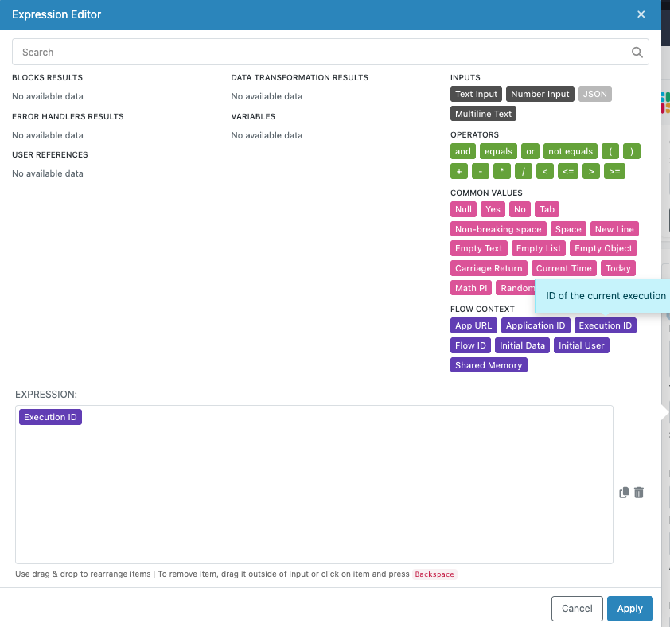

# External Callback Trigger

The External Callback trigger allows your workflow to pause and wait for external systems to send confirmation before continuing. This is essential when your process depends on events outside your application, such as payment confirmations, email verifications, or third-party approvals.

When your flow reaches an External Callback trigger, it pauses execution and waits for an HTTP request to a unique callback URL. External systems activate the trigger by calling this URL, optionally passing data that becomes available to subsequent blocks in your flow.

## Common Use Case: Order Processing

Consider an e-commerce scenario where you need to process orders only after payment confirmation. Here's how you structure this workflow:

1. **Order Received**: The flow starts when a new order is placed
2. **Process Order Details**: The flow processes the order details and prepares for fulfillment
3. **External Callback Trigger**: The flow pauses and waits for payment confirmation
4. **Complete Order**: Once payment is confirmed via the callback, the flow continues to complete the order

This ensures orders are only processed after successful payment while allowing your system to prepare everything else in advance.

## Setting Up the External Callback Block

When you add an External Callback trigger to your flow, FlowRunner™ generates a unique URL for that trigger. This URL serves as the endpoint where external systems send their callback requests.


The URL includes unique identifiers for both your flow and the specific trigger, ensuring callbacks reach the correct destination even when you have multiple flows or multiple callback triggers running simultaneously.

## Callback Request Format

External systems can activate your trigger using either GET or POST HTTP methods. The choice between methods affects how you pass data to the trigger and how you manage multiple workflow instances.

**Base Endpoint**:
```
https://xxxx.backendless.app/api/automation/flow/[FLOW-ID]/trigger/[TRIGGER-ID]/activate
```

The `[FLOW-ID]` and `[TRIGGER-ID]` are automatically generated identifiers. Use the trigger's properties panel to get the complete URL.

### Understanding Trigger Placement

How you structure your callback request depends on where the External Callback trigger is positioned in your workflow:

**Flow-Starting Triggers**: When an External Callback trigger is the first block in your flow, activating it creates a new workflow instance. These triggers start fresh executions rather than resuming existing ones.

**Mid-Flow Triggers**: When an External Callback trigger appears in the middle of your workflow, it pauses an already-running execution. Activating these triggers resumes the paused workflow instance from that specific point.

This distinction is important because mid-flow triggers require you to specify which workflow instance should be resumed, while flow-starting triggers always create new instances.

### GET Method Requests

GET requests pass data through query parameters, making them useful for simple callbacks with minimal data.

**For Flow-Starting Triggers**:
```
GET https://xxxx.backendless.app/api/automation/flow/[FLOW-ID]/trigger/[TRIGGER-ID]/activate?param1=value1&param2=value2
```

All query parameters become the trigger data object available to subsequent blocks. See the [Accessing Callback Data](#accessing-callback-data) section for additional details.

**For Mid-Flow Triggers**:
```
GET https://xxxx.backendless.app/api/automation/flow/[FLOW-ID]/trigger/[TRIGGER-ID]/activate?execution=EXECUTION_ID&param1=value1&param2=value2
```

The `execution` or `executionId` parameter specifies which workflow instance to resume. All other query parameters form the trigger data object. For more details about the trigger data object, see the [Accessing Callback Data](#accessing-callback-data) section.

### POST Method Requests

POST requests allow you to send more complex data structures in the request body, making them suitable for callbacks with rich data payloads.

**For Flow-Starting Triggers**:
```
POST https://xxxx.backendless.app/api/automation/flow/[FLOW-ID]/trigger/[TRIGGER-ID]/activate
Content-Type: application/json

{
  "any valid JSON object can be passed to the trigger"
}
```

FlowRunner™ uses the entire request body as the ["trigger data" object](#accessing-callback-data). Query parameters are ignored for flow-starting triggers.

**For Mid-Flow Triggers**:
```
POST https://xxxx.backendless.app/api/automation/flow/[FLOW-ID]/trigger/[TRIGGER-ID]/activate?execution=EXECUTION_ID
Content-Type: application/json

{
  "any valid JSON object can be passed to the trigger"
}
```

The `execution` or `executionId` query parameter specifies which workflow instance to resume. FlowRunner™ uses the entire request body as the ["trigger data" object](#accessing-callback-data), and other query parameters are ignored.

### Managing Multiple Workflow Instances

When working with mid-flow triggers, you often need to manage multiple instances of the same workflow. For example, if your workflow processes orders and uses a timer to create new instances throughout the day, you might have several order processing workflows waiting at External Callback triggers for payment confirmments.

The execution parameter provides three powerful options for managing these instances:

**Specific Execution ID**: Use the exact execution ID to resume one particular workflow instance. This approach gives you precise control when you need to target a specific order or process.
```
?execution=ABC123-DEF456-GHI789
```

**Any Available Instance**: Use "any" to let FlowRunner™ pick any waiting workflow instance and resume it. This approach works well when all waiting instances are equivalent and you just need to process the next available one.
```
?execution=any
```

**All Waiting Instances**: Use "all" to resume every workflow instance that's waiting at this trigger. This approach is useful for broadcast scenarios where one external event should wake up multiple processes simultaneously.
```
?execution=all
```

### Obtaining Execution IDs for External Systems

When using specific execution IDs, external systems need to know which execution ID to include in their callback requests. This creates an important design consideration: your workflow must actively share the execution ID with external systems before reaching the External Callback trigger.

The execution ID becomes available through the Expression Editor as soon as your workflow starts running. Your flow logic should capture this ID and send it to external systems through whatever communication channel you're using.

**Common Implementation Pattern**: A typical approach involves sending an email or creating a web page that includes the execution ID in a URL parameter. For example, your workflow might send a payment verification email containing a link like:

```
https://yourapp.com/verify-payment?executionId=ABC123-DEF456-GHI789&orderId=12345
```

When users click this link, your web application can extract the execution ID from the URL and include it in the callback request to resume that specific workflow instance.

**Accessing Execution ID in Your Flow**: The execution ID is accessible through the Expression Editor interface at any point in your workflow. You can reference this value in email templates, API calls, database records, or any other blocks that communicate with external systems.



This pattern ensures that external systems have the information they need to target specific workflow instances while maintaining the security and reliability of your automation processes.

### Authentication Headers

**Optional User Token**:
```
user-token: value 
```

The `user-token` header passes the identity of an authenticated user to the trigger, making user information available to subsequent blocks in your workflow.

### Response Handling

**Successful Activation**: Returns `HTTP 200` with no response body for single instance activation. When using `execution=all`, the response contains a comma-separated list of all resumed execution IDs.

**Error Responses**: When no workflow instances are waiting at the trigger (for "any" or "all" options) or when a specific execution ID doesn't exist, FlowRunner™ returns a JSON error response with details about the failure.

## Accessing Callback Data

When external systems send data with callback requests, that data becomes available to subsequent blocks in your workflow through the Expression Editor. The system references this data using the trigger's assigned name.


In this example, the trigger is named "Callback with Orders" so any data sent to it becomes accessible as "Callback with Orders Data".

Here's a sample callback request that sends order data:


The same request in cURL format:
```bash
curl 'https://demoapp.backendless.app/api/automation/flow/AC0B2747-EAD8-4C9A-BB9C-9F0A4EBEAB81/trigger/C778279B-B151-6272-EDA7-76C9141E1F11/activate' \
  -H 'Content-Type: application/json' \
  --data-raw '{
      "data":[
         {"name":"shampoo","price":9.95},
         {"name":"conditioner","price":8.99},
         {"name":"body wash","price":5.99}
      ]
  }'
```

After the trigger activates, subsequent blocks can access this data through the Expression Editor:


## Working with Authenticated Users

Include a `user-token` header in callback requests to pass authenticated user information to your workflow. This token represents a logged-in Backendless user and makes the complete user object available to subsequent blocks.


The user object contains all properties from your application's Users table. For example, with this Users table schema:


The user object accessible through the Expression Editor would include:

```json
{
  "lastLogin": 1719591614000,
  "lastName": "Bond",
  "userStatus": "ENABLED",
  "gender": "male",
  "firstName": "James",
  "phoneNumber": "+44 007007007",
  "age": 45,
  "email": "jamesbond@mi6.co.uk",
  "created": 1719589705912,
  "accountType": "BACKENDLESS",
  "objectId": "087A2B43-EB71-4322-AD34-EDA9CA77B77E"
}
```

Access these properties easily through the Expression Editor:


## Configuring Authentication Requirements

You can require authentication for callback requests to ensure only authorized users can trigger your workflow. Set the trigger's `Authentication Type` property to `BACKENDLESS`:


With this setting, the trigger only activates when callbacks include a valid `user-token` header. You can further restrict access by specifying required security roles:


The `On Fail Policy` setting controls how the system handles requests that fail authentication or role requirements:


When set to `ERROR`, failed authentication returns this error response:

```json
{
    "code": 1000,
    "message": "Unable to execute the callback. User is missing required security role(s)"
}
```

When set to `IGNORE`, the callback request completes successfully but the trigger does not activate if authentication fails.

## Conditional Trigger Activation

You can add conditions to External Callback triggers to control when they actually activate. When a callback request arrives, FlowRunner™ evaluates the condition first. The trigger only activates if the condition evaluates to `TRUE`. If the condition evaluates to `FALSE`, the callback request is ignored and the workflow remains paused.

This is useful when external systems might send multiple status updates but you only want to proceed when a specific condition is met, such as a payment status reaching "confirmed" rather than just "processing".

For more information about setting up conditions, see the [Conditional Logic](../flow-editing/conditions.md) section.